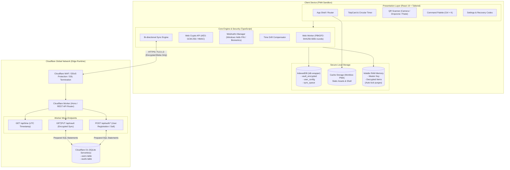
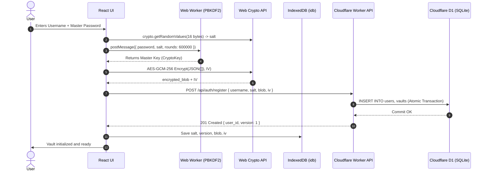
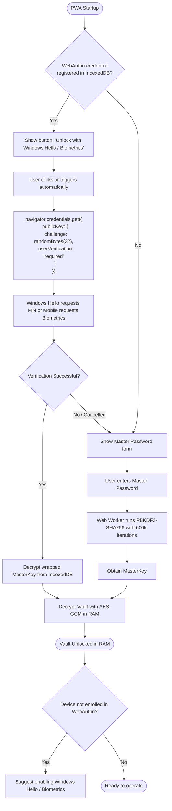
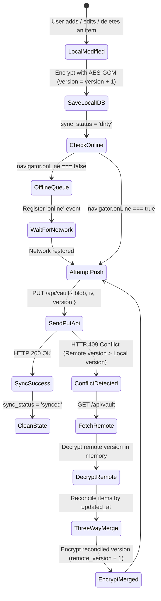

# Technical Design Document (TDD) — System Architecture
## Project: Revolt Pass — Zero-Knowledge 2FA & Security Vault

| Metadata | Detail |
| :--- | :--- |
| **Document Identifier** | `RP-ARCH-002` |
| **Version** | `1.0.0-PROD` |
| **Status** | Approved / Architecture Specification |
| **Production Domain** | `https://pass.revoltgroup.com.ar` |
| **Tech Stack** | React 19, TypeScript, Vite, Tailwind CSS, Workbox, Cloudflare Workers, Cloudflare D1 |

---

## 1. Architecture Overview

Revolt Pass implements a decoupled and distributed architecture based on the **Zero-Knowledge Client-Side Computing** paradigm. Sensitive cryptographic processing executes entirely on the user's device utilizing native hardware acceleration via the **Web Crypto API**. Remote infrastructure acts exclusively as a binary persistence and high-availability edge synchronization layer on the global network via **Cloudflare Workers** and the distributed database **Cloudflare D1**.

### 1.1 High-Level Architecture Diagram



---

## 2. End-to-End Data Flows and Lifecycles

### 2.1 Registration and Vault Initialization Flow
1. The user accesses `https://pass.revoltgroup.com.ar` and enters a username and Master Password.
2. The client generates a 16-byte cryptographic `kdf_salt` using `crypto.getRandomValues`.
3. The client dispatches `MasterKey` derivation to the Web Worker via `PBKDF2-SHA256` (600,000 iterations).
4. The client initializes an empty `VaultItem[]` array, serializes it to JSON, and generates a random 12-byte `IV`.
5. The client encrypts the JSON using `AES-GCM-256`, producing the `encrypted_blob`.
6. The client sends `POST /api/auth/register` to the Worker containing: `{ username, kdf_salt, encrypted_blob, iv }`.
7. The Worker executes an atomic transaction in Cloudflare D1 inserting the user and their initial vault record (version 1).
8. The encrypted blob and configurations are persisted in local `IndexedDB`.



### 2.2 Unlock Flow: Cold (Master Password) vs. Fast (WebAuthn / Windows Hello)



### 2.3 Time Drift Compensation Flow
To prevent TOTP codes from failing due to second-level clock discrepancies in the operating system:
1. Upon loading and every 30 minutes, the client executes `GET /api/time`.
2. The client timestamp $t_0$ is recorded immediately before sending the request.
3. The server responds with its UTC timestamp $t_{server}$ in milliseconds.
4. The client receives the response at $t_1$.
5. Estimated network latency is calculated: $RTT = t_1 - t_0$.
6. Clock discrepancy is determined:
   $$\text{offset} = t_{server} - \left( t_0 + \frac{RTT}{2} \right)$$
7. This `offset` is stored in volatile memory and added to `Date.now()` inside `generateTOTP()`.

---

## 3. Bidirectional Synchronization Strategy and Offline Mode

### 3.1 Local Storage Schema in IndexedDB
The typed library `idb` manages a database named `revolt_pass_db` (version 1) with three object stores:

1. **`vault_encrypted` (Vault Store):**
   * Key: `'current'`
   * Value: `{ user_id: string, encrypted_blob: string, iv: string, version: number, updated_at: number, sync_status: 'synced' | 'dirty' }`
2. **`user_config` (Configuration Store):**
   * Key: `'profile'`
   * Value: `{ user_id: string, username: string, kdf_salt: string, webauthn_credential_id?: string, wrapped_master_key?: string, auto_lock_minutes: number }`
3. **`sync_queue` (Offline Operations Queue):**
   * Key: `id` (autoincrement)
   * Value: `{ action: 'PUSH_VAULT', payload: EncryptedVaultPayload, timestamp: number, attempts: number }`

### 3.2 Synchronization State Machine and Conflict Detection



* **Conflict Reconciliation Rule (Last-Write-Wins per item):** If a collision occurs from simultaneous offline edits across multiple devices, the reconciliation engine decrypts both versions in memory, iterates each `VaultItem` identified by its `id` (UUID v4), and keeps the one with the most recent `updated_at`. It then encrypts the merged result and increments the version number.

### 3.3 Service Worker and Workbox Configuration
`vite.config.ts` uses `VitePWA` configured with the `generateSW` strategy and the following caching directives:
* **Static Assets (`.js`, `.css`, `.html`, `.svg`, `.wasm`):** `CacheFirst` strategy with 30-day expiration and full installation precaching.
* **Simple Icons CDN (`https://cdn.simpleicons.org/*`):** `StaleWhileRevalidate` strategy with a 200-entry cache limit and 15-day TTL.
* **API Calls (`/api/*`):** Strict `NetworkOnly` strategy (never cache authenticated or dynamic requests in the Service Worker to ensure the IndexedDB layer retains the single source of truth).

---

## 4. Formal REST API Contracts

The API is exposed under the `/api/v1` (or `/api`) prefix. All responses adopt a uniform JSON envelope standard.

### 4.1 Canonical Response Envelopes

#### Successful Response (`200 OK`, `201 Created`):
```json
{
  "success": true,
  "data": { ... },
  "timestamp": 1772719200000
}
```

#### Error Response (`4xx`, `5xx`):
```json
{
  "success": false,
  "error": {
    "code": "VAULT_VERSION_CONFLICT",
    "message": "Local vault version (3) is lower than server version (4).",
    "details": {
      "server_version": 4,
      "client_version": 3
    }
  },
  "timestamp": 1772719200000
}
```

### 4.2 Endpoint Catalog

#### 1. `GET /api/time`
* **Purpose:** Time synchronization to compensate for local clock drift in TOTP calculation.
* **Authentication:** Public (no token).
* **HTTP Codes:** `200 OK`.
* **Response Payload:**
  ```json
  {
    "success": true,
    "data": {
      "server_time_utc": 1772719200150
    },
    "timestamp": 1772719200150
  }
  ```

#### 2. `POST /api/auth/register`
* **Purpose:** Initial user registration and empty vault provisioning.
* **Authentication:** Public (first-time setup).
* **Request Payload:**
  ```json
  {
    "username": "admin",
    "kdf_salt": "4a7b3c2d1e0f9a8b7c6d5e4f3a2b1c0d",
    "encrypted_blob": "VGhpcyBpcyBhbiBlbmNyeXB0ZWQgdmF1bHQgcGF5bG9hZC4uLg==",
    "iv": "MDEyMzQ1Njc4OTAx"
  }
  ```
* **HTTP Codes:**
  * `201 Created`: User and vault successfully registered.
  * `400 Bad Request`: Invalid payload or missing fields.
  * `409 Conflict`: `username` is already registered.
* **Response Payload:**
  ```json
  {
    "success": true,
    "data": {
      "user_id": "usr_9b1deb4d-3b7d-4bad-9bdd-2b0d7b3dcb6d",
      "version": 1,
      "updated_at": 1772719200
    }
  }
  ```

#### 3. `GET /api/auth/salt?username={username}`
* **Purpose:** Retrieve `kdf_salt` so the client can derive the key and unlock their account without transmitting the password.
* **Authentication:** Public.
* **HTTP Codes:**
  * `200 OK`: Returns salt.
  * `404 Not Found`: Non-existent user.
* **Response Payload:**
  ```json
  {
    "success": true,
    "data": {
      "kdf_salt": "4a7b3c2d1e0f9a8b7c6d5e4f3a2b1c0d",
      "has_passkey": true
    }
  }
  ```

#### 4. `GET /api/vault`
* **Purpose:** Download the latest encrypted blob.
* **Request Headers:** `X-User-Id: {user_id}`, `If-None-Match: "v{version}"`.
* **HTTP Codes:**
  * `200 OK`: Updated encrypted payload returned.
  * `304 Not Modified`: Local version is identical to remote.
  * `401 Unauthorized`: Missing or invalid user identifier.
* **Response Payload (`200 OK`):**
  ```json
  {
    "success": true,
    "data": {
      "user_id": "usr_9b1deb4d-3b7d-4bad-9bdd-2b0d7b3dcb6d",
      "encrypted_blob": "VGhpcyBpcyBhbiBlbmNyeXB0ZWQgdmF1bHQgcGF5bG9hZC4uLg==",
      "iv": "MDEyMzQ1Njc4OTAx",
      "version": 4,
      "updated_at": 1772719250
    }
  }
  ```

#### 5. `PUT /api/vault`
* **Purpose:** Persist and synchronize a new encrypted vault version.
* **Request Headers:** `X-User-Id: {user_id}`.
* **Request Payload:**
  ```json
  {
    "encrypted_blob": "VXBkYXRlZCBibG9iIGluZm9ybWF0aW9uLi4u",
    "iv": "TmZXaXY5MTIzODAx",
    "version": 5
  }
  ```
* **HTTP Codes:**
  * `200 OK`: Vault updated successfully.
  * `400 Bad Request`: Invalid base64 format or version.
  * `409 Conflict`: Submitted version is not strictly equal to `server.version + 1`.

---

## 5. Canonical Data Models and TypeScript Types

All client and Worker modules share a common type definition file (`src/types/vault.ts`):

```typescript
/**
 * Represents an individual recovery code associated with an account.
 */
export interface RecoveryCode {
  code: string;
  used: boolean;
  created_at?: number;
}

/**
 * Hash algorithms supported for TOTP per RFC 6238.
 */
export type TotpAlgorithm = 'SHA1' | 'SHA256';

/**
 * Item types storable in vault (extensible architecture).
 */
export type VaultItemType = 'totp' | 'login' | 'note';

/**
 * Atomic structure of an item within the decrypted vault in memory.
 */
export interface VaultItem {
  id: string; // Canonical UUID v4
  type: VaultItemType;
  issuer: string; // Service name (e.g. "GitHub", "AWS")
  account: string; // Account identifier (e.g. "user@email.com")
  secret: string; // Decoded secret key in Base32 format
  digits: 6 | 8; // Token digit length (default: 6)
  period: number; // Rotation interval in seconds (default: 30)
  algorithm: TotpAlgorithm; // Hash algorithm (default: 'SHA1')
  recovery_codes?: RecoveryCode[]; // Optional list of emergency codes
  notes?: string; // Additional secure notes
  pinned?: boolean; // Pinned to top indicator
  tags?: string[]; // Organizational tags
  icon_url?: string; // Optional custom logo/photo Data URL or HTTPS link
  created_at: number; // Unix Epoch in milliseconds
  updated_at: number; // Unix Epoch in milliseconds (used for reconciliation)
}

/**
 * Full deserialized vault container on client.
 */
export interface DecryptedVault {
  version: number;
  items: VaultItem[];
  exported_at?: number;
}

/**
 * Encrypted payload transmitted to/from API and stored in D1 / IndexedDB.
 */
export interface EncryptedVaultPayload {
  user_id: string;
  encrypted_blob: string; // Base64 of ciphertext + auth tag (AES-GCM)
  iv: string; // Base64 of 12-byte initialization vector
  version: number; // Monotonic version counter
  updated_at: number; // Unix Epoch in seconds
}

/**
 * Local synchronization state in IndexedDB.
 */
export type SyncStatus = 'synced' | 'dirty' | 'syncing' | 'error';

/**
 * Vault record stored locally in IndexedDB.
 */
export interface LocalVaultRecord extends EncryptedVaultPayload {
  sync_status: SyncStatus;
  last_sync_attempt?: number;
  sync_error_message?: string;
}

/**
 * Profile configuration and WebAuthn wrapping stored in IndexedDB.
 */
export interface LocalUserConfig {
  user_id: string;
  username: string;
  kdf_salt: string; // Base64 or hex of 16-byte salt
  webauthn_credential_id?: string; // Base64URL ID of registered credential
  wrapped_master_key?: string; // Master Key encrypted with WebAuthn hardware key
  auto_lock_minutes: number; // Inactivity time before purging RAM
  clipboard_clear_seconds: number; // Time before clearing clipboard (default 45s)
}

/**
 * Session state in volatile RAM memory (purged on auto-lock).
 */
export interface ActiveSessionState {
  isUnlocked: boolean;
  masterKey: CryptoKey | null; // Derived AES-GCM key in RAM
  timeDriftOffsetMs: number; // Milliseconds offset against server
  lastActivityTimestamp: number; // Timestamp of last user event
}
```

---

## 6. Cloudflare D1 SQL Schema (`schema.sql`)

The underlying SQLite relational engine of Cloudflare D1 is structured using prepared statements, ensuring strict referential integrity, fast index lookups, and uniqueness constraints.

```sql
-- =====================================================================
-- D1 SCHEMA: REVOLT PASS DATABASE (schema.sql)
-- Version: 1.0.0
-- Engine: Cloudflare D1 (SQLite Serverless)
-- =====================================================================

PRAGMA foreign_keys = ON;

-- Users Table
CREATE TABLE IF NOT EXISTS users (
    id TEXT PRIMARY KEY,                       -- Prefix 'usr_' + UUID v4
    username TEXT NOT NULL COLLATE NOCASE,     -- Case-insensitive for login
    kdf_salt TEXT NOT NULL,                    -- 16 bytes in Base64 format
    passkey_credential_id TEXT,                -- Optional FIDO2 credential ID
    created_at INTEGER NOT NULL DEFAULT (unixepoch()),
    updated_at INTEGER NOT NULL DEFAULT (unixepoch()),
    CONSTRAINT uq_users_username UNIQUE (username)
);

-- Index for fast login lookups
CREATE INDEX IF NOT EXISTS idx_users_username ON users(username);

-- Encrypted Vaults Table (Zero-Knowledge)
CREATE TABLE IF NOT EXISTS vaults (
    user_id TEXT PRIMARY KEY,                  -- Strict 1:1 relation per user
    encrypted_blob TEXT NOT NULL,              -- Base64 Ciphertext
    iv TEXT NOT NULL,                          -- Initialization Vector (12 bytes Base64)
    version INTEGER NOT NULL DEFAULT 1,        -- Optimistic concurrency control
    updated_at INTEGER NOT NULL DEFAULT (unixepoch()),
    CONSTRAINT fk_vaults_user FOREIGN KEY (user_id) 
        REFERENCES users(id) ON DELETE CASCADE
);

-- Index for version control and synchronization auditing
CREATE INDEX IF NOT EXISTS idx_vaults_user_version ON vaults(user_id, version);

-- Synchronization Audit Table (Optional, lightweight rotation)
CREATE TABLE IF NOT EXISTS sync_logs (
    id INTEGER PRIMARY KEY AUTOINCREMENT,
    user_id TEXT NOT NULL,
    action TEXT NOT NULL,                      -- 'REGISTER', 'SYNC_PULL', 'SYNC_PUSH'
    client_version INTEGER,
    server_version INTEGER,
    ip_country TEXT,                           -- Sourced from cf.country (no personal IP stored)
    created_at INTEGER NOT NULL DEFAULT (unixepoch()),
    CONSTRAINT fk_synclogs_user FOREIGN KEY (user_id) 
        REFERENCES users(id) ON DELETE CASCADE
);

CREATE INDEX IF NOT EXISTS idx_synclogs_user_created ON sync_logs(user_id, created_at DESC);
```
