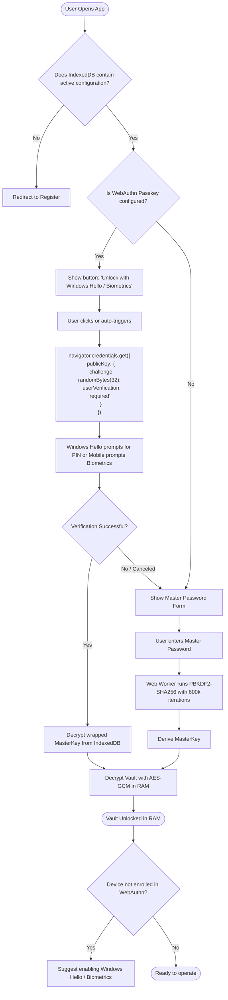
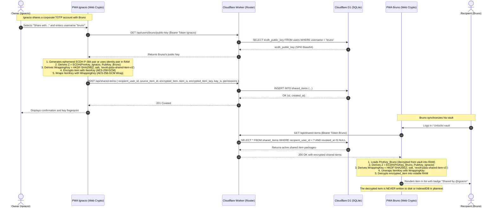
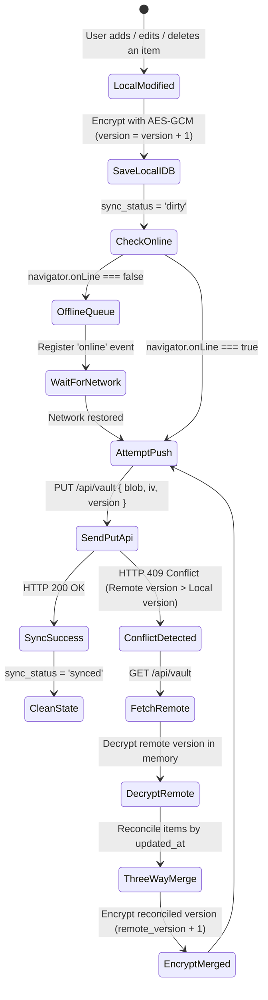

# Technical Design Document (TDD) — System Architecture
## Project: Revolt Pass — Zero-Knowledge 2FA & Security Vault

| Metadata | Detail |
| :--- | :--- |
| **Document Identifier** | `RP-ARCH-002` |
| **Version** | `2.0.0-PROD (v2.5 Architecture Ready)` |
| **Status** | Approved / Architecture Specification |
| **Production Domain** | `https://<your-domain-or-subdomain>.workers.dev` |
| **Tech Stack** | React 19, TypeScript, Vite, Tailwind CSS, Workbox, Cloudflare Workers, Cloudflare D1 |
| **License** | GNU AGPLv3 + Revolt Group Trademark Policy |

---

## 1. Architecture Overview

Revolt Pass implements a decoupled and distributed architecture based on the **Zero-Knowledge Client-Side Computing** paradigm. Sensitive cryptographic processing executes entirely on the user's device utilizing native hardware acceleration via the **Web Crypto API** and sandboxed WebAssembly modules (`hash-wasm`). Remote infrastructure acts exclusively as a binary persistence and high-availability edge synchronization layer on the global network via **Cloudflare Workers** and the distributed database **Cloudflare D1**.

### 1.1 High-Level Architecture Diagram

```mermaid
flowchart TB
    subgraph ClientDevice ["Client Device (PWA Sandbox)"]
        subgraph UI ["Presentation Layer (React 19 + Tailwind)"]
            App["App Shell / Router"]
            PolymorphicCard["PolymorphicItemCard (6 Types + Trash)"]
            QrScanner["QR Scanner (Camera / Dropzone / Paste)"]
            CmdPalette["Command Palette (Ctrl + K)"]
            SecurityModal["Security & History Modal"]
            EmergencyKit["Emergency Kit Generator (Offline SVG)"]
            I18nEngine["i18n Engine (ES/EN Zero-Knowledge)"]
        end

        subgraph CoreEngine ["Core Security Engine (TypeScript)"]
            CryptoWorker["Web Worker (Argon2id WASM 64MB / PBKDF2 600k)"]
            SubtleEngine["Web Crypto API (AES-GCM-256 / HMAC)"]
            EnvelopeEngine["Envelope Encryption Engine (item_key AES-256)"]
            WebAuthnManager["WebAuthn Manager (Windows Hello PIN / Biometrics)"]
            TimeSyncManager["Time Drift Compensator"]
            SyncEngine["Bi-directional Sync Engine"]
            PushClient["Web Push Client (RFC 8291 / 8292)"]
        end

        subgraph ClientStorage ["Secure Local Storage"]
            IDB[("IndexedDB (idb wrapper)\n- vault_encrypted\n- user_config\n- sync_queue")]
            CacheStorage[("Cache Storage (Workbox PWA)\nStatic Assets & Shell")]
            RAM[("Volatile RAM\n- Master Key & Item Keys\n- Decrypted Items & History\n(Auto-lock purges)")]
        end
    end

    subgraph CloudflareEdge ["Cloudflare Global Network (Edge Runtime)"]
        WAF["Cloudflare WAF / DDoS Protection / SSL Termination"]
        Worker["Cloudflare Worker (Router REST API)"]
        
        subgraph Endpoints ["Worker Micro-Endpoints"]
            TimeEp["GET /api/time (UTC Timestamp)"]
            AuthEp["POST /api/auth/* (Register / Salt)"]
            UpgradeEp["POST /api/auth/upgrade-kdf (Argon2id Auto-Upgrade)"]
            VaultEp["GET|PUT /api/vault (Encrypted Sync)"]
            SnapshotEp["GET /api/vault/snapshots (Rolling 5 History)"]
            RestoreEp["POST /api/vault/restore/:vault_version (OCC Rollback)"]
            SessionEp["POST|GET|DELETE|PUT /api/auth/sessions (Session Mgmt)"]
            PasskeyEp["GET|POST|PUT|DELETE /api/passkeys (FIDO2 Registry)"]
            AuditEp["GET /api/audit-logs (Security Audit)"]
            PushEp["POST /api/push/* (Web Push VAPID RFC 8292)"]
            EmailEp["POST /api/notifications/email (BYOK Dispatch)"]
        end
        
        D1Database[("Cloudflare D1 (SQLite Serverless)\n- users & vaults tables\n- vault_snapshots & folders\n- sessions & passkeys\n- audit_logs & push_subscriptions")]
    end

    %% Relationships
    UI --> CoreEngine
    CoreEngine --> RAM
    CoreEngine --> IDB
    App --> CacheStorage
    SyncEngine <--> |"HTTPS / TLS 1.3\n(Encrypted Blobs & Tokens)"| WAF
    WAF --> Worker
    Worker --> TimeEp
    Worker --> AuthEp
    Worker --> UpgradeEp
    Worker --> VaultEp
    Worker --> SessionEp
    Worker --> PasskeyEp
    Worker --> AuditEp
    Worker --> PushEp
    Worker --> EmailEp
    VaultEp <--> |"Prepared SQL"| D1Database
    AuthEp <--> |"Prepared SQL"| D1Database
    UpgradeEp <--> |"Prepared SQL"| D1Database
    SessionEp <--> |"Prepared SQL"| D1Database
    PasskeyEp <--> |"Prepared SQL"| D1Database
    AuditEp <--> |"Prepared SQL"| D1Database
    PushEp <--> |"Prepared SQL"| D1Database
```



---

## 2. Comprehensive Data Flow and Lifecycles

### 2.1 Registration and Initial Vault Provisioning Flow
1. The user visits `https://<your-domain-or-subdomain>.workers.dev` and inputs a username and Master Password.
2. The client generates a random 16-byte cryptographic `kdf_salt` using `crypto.getRandomValues`.
3. The client dispatches Master Key derivation via **Argon2id** (64 MB RAM, 3 rounds, 1 lane via WASM) to an isolated Web Worker. Legacy accounts retain backward compatibility with PBKDF2-SHA256 (600,000 iterations).
4. The client initializes an empty list of `VaultItem[]`, serializes it to JSON, and generates a random 12-byte `IV`.
5. The client encrypts the JSON using `AES-GCM-256`, producing the `encrypted_blob`.
6. The client sends `POST /api/auth/register` to the Worker containing `{ username, kdf_salt, encrypted_blob, iv, kdf: "argon2id" }`.
7. The Worker runs an atomic transaction on Cloudflare D1 inserting the user and their initial vault record (version 1).
8. The encrypted blob and user config are persisted locally in `IndexedDB`.

---

### 2.2 Unlock and Session Reconstruction Flow
Revolt Pass implements a dual unlock pathway (biometric/hardware passkey hot path or Master Password cold path):



### 2.3 Time Drift Compensation Flow
To prevent TOTP codes from failing due to second-level clock discrepancies in the operating system:
1. Upon loading and every 30 minutes, the client executes `GET /api/time`.
2. The client timestamp $t_0$ is recorded immediately before sending the request.
3. The server responds with its UTC timestamp $t_{server}$ in milliseconds.
4. The client receives the response at $t_1$.
5. Estimated network latency is calculated: $RTT = t_1 - t_0$.
6. Clock discrepancy is determined:
   $$\text{offset} = t_{server} - \left( t_0 + \frac{RTT}{2} \right)$$
7. This `offset` is stored in volatile memory and added to `Date.now()` inside `generateTOTP()`.

---

### 2.4 Cross-Account Secure Sharing Subsystem (v2.5 - ADR-014)
To enable cryptographically secure sharing of specific items between distinct user accounts without revealing Master Passwords or delegating decryption to the server, Revolt Pass implements an asymmetric key agreement flow based on ECDH P-384 with AES-256-GCM symmetric encapsulation.



* **Local Storage Isolation Policy:**
  - Received shared items are decrypted in real time upon sync and reside **strictly in volatile RAM memory**.
  - When the vault locks or the session expires, shared item references and their symmetric keys are instantly purged.
  - In `IndexedDB`, only the encrypted payload (`encrypted_item`, `encrypted_item_key`, IVs) is cached for offline availability, ensuring local disk inspections never reveal plaintext secrets.

---

### 2.5 Silent KDF Auto-Upgrade (PBKDF2 -> Argon2id)
With the introduction of Argon2id in v1.5.0, the client transparently migrates all existing vaults configured with PBKDF2:

1. **Detection:** Upon login or unlocking the vault, the client inspects the KDF algorithm returned by `/api/auth/salt` or cached locally in `user_config`.
2. **Off-Thread Re-derivation:** Once the vault payload is decrypted with the legacy key, the client prompts the Web Worker to derive a new `MasterKey` using **Argon2id** (64 MB RAM, 3 iterations) and a fresh 16-byte cryptographic salt.
3. **Re-encryption and Passkey Re-wrapping:** The vault JSON payload is re-encrypted under the new Argon2id master key. Any enrolled platform passkeys (Windows Hello / Touch ID) are re-wrapped transparently with the device platform key.
4. **Atomic Persistence:** The client calls `POST /api/auth/upgrade-kdf`, submitting the new salt, updated KDF identifier (`argon2id`), re-encrypted vault ciphertext, and refreshed authentication verifier. Cloudflare D1 updates the user profile in a single atomic transaction without requiring the user to change their master password.

---

### 2.6 Proactive Zero-Knowledge Notification Dispatch (Web Push & BYOK Email)
To deliver instantaneous alerts for high-risk security events without sacrificing user privacy or incurring SaaS costs:

1. **Web Push RFC 8291 / RFC 8292:**
   - The browser registers a Push Subscription via its Service Worker.
   - Subscription metadata (`endpoint`, public keys `p256dh` and `auth`) is saved in the `push_subscriptions` table in D1 tied to `user_id`.
   - On critical auditing events (e.g. login from a newly detected country, remote session termination, newly enrolled passkey), the Cloudflare Worker sends an encrypted push payload using **RFC 8292 VAPID** and **RFC 8291 AES-128-GCM** directly to browser push gateways (FCM / APNs / Mozilla).
2. **BYOK (Bring Your Own Key) Email:**
   - Users can optionally provide a free personal Resend API key or route notifications through Cloudflare Email Workers (`send_email`).
   - Alerts are dispatched directly from the edge worker without Revolt Pass maintaining centralized mailing lists or subscribing to paid email services.

---

## 3. Bidirectional Synchronization Strategy and Offline Mode

### 3.1 Local Storage Schema in IndexedDB
The typed library `idb` manages a database named `revolt_pass_db` (version 1) with three object stores:

1. **`vault_encrypted` (Vault Store):**
   * Key: `'current'`
   * Value: `{ user_id: string, encrypted_blob: string, iv: string, version: number, updated_at: number, sync_status: 'synced' | 'dirty' }`
2. **`user_config` (Configuration Store):**
   * Key: `'profile'`
   * Value: `{ user_id: string, username: string, kdf_salt: string, webauthn_credential_id?: string, wrapped_master_key?: string, auto_lock_minutes: number }`
3. **`sync_queue` (Offline Operations Queue):**
   * Key: `id` (autoincrement)
   * Value: `{ action: 'PUSH_VAULT', payload: EncryptedVaultPayload, timestamp: number, attempts: number }`

### 3.2 Synchronization State Machine and Conflict Detection



* **Conflict Reconciliation Rule (Last-Write-Wins per item):** If a collision occurs from simultaneous offline edits across multiple devices, the reconciliation engine decrypts both versions in memory, iterates each `VaultItem` identified by its `id` (UUID v4), and keeps the one with the most recent `updated_at`. It then encrypts the merged result and increments the version number.

### 3.3 Service Worker and Workbox Configuration
`vite.config.ts` uses `VitePWA` configured with the `generateSW` strategy and the following caching directives:
* **Static Assets (`.js`, `.css`, `.html`, `.svg`, `.wasm`):** `CacheFirst` strategy with 30-day expiration and full installation precaching.
* **Simple Icons CDN (`https://cdn.simpleicons.org/*`):** `StaleWhileRevalidate` strategy with a 200-entry cache limit and 15-day TTL.
* **API Calls (`/api/*`):** Strict `NetworkOnly` strategy (never cache authenticated or dynamic requests in the Service Worker to ensure the IndexedDB layer retains the single source of truth).

---

## 4. Formal REST API Contracts

The API is exposed under the `/api/v1` (or `/api`) prefix. All responses adopt a uniform JSON envelope standard.

### 4.1 Canonical Response Envelopes

#### Successful Response (`200 OK`, `201 Created`):
```json
{
  "success": true,
  "data": { ... },
  "timestamp": 1772719200000
}
```

#### Error Response (`4xx`, `5xx`):
```json
{
  "success": false,
  "error": {
    "code": "VAULT_VERSION_CONFLICT",
    "message": "Local vault version (3) is lower than server version (4).",
    "details": {
      "server_version": 4,
      "client_version": 3
    }
  },
  "timestamp": 1772719200000
}
```

### 4.2 Endpoint Catalog

#### 1. `GET /api/time`
* **Purpose:** Time synchronization to compensate for local clock drift in TOTP calculation.
* **Authentication:** Public (no token).
* **HTTP Codes:** `200 OK`.
* **Response Payload:**
  ```json
  {
    "success": true,
    "data": {
      "server_time_utc": 1772719200150
    },
    "timestamp": 1772719200150
  }
  ```

#### 2. `POST /api/auth/register`
* **Purpose:** Initial user registration and empty vault provisioning.
* **Authentication:** Public (first-time setup).
* **Request Payload:**
  ```json
  {
    "username": "admin",
    "kdf_salt": "4a7b3c2d1e0f9a8b7c6d5e4f3a2b1c0d",
    "encrypted_blob": "VGhpcyBpcyBhbiBlbmNyeXB0ZWQgdmF1bHQgcGF5bG9hZC4uLg==",
    "iv": "MDEyMzQ1Njc4OTAx"
  }
  ```
* **HTTP Codes:**
  * `201 Created`: User and vault successfully registered.
  * `400 Bad Request`: Invalid payload or missing fields.
  * `409 Conflict`: `username` is already registered.
* **Response Payload:**
  ```json
  {
    "success": true,
    "data": {
      "user_id": "usr_9b1deb4d-3b7d-4bad-9bdd-2b0d7b3dcb6d",
      "version": 1,
      "updated_at": 1772719200
    }
  }
  ```

#### 3. `GET /api/auth/salt?username={username}`
* **Purpose:** Retrieve `kdf_salt` so the client can derive the key and unlock their account without transmitting the password.
* **Authentication:** Public.
* **HTTP Codes:**
  * `200 OK`: Returns salt.
  * `404 Not Found`: Non-existent user.
* **Response Payload:**
  ```json
  {
    "success": true,
    "data": {
      "kdf_salt": "4a7b3c2d1e0f9a8b7c6d5e4f3a2b1c0d",
      "has_passkey": true
    }
  }
  ```

#### 4. `GET /api/vault`
* **Purpose:** Download the latest encrypted blob.
* **Request Headers:** `X-User-Id: {user_id}`, `If-None-Match: "v{version}"`.
* **HTTP Codes:**
  * `200 OK`: Updated encrypted payload returned.
  * `304 Not Modified`: Local version is identical to remote.
  * `401 Unauthorized`: Missing or invalid user identifier.
* **Response Payload (`200 OK`):**
  ```json
  {
    "success": true,
    "data": {
      "user_id": "usr_9b1deb4d-3b7d-4bad-9bdd-2b0d7b3dcb6d",
      "encrypted_blob": "VGhpcyBpcyBhbiBlbmNyeXB0ZWQgdmF1bHQgcGF5bG9hZC4uLg==",
      "iv": "MDEyMzQ1Njc4OTAx",
      "version": 4,
      "updated_at": 1772719250
    }
  }
  ```

#### 5. `PUT /api/vault`
* **Purpose:** Persist and synchronize a new encrypted vault version.
* **Request Headers:** `X-User-Id: {user_id}`.
* **Request Payload:**
  ```json
  {
    "encrypted_blob": "VXBkYXRlZCBibG9iIGluZm9ybWF0aW9uLi4u",
    "iv": "TmZXaXY5MTIzODAx",
    "version": 5
  }
  ```
* **HTTP Codes:**
  * `200 OK`: Vault updated successfully.
  * `400 Bad Request`: Invalid base64 format or version.
  * `409 Conflict`: Submitted version is not strictly equal to `server.version + 1`.

#### 6. `POST /api/auth/session`
* **Purpose:** Register a new device session or touch/refresh an existing session, preserving custom device names.
* **Headers:** `X-User-Id: {user_id}`.
* **Payload:** `{ "session_token": "...", "device_name": "My PC", "device_fingerprint": "..." }`.
* **Response:** `{ "success": true, "data": { "session_id": "ses_...", "device_name": "My PC" } }`.

#### 7. `GET /api/auth/sessions` & `DELETE /api/auth/sessions`
* **Purpose:** List all active user sessions (`GET`) or terminate all other remote sessions (`DELETE`).
* **Headers:** `X-User-Id: {user_id}`, `Authorization: Bearer {session_token}`.

#### 8. `DELETE /api/auth/sessions/:id` & `PUT /api/auth/sessions/:id`
* **Purpose:** Granular termination of a specific session (`DELETE`) or custom device renaming (`PUT`).
* **Payload for PUT:** `{ "device_name": "New Name" }`.

#### 9. `GET /api/passkeys` & `POST /api/passkeys`
* **Purpose:** List registered Passkey credentials (`GET`) or sync a WebAuthn credential (`POST`) with conditional upsert preserving user-assigned labels.

#### 10. `PUT /api/passkeys/:id` & `DELETE /api/passkeys/:id`
* **Purpose:** Rename a registered Passkey (`PUT`) or revoke/delete a remote Passkey (`DELETE`) to neutralize unauthorized biometric access on remote or shared computers.

#### 11. `GET /api/audit-logs`
* **Purpose:** Retrieve the chronological security audit history for the authenticated user.

#### 12. `GET /api/users/:username/public-key`
* **Purpose:** Retrieve recipient ECDH P-384 public key to derive the shared Diffie-Hellman secret.
* **Authentication:** Active session required (`Authorization: Bearer <token>`).
* **HTTP Codes:** `200 OK` (`{ ecdh_public_key, user_id }`), `404 Not Found`.

#### 13. `POST /api/users/me/ecdh-key`
* **Purpose:** Register or rotate the authenticated user's own ECDH P-384 public key.
* **Payload:** `{ "ecdh_public_key": "MFkwEwYHKoZIzj0CAQYIKoZIzj0DAQcDQgAE..." }`.
* **HTTP Codes:** `200 OK`, `400 Bad Request`.

#### 14. `POST /api/shared-items`
* **Purpose:** Share an encrypted item with its symmetric key encapsulated via ECDH wrapping with a designated recipient.
* **Payload:** `{ "recipient_user_id": "usr_...", "source_item_id": "cuid_...", "encrypted_item": "...", "item_iv": "...", "encrypted_item_key": "...", "key_iv": "...", "permissions": "read" | "write" }`.
* **HTTP Codes:** `201 Created`, `400 Bad Request`, `404 Recipient Not Found`, `409 Conflict`.

#### 15. `GET /api/shared-items`
* **Purpose:** List active received shared items (`revoked_at IS NULL`) for client-side decryption.
* **HTTP Codes:** `200 OK` (list of `SharedItemRecord[]`).

#### 16. `GET /api/shared-items/sent`
* **Purpose:** List items shared by the current user with other accounts for audit and revocation management.
* **HTTP Codes:** `200 OK`.

#### 17. `PUT /api/shared-items/:id`
* **Purpose:** Update shared item content (requires `permissions = 'write'` or ownership).
* **Payload:** `{ "encrypted_item": "...", "item_iv": "..." }`.
* **HTTP Codes:** `200 OK`, `403 Forbidden`, `404 Not Found`.

#### 18. `DELETE /api/shared-items/:id`
* **Purpose:** Revoke item access (if invoked by owner) or reject/delete from view (if invoked by recipient).
* **HTTP Codes:** `200 OK`, `403 Forbidden`, `404 Not Found`.

#### 19. `GET /api/vault/snapshots`
* **Purpose:** List historical archived vault versions for the authenticated user (up to 5 rolling snapshots).
* **Headers:** `X-User-Id: {user_id}`.
* **HTTP Codes:** `200 OK` (list of `{ id, user_id, vault_version, created_at }`).

#### 20. `POST /api/vault/restore/:vault_version`
* **Purpose:** Atomically restore vault state to a preceding historical snapshot in Cloudflare D1.
* **Headers:** `X-User-Id: {user_id}`.
* **OCC Behavior:** The Worker retrieves the encrypted blob from the selected snapshot and updates the `vaults` table assigning `version = current.version + 1` to preserve optimistic concurrency control monotonicity, enabling immediate client pulling without synchronization collisions.
* **HTTP Codes:** `200 OK` (`{ success: true, data: { restored_version, new_version } }`), `404 Not Found` (snapshot not found).

---

## 5. Canonical Data Models and TypeScript Types

All client and Worker modules share a common type definition file (`src/types/vault.ts`):

```typescript
/**
 * Represents an individual recovery code associated with an account.
 */
export interface RecoveryCode {
  code: string;
  used: boolean;
  created_at?: number;
}

/**
 * Hash algorithms supported for TOTP per RFC 6238.
 */
export type TotpAlgorithm = 'SHA1' | 'SHA256';

/**
 * Canonical polymorphic secret types supported in the vault (v2.0).
 */
export type VaultItemType = 'totp' | 'login' | 'card' | 'note' | 'server_key' | 'identity';

export interface PasswordHistoryEntry {
  password: string;
  changed_at: number; // Unix timestamp in ms
}

export interface CustomField {
  id: string;
  name: string;
  value: string;
  is_secret?: boolean;
}

export interface LoginItemData {
  username?: string;
  password?: string;
  urls?: string[];
  totp_seed?: string; // Inline 2FA seed (Base32)
  custom_fields?: CustomField[];
  password_history?: PasswordHistoryEntry[]; // Previous password history
}

export type CardBrand = 'visa' | 'mastercard' | 'amex' | 'discover' | 'other';

export interface CardItemData {
  cardholder_name?: string;
  card_number?: string;
  brand?: CardBrand;
  exp_month?: string; // '01'-'12'
  exp_year?: string; // '26'-'99' or '2026'
  cvv?: string;
  pin?: string;
  zip_code?: string;
}

export interface NoteItemData {
  title?: string;
  content_markdown?: string;
}

export interface ServerKeyItemData {
  host?: string;
  port?: number;
  username?: string;
  private_key?: string;
  public_key?: string;
  passphrase?: string;
  api_token?: string;
}

export interface IdentityItemData {
  first_name?: string;
  last_name?: string;
  id_number?: string;
  passport_number?: string;
  license_number?: string;
  birthdate?: string;
  email?: string;
  phone?: string;
  address?: string;
}

/**
 * Atomic polymorphic structure of an item within the decrypted vault in memory.
 */
export interface VaultItem {
  id: string; // Canonical UUID v4
  type: VaultItemType;
  name?: string;
  issuer: string; // Service or provider name
  account: string; // Account or user identifier
  secret: string; // Base32 secret key (empty string for items without 2FA)
  digits: 6 | 8; // Token digit length (default: 6)
  period: number; // Rotation interval in seconds (default: 30)
  algorithm: TotpAlgorithm; // Hash algorithm (default: 'SHA1')
  recovery_codes?: RecoveryCode[]; // Optional list of emergency codes

  // Specialized polymorphic payloads (Milestone v2.0)
  login_data?: LoginItemData;
  card_data?: CardItemData;
  note_data?: NoteItemData;
  server_key_data?: ServerKeyItemData;
  identity_data?: IdentityItemData;

  // Organization & Trash Bin (Milestone v2.0)
  folder_id?: string;
  deleted_at?: number | null; // Soft-delete epoch timestamp in ms (auto-purged after 30 days)

  // Per-item envelope key wrapping (Milestone v2.0 & foundation for v2.5 ECDH sharing)
  encrypted_key?: string; // Symmetrically wrapped AES-256 item key: "${ivBase64}:${ciphertextBase64}"

  notes?: string; // General notes
  pinned?: boolean; // Pinned to top indicator
  tags?: string[]; // Organizational tags
  icon_url?: string; // Optional custom logo/photo Data URL or HTTPS link
  created_at: number; // Unix Epoch in milliseconds
  updated_at: number; // Unix Epoch in milliseconds (used for LWW reconciliation)
}

export interface VaultSnapshotInfo {
  id: number;
  user_id: string;
  vault_version: number;
  created_at: number;
}

export interface Folder {
  id: string;
  user_id: string;
  name: string;
  created_at: number;
}

/**
 * Full deserialized vault container on client.
 */
export interface DecryptedVault {
  version: number;
  items: VaultItem[];
  exported_at?: number;
}

/**
 * Encrypted payload transmitted to/from API and stored in D1 / IndexedDB.
 */
export interface EncryptedVaultPayload {
  user_id: string;
  encrypted_blob: string; // Base64 of ciphertext + auth tag (AES-GCM)
  iv: string; // Base64 of 12-byte initialization vector
  version: number; // Monotonic version counter
  updated_at: number; // Unix Epoch in seconds
}

/**
 * Local synchronization state in IndexedDB.
 */
export type SyncStatus = 'synced' | 'dirty' | 'syncing' | 'error';

/**
 * Vault record stored locally in IndexedDB.
 */
export interface LocalVaultRecord extends EncryptedVaultPayload {
  sync_status: SyncStatus;
  last_sync_attempt?: number;
  sync_error_message?: string;
}

/**
 * Profile configuration and WebAuthn wrapping stored in IndexedDB.
 */
export interface LocalUserConfig {
  user_id: string;
  username: string;
  kdf_salt: string; // Base64 or hex of 16-byte salt
  webauthn_credential_id?: string; // Base64URL ID of registered credential
  wrapped_master_key?: string; // Master Key encrypted with WebAuthn hardware key
  auto_lock_minutes: number; // Inactivity time before purging RAM
  clipboard_clear_seconds: number; // Time before clearing clipboard (default 45s)
}

/**
 * Session state in volatile RAM memory (purged on auto-lock).
 */
export interface ActiveSessionState {
  isUnlocked: boolean;
  masterKey: CryptoKey | null; // Derived AES-GCM key in RAM
  timeDriftOffsetMs: number; // Milliseconds offset against server
  lastActivityTimestamp: number; // Timestamp of last user event
}

/**
 * Permissions assigned to a shared item (v2.5).
 */
export type SharedItemPermissions = 'read' | 'write';

/**
 * Shared item record as persisted in Cloudflare D1 (v2.5).
 */
export interface SharedItemRecord {
  id: string; // Prefix 'shi_' + UUID
  owner_user_id: string;
  recipient_user_id: string;
  source_item_id: string; // ID of item in owner's vault
  encrypted_item: string; // Base64 ciphertext of item encrypted with ItemKey
  item_iv: string; // Base64 12-byte IV for the item
  encrypted_item_key: string; // Base64 ItemKey wrapped with WrappingKey (AES-GCM Wrap)
  key_iv: string; // Base64 12-byte IV for the key
  permissions: SharedItemPermissions;
  version: number;
  created_at: number; // Unix Epoch in seconds
  updated_at: number;
  revoked_at?: number | null;
}

/**
 * In-memory volatile RAM representation of a decrypted incoming shared item.
 */
export interface DecryptedSharedItem {
  shared_id: string;
  source_item_id: string;
  owner_user_id: string;
  owner_username?: string;
  permissions: SharedItemPermissions;
  item: VaultItem;
  item_key: CryptoKey; // Symmetric AES-256-GCM key in RAM
  fingerprint: string; // SHA-256 fingerprint of owner's public key
  received_at: number;
}

/**
 * Cryptographic API interface contract for sharing (src/lib/crypto/sharing.ts).
 */
export interface SharingCryptoAPI {
  generateUserECDHKeyPair(): Promise<{ publicKey: CryptoKey; privateKey: CryptoKey; spkiBase64: string; pkcs8Base64: string }>;
  deriveWrappingKey(localPrivateKey: CryptoKey, remotePublicKey: CryptoKey, salt?: Uint8Array): Promise<CryptoKey>;
  encryptSharedItem(item: VaultItem, itemKey: CryptoKey, recipientPubKey: CryptoKey, senderPrivKey: CryptoKey): Promise<{ encrypted_item: string; item_iv: string; encrypted_item_key: string; key_iv: string }>;
  decryptSharedItem(encryptedItem: string, itemIv: string, encryptedItemKey: string, keyIv: string, recipientPrivKey: CryptoKey, senderPubKey: CryptoKey): Promise<VaultItem>;
  computeKeyFingerprint(spkiBase64: string): Promise<string>;
}
```

---

## 6. Cloudflare D1 SQL Schema (`schema.sql`)

The underlying SQLite relational engine of Cloudflare D1 is structured using prepared statements, ensuring strict referential integrity, fast index lookups, and uniqueness constraints.

```sql
-- =====================================================================
-- D1 SCHEMA: REVOLT PASS DATABASE (schema.sql)
-- Version: 1.1.0 (v2.5 Architecture Ready)
-- Engine: Cloudflare D1 (SQLite Serverless)
-- =====================================================================

PRAGMA foreign_keys = ON;

-- Users Table
CREATE TABLE IF NOT EXISTS users (
    id TEXT PRIMARY KEY,                       -- Prefix 'usr_' + UUID v4
    username TEXT NOT NULL COLLATE NOCASE,     -- Case-insensitive for login
    kdf_salt TEXT NOT NULL,                    -- 16 bytes in Base64 format
    passkey_credential_id TEXT,                -- Optional FIDO2 credential ID
    ecdh_public_key TEXT DEFAULT NULL,         -- ECDH P-384 public key in SPKI Base64 format (v2.5)
    created_at INTEGER NOT NULL DEFAULT (unixepoch()),
    updated_at INTEGER NOT NULL DEFAULT (unixepoch()),
    CONSTRAINT uq_users_username UNIQUE (username)
);

-- Index for fast login lookups
CREATE INDEX IF NOT EXISTS idx_users_username ON users(username);

-- Encrypted Vaults Table (Zero-Knowledge)
CREATE TABLE IF NOT EXISTS vaults (
    user_id TEXT PRIMARY KEY,                  -- Strict 1:1 relation per user
    encrypted_blob TEXT NOT NULL,              -- Base64 Ciphertext
    iv TEXT NOT NULL,                          -- Initialization Vector (12 bytes Base64)
    version INTEGER NOT NULL DEFAULT 1,        -- Optimistic concurrency control
    updated_at INTEGER NOT NULL DEFAULT (unixepoch()),
    CONSTRAINT fk_vaults_user FOREIGN KEY (user_id) 
        REFERENCES users(id) ON DELETE CASCADE
);

-- Index for version control and synchronization auditing
CREATE INDEX IF NOT EXISTS idx_vaults_user_version ON vaults(user_id, version);

-- Cross-Account Shared Items Table (Zero-Knowledge - v2.5)
CREATE TABLE IF NOT EXISTS shared_items (
    id TEXT PRIMARY KEY,                       -- Prefix 'shi_' + UUID
    owner_user_id TEXT NOT NULL,               -- Item owner
    recipient_user_id TEXT NOT NULL,           -- Recipient user
    source_item_id TEXT NOT NULL,              -- ID of source item in owner's vault
    encrypted_item TEXT NOT NULL,              -- Payload encrypted with ItemKey (AES-256-GCM)
    item_iv TEXT NOT NULL,                     -- 12-byte IV for item in Base64
    encrypted_item_key TEXT NOT NULL,          -- ItemKey wrapped with WrappingKey (ECDH + HKDF)
    key_iv TEXT NOT NULL,                      -- 12-byte IV for key in Base64
    permissions TEXT NOT NULL DEFAULT 'read' CHECK(permissions IN ('read', 'write')),
    version INTEGER NOT NULL DEFAULT 1,
    created_at INTEGER NOT NULL DEFAULT (unixepoch()),
    updated_at INTEGER NOT NULL DEFAULT (unixepoch()),
    revoked_at INTEGER DEFAULT NULL,
    CONSTRAINT fk_shared_owner FOREIGN KEY (owner_user_id) REFERENCES users(id) ON DELETE CASCADE,
    CONSTRAINT fk_shared_recipient FOREIGN KEY (recipient_user_id) REFERENCES users(id) ON DELETE CASCADE,
    CONSTRAINT uq_shared_owner_recipient_item UNIQUE (owner_user_id, recipient_user_id, source_item_id)
);

CREATE INDEX IF NOT EXISTS idx_shared_recipient_active ON shared_items(recipient_user_id, revoked_at);
CREATE INDEX IF NOT EXISTS idx_shared_owner ON shared_items(owner_user_id, created_at DESC);

-- Synchronization Audit Table (Optional, lightweight rotation)
CREATE TABLE IF NOT EXISTS sync_logs (
    id INTEGER PRIMARY KEY AUTOINCREMENT,
    user_id TEXT NOT NULL,
    action TEXT NOT NULL,                      -- 'REGISTER', 'SYNC_PULL', 'SYNC_PUSH', 'SHARE_ITEM', 'REVOKE_SHARE'
    client_version INTEGER,
    server_version INTEGER,
    ip_country TEXT,                           -- Sourced from cf.country (no personal IP stored)
    created_at INTEGER NOT NULL DEFAULT (unixepoch()),
    CONSTRAINT fk_synclogs_user FOREIGN KEY (user_id) 
        REFERENCES users(id) ON DELETE CASCADE
);

CREATE INDEX IF NOT EXISTS idx_synclogs_user_created ON sync_logs(user_id, created_at DESC);

-- =====================================================================
-- VAULT SNAPSHOTS & ORGANIZATIONAL FOLDERS (v2.0)
-- =====================================================================

-- Vault Snapshots for Rollback & Disaster Recovery (Rotating max 5 per user)
CREATE TABLE IF NOT EXISTS vault_snapshots (
    id INTEGER PRIMARY KEY AUTOINCREMENT,
    user_id TEXT NOT NULL,
    encrypted_blob TEXT NOT NULL,
    iv TEXT NOT NULL,
    vault_version INTEGER NOT NULL,
    created_at INTEGER NOT NULL DEFAULT (unixepoch()),
    CONSTRAINT fk_snapshots_user FOREIGN KEY (user_id) 
        REFERENCES users(id) ON DELETE CASCADE
);

CREATE INDEX IF NOT EXISTS idx_snapshots_user ON vault_snapshots(user_id, created_at DESC);

-- Organizational Folders
CREATE TABLE IF NOT EXISTS folders (
    id TEXT PRIMARY KEY,
    user_id TEXT NOT NULL,
    encrypted_name TEXT NOT NULL,
    created_at INTEGER NOT NULL DEFAULT (unixepoch()),
    CONSTRAINT fk_folders_user FOREIGN KEY (user_id) 
        REFERENCES users(id) ON DELETE CASCADE
);

CREATE INDEX IF NOT EXISTS idx_folders_user ON folders(user_id);
```
