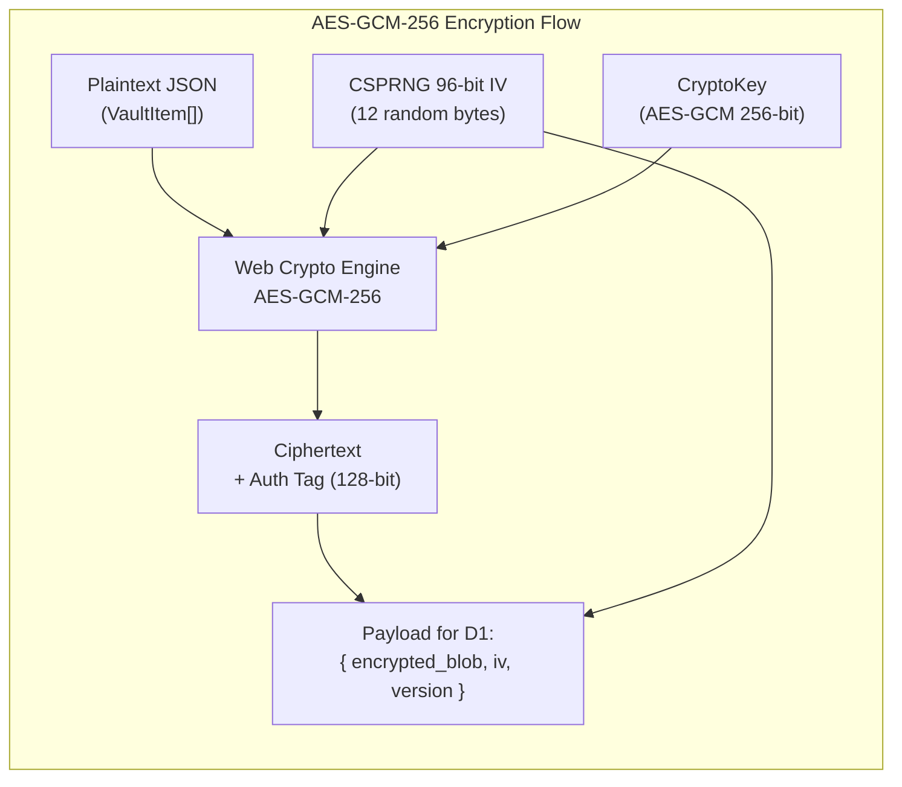
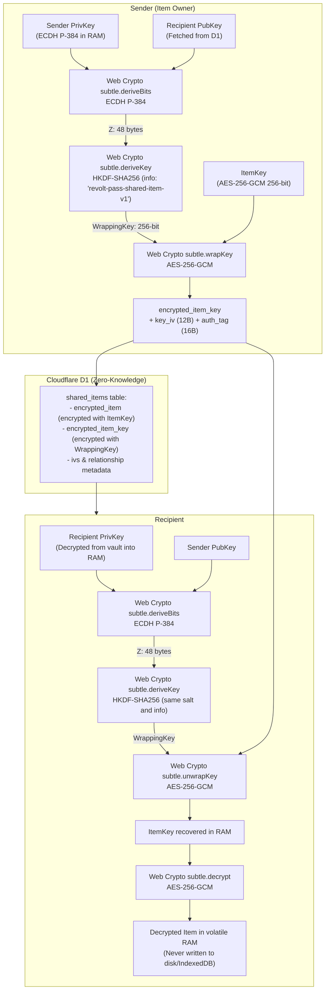
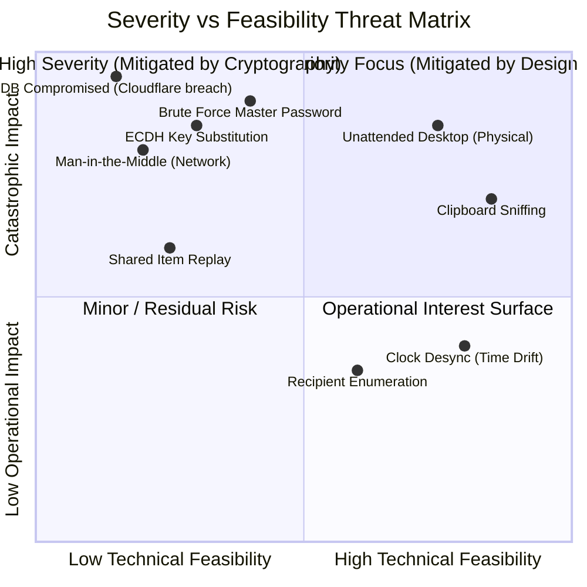

# Cryptographic Specification & Threat Model
## Project: Revolt Pass — Zero-Knowledge 2FA & Security Vault

| Metadata | Detail |
| :--- | :--- |
| **Document Identifier** | `RP-SEC-003` |
| **Version** | `1.4.4-PROD (v2.5 Design)` |
| **Status** | Approved / Cryptographic Grade Security Specification |
| **Frameworks & Standards** | OWASP ASVS v4.0, NIST SP 800-63B, RFC 6238, RFC 5869, W3C WebAuthn Level 3 |
| **Production Domain** | `https://<your-domain-or-subdomain>.workers.dev` |
| **License** | GNU AGPLv3 + Revolt Group Trademark Policy |

---

## 1. Formal Cryptographic Specification

Revolt Pass adheres to the **Zero-Knowledge** cryptographic paradigm. All operations including entropy generation, key derivation, symmetric encryption, and integrity verification occur exclusively within the client execution environment via the **Web Crypto API** (`window.crypto.subtle`), a native component compiled in C++ / Rust inside the browser engine and protected against user-space tampering.

### 1.1 Master Key Derivation (Key Derivation Function - KDF)
Deriving the master key from the user's password is governed by the following immutable parameters:

| Parameter | Canonical Value | Engineering Rationale / Standard |
| :--- | :--- | :--- |
| **Base Algorithm** | `PBKDF2` (Password-Based Key Derivation Function 2) | RFC 8018, industry standard natively supported in Web Crypto without external dependencies. |
| **Pseudorandom Function (PRF)** | `HMAC-SHA256` | Provides superior collision resistance compared to SHA-1 and mitigates length extension attacks. |
| **Iterations** | **$600,000$ rounds** | Exceeds the OWASP Password Storage Cheat Sheet threshold (minimum recommended: 600,000 for PBKDF2-HMAC-SHA256), enforcing a massive computational cost against GPU/ASIC clusters. |
| **Salt (Salting)** | $128 \text{ bits}$ ($16 \text{ bytes}$) random | Cryptographically generated via `crypto.getRandomValues(new Uint8Array(16))`. Unique per user, preventing rainbow table attacks. |
| **Derived Key Length** | $256 \text{ bits}$ ($32 \text{ bytes}$) | Exactly matches the length required for the symmetric `AES-GCM-256` key. |
| **Key Exportability** | `extractable: false` | The `CryptoKey` generated in RAM is marked non-extractable by JavaScript, preventing arbitrary extraction via object inspection. |

#### Mathematical Derivation Process:
$$\text{BaseKey} = \text{importKey}(\text{"raw"}, \text{encode}(\text{MasterPassword}), \text{"PBKDF2"})$$
$$\text{MasterKey} = \text{deriveKey}(\text{PBKDF2-HMAC-SHA256}, \text{BaseKey}, \text{Salt}, 600000, \text{"AES-GCM"}, 256)$$

To avoid blocking the main UI thread during the ~300-800 ms calculation of 600,000 iterations, this process is offloaded to an isolated **Web Worker** (`src/lib/crypto/kdf.worker.ts`).

---

### 1.2 Symmetric Encryption and Vault Authentication (AES-GCM)
The vault payload (list of TOTP accounts, Base32 secrets, recovery codes, and metadata) is serialized into a UTF-8 JSON string and processed using **AES-GCM (Advanced Encryption Standard in Galois/Counter Mode)**.



* **Key Size:** 256 bits (`AES-256`).
* **Initialization Vector (IV / Nonce):** 96 bits (12 bytes). **Strict invariant:** A new IV is generated via `crypto.getRandomValues(new Uint8Array(12))` **on every save operation**. Nonce reuse under AES-GCM destroys authenticity and enables plaintext recovery.
* **Authentication Tag:** 128 bits (16 bytes). Provides strict cryptographic integrity: any 1-bit alteration in transit or at rest triggers an immediate `OperationError` during `subtle.decrypt()`, thwarting tampering attacks.

---

### 1.3 Rapid Unlock Mechanism via WebAuthn / Passkeys
To ensure a frictionless experience without breaking the Zero-Knowledge boundary, Revolt Pass implements a hardware-backed **Local Key Wrapping** scheme via WebAuthn / FIDO2.

1. **Enrollment:**
   * The user authenticates with Master Password (producing `MasterKey`).
   * The client calls `navigator.credentials.create()` with:
     * `authenticatorAttachment: "platform"` (restricts to local platform hardware: Windows Hello, Touch ID / Face ID, Android Biometrics).
     * `userVerification: "required"` (forces biometric scan or Windows Hello PIN).
   * Client generates a random 256-bit symmetric `DeviceWrappingKey`.
   * `MasterKey` is wrapped using `DeviceWrappingKey` via AES-GCM, yielding `wrapped_master_key`.
   * `DeviceWrappingKey` is persisted securely in local browser storage, tied to the WebAuthn credential ID.
2. **Subsequent Unlock:**
   * Application requests assertion with `navigator.credentials.get({ publicKey: { challenge, userVerification: "required" } })`.
   * User provides Windows Hello PIN or biometric touch.
   * Following hardware TPM/Enclave verification, client unlocks `DeviceWrappingKey`, decrypts `wrapped_master_key`, and reconstructs `MasterKey` in volatile RAM.
   * If the credential is revoked or verification fails, keys are purged and Master Password is required.

---

### 1.4 TOTP Engine (RFC 6238 / RFC 4226)
One-Time Password generation strictly follows IETF standards:

1. **Base32 Decoding (RFC 4648):**
   * Sanitizes secrets by stripping null characters, hyphens, and whitespace.
   * Pure TypeScript Base32 decoder with alphabet `[A-Z2-7]`.
2. **Interval Calculation:**
   $$C_t = \left\lfloor \frac{T_{local} + \Delta T_{drift}}{X} \right\rfloor$$
   where $X = 30$ seconds and $\Delta T_{drift}$ is the edge time synchronization delta. Counter serialized as 64-bit Big-Endian integer (8 bytes).
3. **HMAC Generation:**
   * Signs $C_t$ with secret using `crypto.subtle.sign("HMAC", hmacKey, counterBuffer)`.
   * Supports `SHA-1` (20 bytes default) and `SHA-256` (32 bytes).
4. **Dynamic Truncation:**
   * Last byte determines offset:
     $$\text{offset} = \text{hash}[20 - 1] \ \& \ \text{0x0F}$$
   * Extracts 4 bytes masking sign bit:
     $$\text{binary} = ((\text{hash}[\text{offset}] \ \& \ \text{0x7F}) \ll 24) \ | \ ((\text{hash}[\text{offset} + 1] \ \& \ \text{0xFF}) \ll 16) \ | \ ((\text{hash}[\text{offset} + 2] \ \& \ \text{0xFF}) \ll 8) \ | \ (\text{hash}[\text{offset} + 3] \ \& \ \text{0xFF})$$
   * Computes final code via modulo:
     $$\text{token} = (\text{binary} \pmod{10^{\text{digits}}}).\text{toString}().\text{padStart}(\text{digits}, \text{'0'})$$

---

### 1.5 Asymmetric Cryptography & Key Agreement (ECDH P-384 + HKDF-SHA256 - ADR-014)
To enable cryptographically secure secret sharing between individual users without leaking plaintext to Cloudflare D1 and without requiring out-of-band pre-shared keys, Revolt Pass implements an **Asymmetric Key Encapsulation Mechanism (KEM)** built on **ECDH P-384** and **HKDF-SHA256**.



#### Canonical Cryptographic Parameters:
1. **Elliptic Curve:** NIST P-384 (`secp384r1`). Provides a 192-bit cryptographic security strength (exceeding P-256 and aligned with CNSA/NSA Suite B specifications), natively supported in the Web Crypto API without external libraries.
2. **Key Pair Generation:**
   $$\text{KeyPair} = \text{crypto.subtle.generateKey}(\{ \text{name: "ECDH"}, \text{namedCurve: "P-384"} \}, \text{extractable: true}, [\text{"deriveKey"}, \text{"deriveBits"} ])$$
   * Public key is exported in `spki` format (Base64 encoded) and registered in Cloudflare D1 column `users.ecdh_public_key`.
   * Private key is exported in `pkcs8` format, symmetrically encrypted with user's `MasterKey`, and stored inside the user's `encrypted_blob` in IndexedDB. It is never exposed to the server in plaintext.
3. **Diffie-Hellman Shared Secret Agreement (ECDH):**
   $$\mathcal{Z} = \text{ECDH}(\text{PrivKey}_A, \text{PubKey}_B) \in \mathbb{F}_p \quad (48 \text{ bytes})$$
4. **Key Derivation Function (HKDF-SHA256 - RFC 5869):**
   From the shared secret $\mathcal{Z}$, a 256-bit symmetric `WrappingKey` is derived, ensuring context separation and key independence:
   $$\text{PRK} = \text{HMAC-SHA256}(\text{Salt}, \mathcal{Z})$$
   $$\text{WrappingKey} = \text{HKDF-Expand}(\text{PRK}, \text{"revolt-pass-shared-item-v1"}, 256 \text{ bits})$$
5. **Secret Encapsulation (Key Wrapping):**
   The item's symmetric key (`ItemKey`, AES-256-GCM) is wrapped using the derived `WrappingKey`:
   $$\text{EncryptedKey}, \text{KeyTag} = \text{AES-GCM-256-Wrap}(\text{WrappingKey}, \text{ItemKey}, \text{KeyIV})$$
   The item content is encrypted with the `ItemKey`:
   $$\text{EncryptedItem}, \text{ItemTag} = \text{AES-GCM-256-Encrypt}(\text{ItemKey}, \text{ItemJSON}, \text{ItemIV})$$

---

## 2. Threat Model (STRIDE & Attack Vector Analysis)

Revolt Pass security posture is evaluated using Microsoft's **STRIDE** methodology alongside an attack vector matrix.



### Detailed Attack Vector Matrix and Mitigations

| Vector / ID | STRIDE Category | Threat Description | Impact | Implemented Mitigation Controls |
| :--- | :--- | :--- | :--- | :--- |
| **VEC-01** | *Information Disclosure* | **Cloudflare D1 Compromise:** A malicious actor or rogue employee with administrative access to Cloudflare extracts the `vaults` table. | Nil (Zero-Knowledge) | **Cryptographic Inviolability:** The database only stores AES-256-GCM encrypted blobs. Without the Master Password and salt, cracking the blob requires $2^{255}$ computational operations, which is physically impossible. |
| **VEC-02** | *Tampering* | **Data Tampering in Transit or Rest:** Malicious modification of bytes in `encrypted_blob` inside D1 to induce anomalous client behavior. | Nil (Immediate Rejection) | **GCM Authentication Tag:** AES-GCM verifies the 128-bit Authentication Tag. Modifying a single bit causes `crypto.subtle.decrypt` to throw an immutable error, immediately locking the app without processing corrupt data. |
| **VEC-03** | *Information Disclosure* | **Physical Access to Unattended Workstation:** The operator leaves their desk with the PWA unlocked in foreground. | Critical | **Inactivity & Background Auto-Lock:** RAM timer purges keys after 5 minutes of keyboard/mouse inactivity. Additionally, the `visibilitychange` event locks the vault if the tab remains hidden. |
| **VEC-04** | *Information Disclosure* | **Clipboard Sniffing:** Background applications or unprivileged malware monitoring the OS clipboard to capture TOTP or Recovery Codes. | High | **Scheduled Auto-Clear:** Routine with strict 45-second timer overwriting clipboard with empty text. Compares previous content to avoid clearing legitimate data if user copied something else in between. |
| **VEC-05** | *Information Disclosure* | **Offline Brute Force on Master Password:** Attacker steals salt and encrypted blob, attempting dictionary and hash-cracking attacks. | High | **High Work Factor (PBKDF2 600,000 rounds):** 600,000 iterations with SHA-256 force massive CPU/energy consumption per attempt, making brute force infeasible against strong passwords. |
| **VEC-06** | *Elevation of Privilege* | **Cross-Site Scripting (XSS) Attacks:** JavaScript injection to inspect browser memory or intercept keystrokes. | Critical | **Strict Isolation & CSP:** Content Security Policy blocking `unsafe-inline`, `unsafe-eval` and restricting external resource loading strictly to `self` and `cdn.simpleicons.org`. Zero runtime CDN dependencies. |
| **VEC-07** | *Denial of Service* | **Sync Failure Due to Connectivity Loss:** User travels on an airplane or encounters outages and needs access to corporate accounts. | High | **Absolute Offline Availability (100%):** Entire state remains encrypted in IndexedDB and assets precached in Service Worker. Operates indefinitely in airplane mode. |
| **VEC-NEW-01** | *Spoofing / Tampering* | **Malicious ECDH Public Key Substitution (Key Substitution Attack):** An attacker compromising Cloudflare D1 replaces a user's public key with their own to intercept and decrypt shared items addressed to that recipient. | Critical | **Out-of-Band Visual Fingerprint Verification:** The UI computes and presents the SHA-256 fingerprint of the recipient's public key (`SHA-256(spki)` in grouped hex or emoji-hash format). Users verify this fingerprint via an independent secure channel (Signal, voice call) before sharing sensitive secrets. |
| **VEC-NEW-02** | *Tampering / Replay* | **Replay or Insertion of Stale Shared Ciphertext:** An attacker replays an old shared ciphertext to overwrite an updated item or reverse a revocation. | Medium | **D1 Uniqueness Constraints & Monotonic Versions:** Database constraint `UNIQUE(owner_user_id, recipient_user_id, source_item_id)`, version monotonicity, and strict session authentication preventing third parties from injecting or modifying rows in `shared_items`. |
| **VEC-NEW-03** | *Information Disclosure* | **Mass Recipient Enumeration:** Automated scraping of the public key endpoint to identify registered usernames on the platform. | Low | **Edge Defense-in-Depth:** Requires an active authenticated session (`Authorization: Bearer <token>`) to query `/api/users/:username/public-key` and enforces Cloudflare Workers edge rate limiting against brute-force queries per IP. |

---

## 3. Engineering Mitigations and Best Practices

### 3.1 RAM Memory Hygiene
In garbage-collected browser environments, guaranteed memory wiping poses unique challenges. To mitigate secret persistence:
1. Keys are managed primarily as non-extractable `CryptoKey` objects.
2. Temporary keys or plaintext passwords handled as `Uint8Array` are explicitly overwritten with zeroes immediately after use:
   ```typescript
   function secureZeroBuffer(buffer: Uint8Array): void {
     buffer.fill(0);
   }
   ```
3. Upon lock event, the state variable `activeSessionState.masterKey` is set to `null` and dereferencing is invoked on vault items to allow immediate V8 garbage collection.

### 3.2 Content Security Policy (CSP) on Cloudflare
The Worker and response headers emitted by Cloudflare for the subdomain `https://<your-domain-or-subdomain>.workers.dev` apply the following canonical directive:

```http
Content-Security-Policy: default-src 'self'; script-src 'self'; style-src 'self' 'unsafe-inline'; img-src 'self' data: https://cdn.simpleicons.org; connect-src 'self'; font-src 'self'; object-src 'none'; frame-ancestors 'none'; base-uri 'self'; form-action 'self';
Strict-Transport-Security: max-age=31536000; includeSubDomains; preload
X-Content-Type-Options: nosniff
X-Frame-Options: DENY
X-XSS-Protection: 1; mode=block
Referrer-Policy: strict-origin-when-cross-origin
```

### 3.3 Automatic Clipboard Clearing Protocol (Algorithm)
```typescript
class ClipboardGuard {
  private timeoutId: number | null = null;
  private lastCopiedSecret: string | null = null;

  public copySecret(secret: string, clearDelayMs = 45000): void {
    if (this.timeoutId !== null) {
      window.clearTimeout(this.timeoutId);
    }

    navigator.clipboard.writeText(secret).then(() => {
      this.lastCopiedSecret = secret;
      this.timeoutId = window.setTimeout(async () => {
        try {
          // Only clear if the clipboard still holds the protected secret
          const currentText = await navigator.clipboard.readText();
          if (currentText === this.lastCopiedSecret) {
            await navigator.clipboard.writeText('');
          }
        } catch {
          // If read permissions fail, force preemptive blank write
          await navigator.clipboard.writeText('');
        } finally {
          this.lastCopiedSecret = null;
          this.timeoutId = null;
        }
      }, clearDelayMs);
    });
  }
}
```
This algorithm prevents inadvertent secret leaks into messaging applications, office suites, or screen capture tools.

### 3.4 Session Security and Cryptographic Token Hashing (D1)
* **Session Tokens:** Each authenticated client possesses an ephemeral session token generated on the client with high entropy (`crypto.getRandomValues`).
* **Database Breach Resistance:** Session tokens are never stored in plaintext within Cloudflare D1. The Worker computes a **SHA-256** hash of the token (`token_hash`) prior to database storage and indexing in the `sessions` table.
* **Immediate Granular Revocation:** If a session token is revoked individually (`is_revoked = 1`), any subsequent API request presenting that token is immediately rejected with HTTP `401 Unauthorized`.

### 3.5 Biometric Re-entry Mitigation & Hardware Passkeys Lifecycle (FIDO2)
* **Threat Vector:** In a corporate, shared, or public workstation environment, a user may log out of their session. However, if the workstation hardware maintains a registered Windows Hello PIN or biometric authenticator, a third party with physical access could attempt to re-authenticate without the Master Password.
* **Architectural Mitigation:**
  1. **Remote Passkey Revocation:** Users can list all enrolled Passkeys from any other device and revoke/delete them (`DELETE /api/passkeys/:id`).
  2. **Elimination of Windows Hello Bypass:** Insecure bypass flows have been eliminated, ensuring that no local key wrapping can be decrypted without completing standard platform authentication.

### 3.6 Strict Internationalization Privacy (Zero-Leak i18n)
* **Zero Third-Party APIs:** Unlike applications that proxy rendered DOM strings to cloud translation services (Google Translate, DeepL, etc.) — which risks leaking account descriptions, service names, and 2FA credentials —, Revolt Pass utilizes 100% static dictionaries compiled directly into the client bundle.
* **Zero Language Telemetry:** Locale preferences are stored purely in `localStorage.revolt_lang` and never transmitted to or logged on any remote server.

---

### 3.7 Extension of the Trust Model (Cross-Account Secure Sharing v2.5: Relationship Metadata vs. ZK Content)
Milestone v2.5 introduces asymmetric cross-account secret sharing. As an engineering transparency principle, we rigorously delineate what the central infrastructure learns versus what remains strictly inviolable under Zero-Knowledge:

#### 1. Information Learned by the Server / Cloudflare D1 (Relationship Metadata):
* **Transaction Participants:** Who shares (`owner_user_id`) and with whom (`recipient_user_id`).
* **Opaque Source Item Identifier:** The UUID/CUID identifier of the shared item (`source_item_id`).
* **Timestamps:** Sharing creation date (`created_at`), update date (`updated_at`), and revocation date (`revoked_at`).
* **Granted Permissions:** Whether the recipient possesses read-only (`read`) or collaborative edit (`write`) privileges.
* **ECDH P-384 Public Keys:** Public SPKI key representations required to perform Diffie-Hellman key agreement.

#### 2. Information 100% Shielded Under Zero-Knowledge (Content & Key Confidentiality):
* **Secret Content:** Usernames, passwords, TOTP seeds, backup codes, and notes (`encrypted_item`).
* **Item Symmetric Key (`item_key`):** Encapsulated (`encrypted_item_key`) under an AES-256-GCM wrapping key derived strictly in the browser RAM of the two parties via ECDH + HKDF.
* **Resilience to Centralized Breaches:** Even with a full database dump of D1 or compromised Worker execution at the edge, an attacker cannot decrypt items or extract symmetric keys, as no ECDH private key ever reaches the server or leaves the client unencrypted.
* **Volatile RAM Lifecycle:** Received shared items are decrypted in real time and retained **strictly in volatile client RAM**; they are never persisted as plaintext in IndexedDB, mitigating forensic recovery risks from lost or stolen devices.

