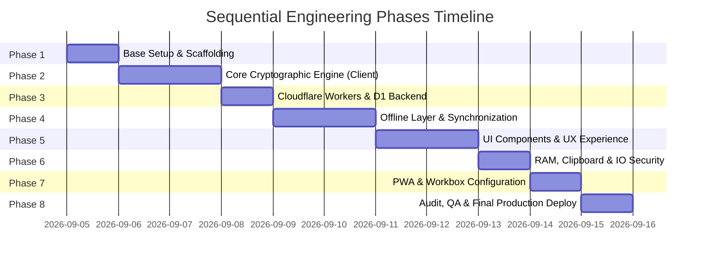

# Roadmap & Execution Plan
## Project: Revolt Pass — Zero-Knowledge 2FA & Security Vault

| Metadata | Detail |
| :--- | :--- |
| **Document Identifier** | `RP-RDM-005` |
| **Version** | `1.0.0-PROD` |
| **Status** | Approved / Sequential Execution Plan |
| **Remote Repository** | `https://github.com/Revolt-Group/revolt-pass.git` |
| **Primary Branch** | `main` |
| **Target URL** | `https://pass.revoltgroup.com.ar` |

---

## 1. Execution Methodology and Quality Gates

The implementation of **Revolt Pass** is organized into **8 rigorous sequential phases**. Each phase includes a distinct set of **Acceptance Criteria (Definition of Done - DoD)**. No subsequent phase may commence without the prior phase satisfying 100% of its acceptance criteria and receiving explicit technical verification.

---

## 2. Detailed Development Phases

### PHASE 1: Environment Setup and Base Scaffolding
* **Objective:** Initialize project structure with official tooling, strict TypeScript configuration, Tailwind CSS, and Wrangler support for Cloudflare D1.
* **Key Activities:**
  1. Initialization with `pnpm create vite . --template react-ts`.
  2. Installation of core dependencies: `tailwindcss`, `@tailwindcss/vite` (or PostCSS), `lucide-react`, `idb`, `@zxing/browser`, `vite-plugin-pwa`.
  3. Configuration of `tsconfig.json` with `strict: true`, `noImplicitAny: true`, `exactOptionalPropertyTypes: true`.
  4. Configuration of `wrangler.toml` binding D1 database (`DB`) and declaring environment variables.
  5. Git setup (`.gitignore`, verifying `main` branch and remote link `https://github.com/Revolt-Group/revolt-pass.git`).
* **Definition of Done (DoD) - Phase 1:**
  - [x] Command `pnpm build` compiles cleanly with 0 errors and 0 TypeScript warnings.
  - [x] Local development server (`pnpm dev`) responds in `<100ms`.
  - [x] `wrangler.toml` contains correct structural configuration for D1 and Workers.
  - [x] Clean Git repository with active `main` branch and exhaustive `.gitignore`.

---

### PHASE 2: Client Core Cryptographic Engine
* **Objective:** Implement native cryptographic suite in TypeScript following RFC 6238, RFC 4648, and Web Crypto API without external encryption dependencies.
* **Key Activities:**
  1. `src/lib/crypto/base32.ts`: Pure Base32 decoder and encoder handling canonical alphabets and flexible padding.
  2. `src/lib/crypto/totp.ts`: TOTP token generation with HMAC-SHA1 and HMAC-SHA256, time-step calculations, and dynamic truncation.
  3. `src/lib/crypto/kdf.worker.ts`: Dedicated Web Worker for PBKDF2-SHA256 derivation (600,000 iterations) without freezing the UI.
  4. `src/lib/crypto/vault.ts`: Authenticated vault encryption and decryption with AES-GCM (256-bit key, random 12-byte IV per operation, 128-bit tag).
  5. `src/lib/crypto/webauthn.ts`: FIDO2 registration and authentication module with platform authenticator (Windows Hello PIN and mobile biometrics) for local key wrapping.
* **Definition of Done (DoD) - Phase 2:**
  - [x] Unit tests validated against official RFC 6238 Appendix B vectors (exact tokens for predefined timestamps).
  - [x] JSON payload encryption and decryption generates identical output (*roundtrip test*).
  - [x] Intentional 1-bit tampering of `encrypted_blob` triggers immediate rejection by `AES-GCM` (`OperationError`).
  - [x] PBKDF2 executes in background Web Worker without blocking React visual rendering.

---

### PHASE 3: Edge Backend & Remote Persistence Layer
* **Objective:** Create REST API in Cloudflare Workers and provision relational schema in Cloudflare D1.
* **Key Activities:**
  1. Creation and execution of initial database migration (`schema.sql`) in Cloudflare D1.
  2. Creation of API router in Cloudflare Workers (`src/worker/index.ts`).
  3. Endpoint `GET /api/time`: Emitting server UTC timestamp with `Cache-Control: no-store` headers.
  4. Authentication endpoints: `POST /api/auth/register`, `GET /api/auth/salt`.
  5. Vault endpoints: `GET /api/vault` and `PUT /api/vault` with optimistic concurrency control (`version`).
  6. Strict security headers middleware (CSP, HSTS, X-Frame-Options, CORS for `pass.revoltgroup.com.ar`).
* **Definition of Done (DoD) - Phase 3:**
  - [x] D1 database initialized with `users`, `vaults`, and `sync_logs` tables.
  - [x] `GET /api/time` returns server timestamp with latency under 50ms.
  - [x] Attempts to update a vault with an outdated version deterministically return `HTTP 409 Conflict`.
  - [x] All responses packaged in canonical format `{ success, data, error, timestamp }`.

---

### PHASE 4: Local Persistence Layer & Offline Synchronization
* **Objective:** Ensure data sovereignty and 100% offline availability via IndexedDB and asynchronous synchronization engine.
* **Key Activities:**
  1. `src/lib/storage/idb.ts`: Initialization of `idb` with `vault_encrypted`, `user_config`, and `sync_queue` stores.
  2. `src/lib/sync/syncEngine.ts`: Synchronization state machine (`synced`, `dirty`, `syncing`, `conflict`).
  3. Last-Write-Wins conflict resolution algorithm per item (`VaultItem.updated_at`).
  4. Time Drift Synchronizer: millimetric offset calculation between workstation clock and Worker.
* **Definition of Done (DoD) - Phase 4:**
  - [x] Application can be closed and reopened offline, retrieving the latest local encrypted state.
  - [x] Offline modifications automatically sync with D1 as soon as connectivity is restored (`window.addEventListener('online')`).
  - [x] Time drift accurately compensated if operating system clock is intentionally altered by 5 minutes.

---

### PHASE 5: UI Components & Fortune 500-Grade User Experience
* **Objective:** Build Dark-Mode First user interface inspired by the aesthetic standards of Raycast, Linear, and Vercel.
* **Key Activities:**
  1. `src/components/VaultList.tsx`: Fluid account listing with instant filtering, tag grouping, and pinned favorites section (`pinned`).
  2. `src/components/TotpCard.tsx`: Card with brand logo, name, circular SVG countdown indicator, copy button with haptic feedback (`navigator.vibrate`), and collapsible Recovery Codes section.
  3. `src/components/CommandPalette.tsx`: Universal floating search accessible via `Ctrl + K` / `Cmd + K`.
  4. `src/components/QrModal.tsx`:
     * Live camera scanning with device selector via `@zxing/browser`.
     * Dropzone to drag images/screenshots.
     * Global paste interceptor (`Ctrl + V`) to scan clipboard screenshots directly.
  5. `src/components/PasswordGeneratorModal.tsx`: High-entropy password generator with bit calculation.
  6. `src/components/BrandIcon.tsx`: Simple Icons CDN integration with fallback to deterministic gradient monogram.
* **Definition of Done (DoD) - Phase 5:**
  - [x] Fully responsive interface on mobile screens (375px) and 4K desktop displays.
  - [x] Shortcut `Ctrl + K` opens command palette in under 50ms and copies code with `Enter`.
  - [x] QR scanning works seamlessly via camera, dropping an image, or pressing `Ctrl + V`.
  - [x] Circular countdown animation updates smoothly without frame drops.

---

### PHASE 6: Memory, Clipboard & Backup Security
* **Objective:** Harden local application attack surface against data leaks.
* **Key Activities:**
  1. `src/lib/security/autoLock.ts`: Mouse/keyboard inactivity timer purging RAM variables after 5 minutes (configurable).
  2. Reactive locking on tab visibility (`visibilitychange`).
  3. `src/lib/security/clipboardGuard.ts`: Clipboard auto-clearing after 45 seconds with content verification.
  4. Fast unlock modal with priority support for **Windows Hello PIN** on PC and biometrics on smartphones.
  5. Export/import module: JSON file encrypted with Master Key and optional plaintext download under destructive confirmation.
* **Definition of Done (DoD) - Phase 6:**
  - [x] After 5 minutes without mouse/keyboard activity, application returns to lock screen and `MasterKey` in memory is destroyed.
  - [x] Copying a TOTP code clears the OS clipboard verifiably after exactly 45 seconds.
  - [x] Quick unlock with Windows Hello PIN restores session in <400ms.
  - [x] Vault export and import completely reconstitutes all accounts, tags, and recovery codes.

---

### PHASE 7: PWA, Service Worker & Offline Hardening
* **Objective:** Transform project into a fully installable, resilient Progressive Web App at operating system level.
* **Key Activities:**
  1. Configuration of `vite-plugin-pwa` in `vite.config.ts` with canonical manifest (`name: "Revolt Pass"`, `short_name: "RevoltPass"`, `theme_color: "#0a0a0c"`).
  2. Generation and provisioning of PWA icons (`192x192`, `512x512`, `maskable`, `apple-touch-icon`).
  3. Configuration of Workbox caching rules to precache 100% of static bundles.
  4. Native installation testing on Windows (standalone window PWA) and mobile phones.
* **Definition of Done (DoD) - Phase 7:**
  - [x] PWA scores 100/100 on Google Lighthouse PWA audit.
  - [x] App installs as native desktop application on Windows 10/11 with high-resolution icon.
  - [x] Physical network disconnection allows continuous navigation and TOTP code generation without interruption.

---

### PHASE 8: Security Audit, QA & Production Deployment
* **Objective:** Perform exhaustive verification, dependency checking, and production deployment onto `pass.revoltgroup.com.ar`.
* **Key Activities:**
  1. Dependency security audit (`pnpm audit`).
  2. Bundle size verification and dead-code elimination (*tree shaking*).
  3. API and D1 database deployment via `wrangler deploy` and `wrangler d1 migrations apply`.
  4. Frontend deployment on Cloudflare Pages / Workers Sites linked to `pass.revoltgroup.com.ar`.
  5. DNS record verification, SSL certificates, and security headers in production.
* **Definition of Done (DoD) - Phase 8:**
  - [x] Production fully operational and responding at `https://pass.revoltgroup.com.ar`.
  - [x] "A+" rating on SSL Labs / SecurityHeaders security tests.
  - [x] Complete user registration and vault synchronization tested on live Cloudflare D1.
  - [x] Zero financial budget consumption (100% contained within Cloudflare's free tier).
