# Roadmap & Technical Evolution Plan
## Project: Revolt Pass — Zero-Knowledge 2FA & Security Vault

| Metadata | Detail |
| :--- | :--- |
| **Document Identifier** | `RP-RDM-005` |
| **Current Version** | `1.4.4-PROD` (Live & Production Ready) |
| **Status** | Approved / Quality-Driven Milestone Evolution Plan |
| **Remote Repository** | `https://github.com/Revolt-Group/revolt-pass.git` |
| **Primary Branch** | `main` |
| **Timeline Philosophy** | Quality & Security First (Quality-Driven, no arbitrary calendar day limits) |
| **License** | GNU AGPLv3 + Revolt Group Trademark Policy |

---

## 1. Engineering Philosophy and Quality Gates

At **Revolt Pass**, software engineering and architectural evolution are guided by an unyielding commitment to **security, cryptographic resilience, and world-class user experience**, prioritizing technical rigor and thorough validation over arbitrary calendar deadlines or artificial day estimates.

Every milestone or product release is structured around a rigorous **Definition of Done (DoD)**. No feature or architectural change is promoted to production or marked as complete without satisfying 100% of its automated unit tests, strict static type checks (`tsc -b`), memory hygiene audits, and Zero-Knowledge security verification.

```mermaid
flowchart TD
    subgraph COMPLETADAS ["✅ Production Foundation in Production (v1.0 — v1.4.4)"]
        v10["Phases 1 to 8: Cryptographic Core & PWA<br/>AES-256-GCM, PBKDF2 600k in Web Worker, Cloudflare D1 Edge, WebAuthn, AutoLock"]
        v11["Phase 9: Multi-Device & Auditing (v1.1)<br/>D1 Sessions, Granular Remote Revocation, FIDO2 Passkeys, Audit Logs"]
        v12["Phases 10 & 11: i18n, Backups & Open Source Release (v1.2.1)<br/>Bilingual i18n ES/EN, Encrypted Backups, Private Instance Mode, AGPLv3"]
        v13["Phase 12: Hygiene & HaveIBeenPwned (v1.3.0)<br/>k-Anonymity SHA-1, Base32 Entropy Alerts, Visual Scorecard"]
        v131["Phase 13: Hardening & Token Rotation (v1.3.1)<br/>Strict CSP, Edge Rate Limiter, Scoped CORS, Sliding Token Rotation"]
        v14["Milestone v1.4.0: Universal Importers, Exporters & YubiKey<br/>Google Auth, Aegis, 2FAS, Bitwarden + otpauth:// export & FIDO2 roaming"]
        v141["Milestone v1.4.1: Mass QR Exporter & Individual Viewer<br/>Protobuf carousel matching Google Authenticator"]
        v142["Milestone v1.4.2: Mobile Overhaul<br/>Contained design, anti-zoom viewport, touch dropdowns"]
        v143["Milestone v1.4.3: Cloud Sync Fix & Key Preservation<br/>Recovery code retention across imports and reactive sync"]
        v144["Milestone v1.4.4: Session Revocation Fix & Auto-Deduplication<br/>End of session revocation loops & zero-data-loss deduplication"]
        v10 --> v11 --> v12 --> v13 --> v131 --> v14 --> v141 --> v142 --> v143 --> v144
    end

    subgraph PROXIMAS ["🔵 Technical Evolution Horizons (Upcoming Versions)"]
        v15["Milestone v1.5: Argon2id KDF & Web Push / BYOK Email<br/>Argon2id WASM cryptographic upgrade, Resend / Cloudflare Email Workers"]
        v20["Milestone v2.0: Full Secret Suite & Vault Evolution<br/>Passwords, Credit Cards, Notes, SSH, 5d Snapshots, Emergency Kit, per-item encrypted_key"]
        v21["Milestone v2.1: Browser Extension (Manifest V3)<br/>Contextual Autofill via eTLD+1 Matching, Inline 2FA Token Injection, 2m Auto-lock"]
        v22["Milestone v2.2: Native Desktop Application (Tauri v2 + Rust)<br/>Lightweight Binary <10MB, OS Windows Hello / Touch ID, Signed Auto-updater"]
        v23["Milestone v2.3: Command Line Interface CLI (rpctl)<br/>Terminal secret retrieval, environment variable injection"]
        v24["Milestone v2.4: Duress Password & Plausible Deniability<br/>Decoy vault, emergency silent auditing"]
        v25["Milestone v2.5: ECDH P-384 Secure Sharing (ADR-014)<br/>Cross-user Zero-Knowledge secret sharing via native Web Crypto ECIES"]
        v30["Milestone v3.0: Decoupled Self-Hosted Backend<br/>Docker Compose, standalone VPS, alternative to Cloudflare D1"]
        v144 -.-> v15 --> v20 --> v21 --> v22 --> v23 --> v24 --> v25 --> v30
    end

    style COMPLETADAS fill:#0f172a,stroke:#22c55e,stroke-width:2px,color:#f8fafc
    style PROXIMAS fill:#090d16,stroke:#6366f1,stroke-width:2px,stroke-dasharray: 5 5,color:#f8fafc
    style v10 fill:#1e293b,stroke:#3b82f6,color:#fff
    style v11 fill:#1e293b,stroke:#3b82f6,color:#fff
    style v12 fill:#166534,stroke:#22c55e,color:#fff
    style v13 fill:#166534,stroke:#22c55e,color:#fff
    style v131 fill:#166534,stroke:#22c55e,color:#fff
    style v14 fill:#166534,stroke:#22c55e,color:#fff
    style v141 fill:#166534,stroke:#22c55e,color:#fff
    style v142 fill:#166534,stroke:#22c55e,color:#fff
    style v143 fill:#166534,stroke:#22c55e,color:#fff
    style v144 fill:#166534,stroke:#22c55e,color:#fff
    style v15 fill:#1e1b4b,stroke:#818cf8,color:#fff
    style v20 fill:#1e1b4b,stroke:#818cf8,color:#fff
    style v21 fill:#1e1b4b,stroke:#818cf8,color:#fff
    style v22 fill:#1e1b4b,stroke:#818cf8,color:#fff
    style v23 fill:#1e1b4b,stroke:#818cf8,color:#fff
    style v24 fill:#1e1b4b,stroke:#818cf8,color:#fff
    style v25 fill:#1e1b4b,stroke:#22c55e,color:#fff
    style v30 fill:#1e1b4b,stroke:#818cf8,color:#fff
```

---

## 2. Block I: Deployed Foundation Phases (v1.0 — v1.4.4)

The following foundational phases represent the architectural baseline that is **100% implemented, audited, and live in production**:

### PHASE 1: Environment Setup and Base Scaffolding
* **Objective:** Initialize project structure with official tooling, strict TypeScript configuration, Tailwind CSS, and Wrangler support for Cloudflare D1.
* **Definition of Done (DoD) - Phase 1:**
  - [x] Command `pnpm build` compiles cleanly with 0 errors and 0 TypeScript warnings.
  - [x] Local development server (`pnpm dev`) responds in `<100ms`.
  - [x] `wrangler.toml` contains correct structural configuration for D1 and Workers.
  - [x] Clean Git repository with active `main` branch and exhaustive `.gitignore`.

---

### PHASE 2: Core Cryptographic Engine on Client
* **Objective:** Implement native TypeScript cryptographic suite adhering to RFC 6238, RFC 4648, and Web Crypto API standards, free from obsolete third-party dependencies.
* **Definition of Done (DoD) - Phase 2:**
  - [x] Unit tests validated against official vectors in RFC 6238 Appendix B.
  - [x] JSON payload encryption and decryption yields identical data (*roundtrip test*).
  - [x] Intentional 1-bit tampering in the ciphertext triggers immediate rejection by `AES-GCM` (`OperationError`).
  - [x] PBKDF2 (600,000 rounds) executes in background via dedicated Web Worker without freezing the React UI thread.

---

### PHASE 3: Edge Backend & Remote Persistence Layer
* **Objective:** Build REST API on Cloudflare Workers and provision relational schema on Cloudflare D1.
* **Definition of Done (DoD) - Phase 3:**
  - [x] D1 database provisioned with relational tables.
  - [x] `GET /api/time` returns server timestamp with <50ms latency for Time Drift compensation.
  - [x] Vault updates with stale versions deterministically return `HTTP 409 Conflict`.
  - [x] All responses packaged in canonical format `{ success, data, error, timestamp }`.

---

### PHASE 4: Local Persistence Layer & Offline Sync
* **Objective:** Guarantee data sovereignty and 100% offline availability via IndexedDB and asynchronous sync engine.
* **Definition of Done (DoD) - Phase 4:**
  - [x] Application opens and operates fully without Internet connectivity, loading encrypted local state.
  - [x] Offline modifications sync automatically to D1 upon network restoration (`window.addEventListener('online')`).
  - [x] Time drift is smoothly compensated even if client clock is intentionally skewed.

---

### PHASE 5: UI Components & Dark-Mode First UX Experience
* **Objective:** Build Fortune 500-grade Dark-Mode First interface inspired by Raycast, Linear, and Vercel design systems.
* **Definition of Done (DoD) - Phase 5:**
  - [x] Fully responsive layout on mobile screens (375px) and 4K desktop displays.
  - [x] Shortcut `Ctrl + K` opens Command Palette in <50ms with instant `Enter` key copying.
  - [x] QR code scanning functions seamlessly via webcam, file dropzone, or clipboard paste (`Ctrl + V`).
  - [x] Circular SVG countdown animation renders smoothly at 60 FPS without stutter.

---

### PHASE 6: Memory Security, Clipboard Guard & Backups
* **Objective:** Shield client application surface from memory leakages and clipboard hijacking.
* **Definition of Done (DoD) - Phase 6:**
  - [x] After mouse/keyboard inactivity or tab visibility change, session locks and RAM `MasterKey` is destroyed.
  - [x] Copying a TOTP token or secret triggers guarded clipboard wipe after 45 seconds.
  - [x] Quick unlock with Windows Hello PIN or mobile biometrics restores session instantly.
  - [x] Encrypted JSON vault export/import faithfully restores accounts, tags, and recovery codes.

---

### PHASE 7: PWA, Service Worker & Offline Hardening
* **Objective:** Deliver a Progressive Web App installable across major operating systems.
* **Definition of Done (DoD) - Phase 7:**
  - [x] PWA achieves 100/100 score on Google Lighthouse PWA audit.
  - [x] App installs as standalone desktop window on Windows 10/11 and mobile devices.
  - [x] Physical network disconnection allows continuous vault operations without interruption.

---

### PHASE 8: Security Audit, QA & Production Deployment
* **Objective:** Subject the application to rigorous verification, dependency audit, and production deployment.
* **Definition of Done (DoD) - Phase 8:**
  - [x] Production service operational globally on Cloudflare edge network with ultra-low latency.
  - [x] "A+" rating on SSL Labs / SecurityHeaders security benchmarks.
  - [x] Complete test suite of 73 unit and integration tests passing at 100% in Vitest.
  - [x] Zero financial operating overhead (sustainably contained within Cloudflare free tier).

---

### PHASE 9: Security Panel, Multi-Device Sessions & Passkey Lifecycle (v1.1.0)
* **Objective:** Provide users with granular control and visibility over all active sessions and biometric passkeys.
* **Definition of Done (DoD) - Phase 9:**
  - [x] D1 relational tables `sessions`, `passkeys`, and `audit_logs` provisioned.
  - [x] Granular individual and remote session termination operational with instant client memory wipe.
  - [x] Remote passkey deletion neutralizes biometric re-entry on external workstations.
  - [x] Custom device and passkey names permanently preserved across browser refreshes (`Ctrl + F5`).

---

### PHASE 10: Zero-Knowledge Bilingual Internationalization (i18n ES/EN) (v1.2.0)
* **Objective:** Implement comprehensive native Spanish and English support without cloud translation APIs or runtime overhead.
* **Definition of Done (DoD) - Phase 10:**
  - [x] Synchronous static TypeScript dictionaries in `src/i18n/locales/es.ts` and `en.ts` with strict typing.
  - [x] 100% key parity enforced at build time (`tsc -b`) and validated by Vitest.
  - [x] Dynamic language switching with browser language autodetection and telemetry-free local persistence.

---

### PHASE 11: Private Instance Decoupling, AGPLv3 License & Security Policy (v1.2.1)
* **Objective:** Open the codebase to the community while securing the owner's private instance and establishing responsible disclosure channels.
* **Definition of Done (DoD) - Phase 11:**
  - [x] `VITE_PRIVATE_INSTANCE` environment variable decoupled: open (`false`) in public repo, restricted (`true`) on owner's instance.
  - [x] Restricted Access Overlay with capture-phase unlock shortcuts (`Ctrl + Alt + U`, `Ctrl + Shift + U`, and triple-click on shield).
  - [x] D1 SQLite `BEFORE INSERT` trigger providing defense-in-depth against unauthorized accounts on production database.
  - [x] **GNU AGPLv3** license adopted with **Trademark & Brand Assets Policy (Section 7(e))**.
  - [x] Canonical bilingual security policies [`SECURITY.md`](../../SECURITY.md) and [`SECURITY.es.md`](../../SECURITY.es.md) integrated with GitHub Private Vulnerability Reporting.

---

### PHASE 12: Hygiene Diagnostics, Scorecard & HaveIBeenPwned k-Anonymity (v1.3.0)
* **Objective:** Equip the vault with proactive vulnerability telemetry, cryptographic hygiene diagnostics, and breach detection under a strict Zero-Knowledge k-Anonymity model.
* **Definition of Done (DoD) - Phase 12:**
  - [x] No plaintext password, full secret, or SHA-1 hash longer than 5 characters ever leaves the client device (k-Anonymity privacy guarantee with anti-analysis padding and Cloudflare proxy caching).
  - [x] Client-side hygiene engine accurately detects duplicate secrets, weak entropy Base32 (<80b), missing backup recovery codes, and stale backup exports (>30d).
  - [x] Interactive visual health scorecard with real-time percentage gauge and direct remediation actions.
  - [x] Real-time k-Anonymity HaveIBeenPwned breach tester with transparent zero-knowledge explanation.
  - [x] Full suite of 88 automated unit and integration tests passing at 100% in Vitest with 0 strict TypeScript errors (`tsc -b`).

---

### PHASE 13: Edge Security Hardening & Sliding Session Token Rotation (v1.3.1)
* **Objective:** Align runtime defenses with the documented threat model, mitigate user enumeration via edge rate limiting, enforce scoped CORS origins, and protect active sessions with continuous token rotation.
* **Definition of Done (DoD) - Phase 13:**
  - [x] Strict Content-Security-Policy (CSP) headers applied to all static asset responses from the Worker (mitigating VEC-06 / XSS).
  - [x] Native Cloudflare Workers edge rate limiter on `/api/auth/salt` and `/api/auth/register` returning `Retry-After: 60`.
  - [x] CORS allowed origin dynamically restricted to `env.APP_DOMAIN` in production, falling back to wildcard only on unconfigured development environments.
  - [x] Automatic sliding session token rotation on vault synchronization (`GET` and `PUT /api/vault`) with immediate revocation of the previous token in Cloudflare D1.
  - [x] Client PWA (`syncEngine.ts`) intercepts `X-New-Session-Token` and updates the active session in IndexedDB (`user_config`).
  - [x] Automated test suite expanded to 94 tests passing at 100% in Vitest with 0 strict TypeScript compilation errors (`tsc -b`).

---

### PHASE 14: Universal Importers, Open Vault Exporters & Physical Roaming Keys (v1.4.0)
* **Objective:** Remove switching friction by enabling smooth zero-knowledge migration from 10 industry-standard platforms, provide open-standard export formats, support physical roaming security keys (YubiKey / FIDO2), and export security audit logs.
* **Definition of Done (DoD) - Phase 14:**
  - [x] Pure TypeScript Protobuf binary decoder for Google Authenticator `otpauth-migration://offline?data=...` migration payloads.
  - [x] Multi-platform unit-tested parsers for Authy JSON, Aegis JSON, 2FAS JSON, Bitwarden JSON/CSV, 1Password CSV/1PUX, Proton Pass JSON/CSV, Ente Auth JSON, LastPass CSV, and `otpauth://` URI lists.
  - [x] Interactive smart reconciliation engine with diff preview (`new`, `duplicate`, `conflict`) and user-selectable resolution strategies (`keep existing`, `overwrite`, `keep both`).
  - [x] Open vault exporters for Aegis JSON, Bitwarden CSV, and plain `otpauth://` lists.
  - [x] WebAuthn `cross-platform` attachment support for hardware roaming security keys (YubiKey 5 Series, Feitian, SoloKeys, Nitrokey) with USB, NFC, and BLE transport handling.
  - [x] Security audit trail export to CSV and JSON directly from the Security Modal.
  - [x] Sliding session token concurrency resilience with D1 `prev_token_hash` grace window and IndexedDB client re-sync.
  - [x] Test suite expanded to 111 tests passing at 100% in Vitest with 0 TypeScript compilation errors (`tsc -b`).

---

## 3. Block II: Technical Evolution & Product Horizons

The following milestones define the future product evolution. Each milestone will be implemented sequentially and promoted to production strictly upon reaching 100% of its technical quality gates:

---

### 📍 Milestone v2.0: Full Secret Suite & Vault Evolution
* **Objective:** Expand Revolt Pass from a dedicated 2FA authenticator into a full-scale Zero-Knowledge password and secrets management suite.
* **Key Deliverables:**
  1. **Polymorphic Vault Items:**
     - **Logins:** Username, password, website URLs with eTLD+1 matching, TOTP seed, and custom fields.
     - **Payment Cards:** Cardholder name, card number, expiration date, and CVV security code.
     - **Secure Notes:** Rich text editor with client-side encrypted Markdown.
     - **Server & SSH Keys:** Public/private key pairs, passphrases, and API access tokens.
     - **Identities:** Passports, national identity documents, and driver's licenses.
  2. **Relational Schema Evolution in D1:**
     - Unified `vault_items` table with polymorphic AES-256-GCM encrypted payloads.
     - `folders` table with client-side encrypted folder names.
  3. **Password History & Trash Bin:**
     - History of the last 5 previous passwords retained inside encrypted payload.
     - Trash bin with automatic permanent purge after 30 days and immediate manual recovery.
  4. **Symmetric Key per Item (Architectural Foundation for v2.5 Sharing):**
     - Each `vault_items` row introduces its own symmetric key `item_key` (AES-256-GCM 256-bit) wrapped inside the `encrypted_key` column via the user's `masterKey`, moving beyond monolithic blobs and enabling future asymmetric re-wrapping.
* **Definition of Done (DoD) - v2.0:**
  - [ ] Backwards compatibility guaranteed: existing v1.x 2FA vaults migrate seamlessly with zero data loss.
  - [ ] Client decryption latency remains <100ms for vaults containing over 1,000 secret items.
  - [ ] Database schema preserves Zero-Knowledge paradigm without revealing secret types or metadata to the server.
  - [ ] Each `vault_items` record features its own `item_key` wrapped inside `encrypted_key` using the `masterKey`, guaranteeing per-item cryptographic isolation required by Milestone v2.5.

---

### 📍 Milestone v2.1: Browser Extension (Manifest V3)
* **Objective:** Provide seamless contextual autofill across Chrome, Edge, Brave, and Firefox.
* **Key Deliverables:**
  1. **Manifest V3 Architecture:**
     - Background Service Worker sharing 100% of the cryptographic and sync logic from `src/lib/`.
     - In-memory key management with auto-lock alarms via `chrome.alarms`.
  2. **Context-Aware DOM Injection:**
     - Detection of credential fields and display of accounts filtered by current tab origin (`window.location.origin`).
     - Automated copy or inline injection of 6-digit TOTP token upon login form submission.
* **Definition of Done (DoD) - v2.1:**
  - [ ] Full compliance with Chrome Web Store and Firefox Add-ons extension store guidelines.
  - [ ] Strict cross-origin isolation preventing credential leakage across browser tabs.

---

### 📍 Milestone v2.2: Native Desktop Application (Tauri v2 + Rust)
* **Objective:** Deliver an ultra-lightweight desktop experience with native OS hardware security integration.
* **Key Deliverables:**
  1. **Rust-Powered Tauri v2 Core:**
     - Lightweight compiled binary with minimal memory footprint (~25 MB RAM vs >150 MB in Electron) and <10 MB installer size.
  2. **Hardware Security Integration:**
     - Direct communication with native OS APIs: **Windows Hello** (`windows-rs`) and **macOS Touch ID** (`LocalAuthentication`).
  3. **Global Floating Quick-Search Palette:**
     - Operating-system-wide shortcut (`Ctrl + Shift + Space` / `Cmd + Shift + Space`) invoking floating search overlay over any active window.
     - Direct keyboard simulation (*auto-type*) for injecting credentials into terminal windows and legacy applications.
* **Definition of Done (DoD) - v2.2:**
  - [ ] Official install packages compiled for Windows (MSIX/EXE), macOS (Universal DMG), and Linux (AppImage/Deb).
  - [ ] Cold start latency under 250ms.
  - [ ] Offline vault persisted in local SQLite database encrypted with SQLCipher.

---

### 📍 Milestone v2.3: Command Line Interface CLI (`rpctl`)
* **Objective:** Enable developers and system administrators to query secrets and generate TOTP tokens directly from terminal environments.
* **Key Deliverables:**
  1. **CLI Binary in Rust / Go:** Interaction with the Worker API authenticated via ephemeral session tokens or local encrypted API keys.
  2. **Environment Variable Injection:** `rpctl run -- <command>` injecting secrets directly into child process memory without writing to disk.

---

### 📍 Milestone v2.4: Duress Password & Plausible Deniability
* **Objective:** Provide plausible deniability in extreme physical coercion or forced inspection scenarios.
* **Key Deliverables:**
  1. **Decoy Vault:** Unlocking via an alternative duress password opens a legitimate decoy vault containing innocuous generic accounts.
  2. **Silent Audit Log:** Discrete audit logging and optional proactive alert dispatched to emergency contacts.

---

### 📍 Milestone v2.5: Cross-Account Secure Sharing (ECDH P-384 + ECIES - ADR-014)
* **Objective:** Enable cryptographically secure cross-account sharing of individual items (organization TOTPs, shared credentials) between Revolt Pass users under a strict Zero-Knowledge model, establishing Revolt Pass as the only free open-source ZK manager with native cross-account sharing capabilities.
* **Blocking Pre-requisites:**
  - `v2.0` completed with per-item symmetric key model (`item_key` in `encrypted_key`).
  - `ADR-014` formally adopted.
* **Cryptographic Architecture:**
  - **ECDH P-384:** Client-side keypair generation; public key stored in D1, private key stored encrypted inside user's personal vault.
  - **HKDF-SHA256:** Derivation of AES-256-GCM `wrapping_key` from ECDH shared secret with domain separation context.
  - **AES-256-GCM Wrapping:** Encapsulation of the shared item's `item_key`. D1 stores only ciphertext and wrapped key.
* **Cloudflare D1 Database Schema:**
  - `ALTER TABLE users ADD COLUMN ecdh_public_key TEXT DEFAULT NULL;`
  - Table `shared_items` (`id`, `owner_user_id`, `recipient_user_id`, `source_item_id`, `encrypted_item`, `item_iv`, `encrypted_item_key`, `key_iv`, `permissions`, `version`, `created_at`, `updated_at`, `revoked_at`).
* **API Endpoints Catalog:**
  - `GET /api/users/:username/public-key`: Retrieve recipient ECDH public key (requires authenticated session).
  - `POST /api/users/me/ecdh-key`: Register or rotate user's ECDH public key.
  - `POST /api/shared-items`: Share wrapped item with recipient.
  - `GET /api/shared-items`: List incoming shared items for client-side unwrap and decrypt.
  - `GET /api/shared-items/sent`: List outgoing items shared by current user.
  - `PUT /api/shared-items/:id`: Update shared payload (if `permissions='write'`).
  - `DELETE /api/shared-items/:id`: Revoke recipient access (owner) or decline shared item (recipient).
* **Client-Side Modules:**
  - `src/lib/crypto/sharing.ts`: `generateUserECDHKeyPair`, `deriveWrappingKey`, `encryptSharedItem`, `decryptSharedItem`.
  - Decrypted shared items reside **strictly in volatile RAM memory**; never persisted as plaintext in IndexedDB.
* **Revocation Model & ZK Inherent Limitation:**
  - Revocation blocks future sync updates and removes the item from recipient sync, recording the event in `audit_logs`.
  - UI displays standard security recommendation: rotate the secret on the destination service if the credential was critical.
* **Mitigations for New Threat Vectors:**
  - `VEC-NEW-01` (Public key substitution) → Mitigated via visual key fingerprint verification modal in UI.
  - `VEC-NEW-02` (Replay of shared ciphertext) → Mitigated via session authentication and unique D1 constraints (`owner + recipient + source_item_id`).
  - `VEC-NEW-03` (Recipient enumeration) → Mitigated via edge rate limiter and mandatory authentication.
* **Definition of Done (DoD) - v2.5:**
  - [ ] Unit tests confirming round-trip: `encryptSharedItem` → `decryptSharedItem` reproduces exact original secret.
  - [ ] Tampering with 1 bit of `encrypted_item` or `encrypted_item_key` triggers immediate `OperationError` via AES-GCM tag verification.
  - [ ] ECDH private key is never transmitted outside client nor stored in D1.
  - [ ] Context menus in `TotpCard` and `EditAccountModal` offer "Share with..." flow with permission selection (`read` / `write`).
  - [ ] "Shared Items" tab in `SecurityModal` with revocation controls for owners and rejection for recipients.
  - [ ] Visual badge indicators distinguishing owned items from received shared items.
  - [ ] All endpoints protected by strict session validation and audited in `audit_logs`.
  - [ ] 0 errors in `tsc -b`, 100% automated test suite passing.

---

### 📍 Milestone v3.0: Decoupled Self-Hosted Backend (Docker / VPS)
* **Objective:** Enable deployment of the sync backend on user-controlled infrastructure outside Cloudflare (Docker Compose / VPS), utilizing SQLite or PostgreSQL while maintaining full compatibility with the PWA client.
