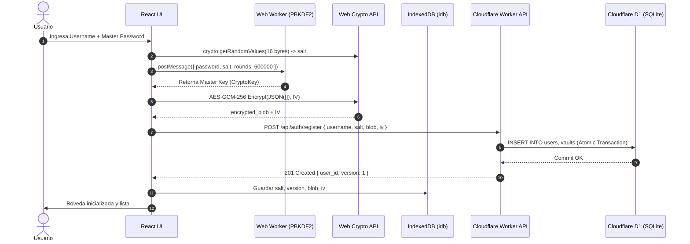
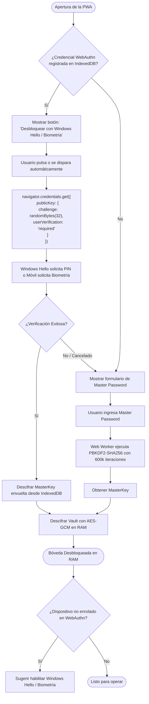
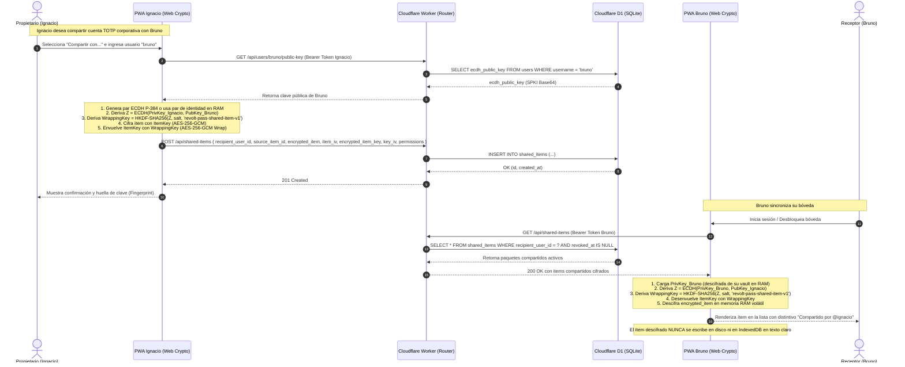
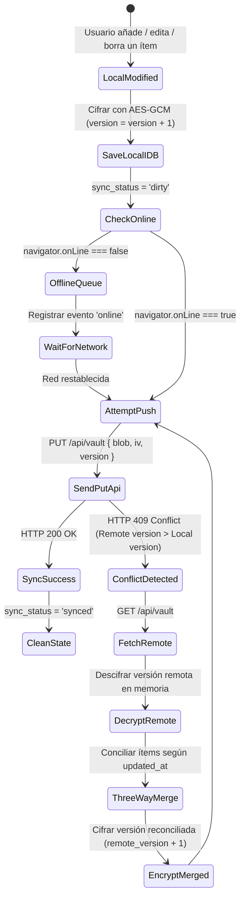

# Technical Design Document (TDD) — Arquitectura del Sistema
## Proyecto: Revolt Pass — Zero-Knowledge 2FA & Security Vault

| Metadato | Detalle |
| :--- | :--- |
| **Identificador de Documento** | `RP-ARCH-002` |
| **Versión** | `1.5.0-PROD (v2.5 Architecture)` |
| **Estado** | Aprobado / Especificación de Arquitectura |
| **Dominio Productivo** | `https://<tu-dominio-o-subdominio>.workers.dev` |
| **Pila Tecnológica** | React 19, TypeScript, Vite, Tailwind CSS, Workbox, Cloudflare Workers, Cloudflare D1 |
| **Licencia** | GNU AGPLv3 + Política de Marca Registrada (Revolt Group) |

---

## 1. Visión General de la Arquitectura

Revolt Pass implementa una arquitectura desacoplada y distribuida basada en el paradigma **Zero-Knowledge Client-Side Computing**. El procesamiento criptográfico sensible se ejecuta íntegramente en el dispositivo del usuario utilizando la aceleración de hardware de la **Web Crypto API** y módulos WebAssembly aislados (`hash-wasm`). La infraestructura remota actúa exclusivamente como una capa de persistencia binaria y sincronización de alta disponibilidad en el borde global (*Edge*) mediante **Cloudflare Workers** y la base de datos distribuida **Cloudflare D1**.

### 1.1 Diagrama de Arquitectura de Alto Nivel

```mermaid
flowchart TB
    subgraph ClientDevice ["Dispositivo Cliente (PWA Sandbox)"]
        subgraph UI ["Capa de Presentación (React 19 + Tailwind)"]
            App["App Shell / Router"]
            TotpView["TotpCard & Circular Timer"]
            QrScanner["QR Scanner (Camera / Dropzone / Paste)"]
            CmdPalette["Command Palette (Ctrl + K)"]
            SecurityModal["Security & Sessions Modal"]
            I18nEngine["i18n Engine (ES/EN Zero-Knowledge)"]
        end

        subgraph CoreEngine ["Motor Core & Seguridad (TypeScript)"]
            CryptoWorker["Web Worker (Argon2id WASM 64MB / PBKDF2 600k)"]
            SubtleEngine["Web Crypto API (AES-GCM-256 / HMAC)"]
            WebAuthnManager["WebAuthn Manager (Windows Hello PIN / Biometrics)"]
            TimeSyncManager["Time Drift Compensator"]
            SyncEngine["Bi-directional Sync Engine"]
            PushClient["Web Push Client (RFC 8291 / 8292)"]
        end

        subgraph ClientStorage ["Almacenamiento Local Seguro"]
            IDB[("IndexedDB (idb wrapper)\n- vault_encrypted\n- user_config\n- sync_queue")]
            CacheStorage[("Cache Storage (Workbox PWA)\nStatic Assets & Shell")]
            RAM[("Memoria Volátil RAM\n- Master Key\n- Decrypted Items\n(Auto-lock purges)")]
        end
    end

    subgraph CloudflareEdge ["Cloudflare Global Network (Edge Runtime)"]
        WAF["Cloudflare WAF / DDoS Protection / SSL Termination"]
        Worker["Cloudflare Worker (Router REST API)"]
        
        subgraph Endpoints ["Worker Micro-Endpoints"]
            TimeEp["GET /api/time (UTC Timestamp)"]
            AuthEp["POST /api/auth/* (Register / Salt)"]
            UpgradeEp["POST /api/auth/upgrade-kdf (Argon2id Auto-Upgrade)"]
            VaultEp["GET|PUT /api/vault (Encrypted Sync)"]
            SessionEp["POST|GET|DELETE|PUT /api/auth/sessions (Session Mgmt)"]
            PasskeyEp["GET|POST|PUT|DELETE /api/passkeys (FIDO2 Registry)"]
            AuditEp["GET /api/audit-logs (Security Audit)"]
            PushEp["POST /api/push/* (Web Push VAPID RFC 8292)"]
            EmailEp["POST /api/notifications/email (BYOK Dispatch)"]
        end
        
        D1Database[("Cloudflare D1 (SQLite Serverless)\n- users & vaults tables\n- sessions table\n- passkeys table\n- audit_logs & push_subscriptions")]
    end

    %% Relaciones
    UI --> CoreEngine
    CoreEngine --> RAM
    CoreEngine --> IDB
    App --> CacheStorage
    SyncEngine <--> |"HTTPS / TLS 1.3\n(Encrypted Blobs & Tokens)"| WAF
    WAF --> Worker
    Worker --> TimeEp
    Worker --> AuthEp
    Worker --> UpgradeEp
    Worker --> VaultEp
    Worker --> SessionEp
    Worker --> PasskeyEp
    Worker --> AuditEp
    Worker --> PushEp
    Worker --> EmailEp
    VaultEp <--> |"Prepared SQL"| D1Database
    AuthEp <--> |"Prepared SQL"| D1Database
    UpgradeEp <--> |"Prepared SQL"| D1Database
    SessionEp <--> |"Prepared SQL"| D1Database
    PasskeyEp <--> |"Prepared SQL"| D1Database
    AuditEp <--> |"Prepared SQL"| D1Database
    PushEp <--> |"Prepared SQL"| D1Database
```



---

## 2. Flujo Integral de Datos y Ciclos de Vida

### 2.1 Flujo de Registro e Inicialización de Bóveda
1. El usuario accede a `https://<tu-dominio-o-subdominio>.workers.dev` e introduce un nombre de usuario y una Contraseña Maestra (*Master Password*).
2. El cliente genera un `kdf_salt` criptográfico de 16 bytes usando `crypto.getRandomValues`.
3. El cliente despacha al Web Worker la derivación de la `MasterKey` mediante **Argon2id** (64 MB RAM, 3 rondas, 1 lane vía WASM). Cuentas históricas retienen compatibilidad con PBKDF2-SHA256 (600,000 iteraciones).
4. El cliente inicializa una lista vacía de `VaultItem[]`, la serializa a JSON y genera un `IV` aleatorio de 12 bytes.
5. El cliente cifra el JSON usando `AES-GCM-256`, produciendo el `encrypted_blob`.
6. El cliente envía `POST /api/auth/register` al Worker conteniendo: `{ username, kdf_salt, encrypted_blob, iv, kdf: "argon2id" }`.
7. El Worker ejecuta una transacción atómica en Cloudflare D1 insertando al usuario y su registro de bóveda inicial (versión 1).
8. El blob cifrado y las configuraciones se persisten en el `IndexedDB` local.



### 2.2 Flujo de Desbloqueo: Frío (Master Password) vs. Rápido (WebAuthn / Windows Hello)



### 2.3 Flujo de Compensación de Desfase Horario (Time Drift)
Para evitar que los códigos TOTP fallen por desfase de segundos en el reloj del sistema operativo:
1. Al cargar y cada 30 minutos, el cliente ejecuta `GET /api/time`.
2. Se toma la marca de tiempo del cliente $t_0$ inmediatamente antes del envío de la petición.
3. El servidor responde con su marca de tiempo UTC $t_{server}$ en milisegundos.
4. El cliente recibe la respuesta en $t_1$.
5. Se calcula la latencia de red estimada: $RTT = t_1 - t_0$.
6. Se determina la discrepancia de reloj:
   $$\text{offset} = t_{server} - \left( t_0 + \frac{RTT}{2} \right)$$
7. Dicho `offset` se almacena en memoria volátil y se suma a `Date.now()` en la función `generateTOTP()`.

---

### 2.4 Subsistema de Compartición Segura entre Cuentas (v2.5 - ADR-014)
Para permitir el intercambio seguro de ítems específicos entre cuentas independientes sin comprometer la clave maestra de ningún usuario ni delegar descifrado al servidor, se implementa el flujo de acuerdo de clave asimétrico ECDH P-384 con encapsulamiento simétrico AES-256-GCM.



* **Política de Aislamiento en Almacenamiento Local:**
  - Los ítems compartidos recibidos se descifran en tiempo de ejecución tras la sincronización y habitan **estrictamente en la memoria RAM volátil**.
  - Si la sesión se bloquea o caduca, las referencias a los ítems compartidos y sus claves se purgan automáticamente de la memoria.
  - En `IndexedDB`, solo se almacena el paquete cifrado (`encrypted_item`, `encrypted_item_key`, IVs) para permitir funcionamiento offline, garantizando que una inspección de almacenamiento local no exponga jamás secretos en claro.

---

### 2.5 Auto-Upgrade Silencioso de KDF (PBKDF2 -> Argon2id)
Con la introducción de Argon2id en v1.5.0, el cliente gestiona la migración progresiva y transparente de todas las cuentas creadas bajo PBKDF2:

1. **Detección:** Al autenticarse o desbloquear la bóveda, el cliente inspecciona el algoritmo de KDF devuelto por `/api/auth/salt` o almacenado localmente en `user_config`.
2. **Re-derivación Off-Thread:** Una vez descifrado el baúl con la clave legada, el cliente invoca al Web Worker para derivar una nueva `MasterKey` con **Argon2id** (64 MB, 3 rondas) utilizando un nuevo salt criptográfico de 16 bytes.
3. **Re-cifrado y Re-envoltura:** El payload del baúl se vuelve a cifrar con la nueva clave maestra. Si existen credenciales WebAuthn/passkey registradas, se re-envuelve la clave maestra bajo la clave de plataforma del dispositivo.
4. **Persistencia Atómica:** El cliente envía `POST /api/auth/upgrade-kdf` transmitiendo el nuevo salt, el nuevo KDF (`argon2id`), el nuevo blob cifrado y el nuevo verifier de autenticación. La base de datos D1 actualiza el registro atómicamente, consolidando la migración sin que el usuario deba cambiar su contraseña.

---

### 2.6 Despacho de Notificaciones Proactivas Zero-Knowledge (Web Push y BYOK Email)
Para mantener a los usuarios al tanto de eventos de seguridad críticos sin comprometer su privacidad ni generar costos operativos:

1. **Web Push RFC 8291 / RFC 8292:**
   - El cliente solicita permisos de notificación y registra un Service Worker Push Subscription.
   - Los parámetros de la suscripción (`endpoint`, claves públicas `p256dh` y `auth`) se almacenan en la tabla `push_subscriptions` de D1 vinculadas al `user_id`.
   - Ante eventos de auditoría sensibles (ej. inicio de sesión desde un nuevo país, sesión remota revocada, passkey agregada), el Cloudflare Worker despacha directamente un mensaje cifrado mediante **VAPID RFC 8292** y payload **AES-128-GCM RFC 8291** a los servidores Push del navegador (FCM / APNs / Mozilla).
2. **Email BYOK (Bring Your Own Key):**
   - El usuario puede configurar opcionalmente una clave personal gratuita de Resend o canalizar alertas a través de Cloudflare Email Workers (`send_email`).
   - El envío se produce directamente desde el Worker perimetral sin que Revolt Pass almacene listas de correos centralizadas ni contrate servicios de terceros.

---

## 3. Estrategia de Sincronización Bidireccional y Modo Offline

### 3.1 Esquema de Almacenamiento Local en IndexedDB
Se utiliza la librería tipada `idb` gestionando una base de datos denominada `revolt_pass_db` (versión 1) con tres almacenes de objetos (*object stores*):

1. **`vault_encrypted` (Store de Bóveda):**
   * Key: `'current'`
   * Value: `{ user_id: string, encrypted_blob: string, iv: string, version: number, updated_at: number, sync_status: 'synced' | 'dirty' }`
2. **`user_config` (Store de Configuración):**
   * Key: `'profile'`
   * Value: `{ user_id: string, username: string, kdf_salt: string, webauthn_credential_id?: string, wrapped_master_key?: string, auto_lock_minutes: number }`
3. **`sync_queue` (Cola de Operaciones Offline):**
   * Key: `id` (autoincrement)
   * Value: `{ action: 'PUSH_VAULT', payload: EncryptedVaultPayload, timestamp: number, attempts: number }`

### 3.2 Máquina de Estados de Sincronización y Detección de Conflictos



* **Regla de Reconciliación en Conflicto (Last-Write-Wins a nivel de ítem):** Si se produce una colisión por edición en múltiples dispositivos offline, el motor de conciliación descifra ambas versiones en memoria, itera cada `VaultItem` identificándolo por su `id` (UUID v4) y conserva aquel con el `updated_at` más reciente. Luego cifra el resultado combinado e incrementa el número de versión.

### 3.3 Configuración de Service Worker y Workbox
El archivo `vite.config.ts` utilizará `VitePWA` configurado con estrategia `generateSW` y las siguientes directivas de caché:
* **Assets Estáticos (`.js`, `.css`, `.html`, `.svg`, `.wasm`):** Estrategia `CacheFirst` con expiración a 30 días y precaching completo en instalación.
* **CDN de Simple Icons (`https://cdn.simpleicons.org/*`):** Estrategia `StaleWhileRevalidate` con un límite de 200 entradas en caché y TTL de 15 días.
* **Llamadas a la API (`/api/*`):** Estrategia `NetworkOnly` estricta (no cachear peticiones autenticadas o dinámicas en el Service Worker para garantizar que la capa IndexedDB controle la verdad de los datos).

---

## 4. Contratos Formales de la API REST

La API se expone bajo el prefijo `/api/v1` (o `/api`). Todas las respuestas adoptan un estándar uniforme de envoltura JSON.

### 4.1 Envolturas Canónicas de Respuesta

#### Respuesta Exitosa (`200 OK`, `201 Created`):
```json
{
  "success": true,
  "data": { ... },
  "timestamp": 1772719200000
}
```

#### Respuesta de Error (`4xx`, `5xx`):
```json
{
  "success": false,
  "error": {
    "code": "VAULT_VERSION_CONFLICT",
    "message": "La versión de la bóveda local (3) es inferior a la versión del servidor (4).",
    "details": {
      "server_version": 4,
      "client_version": 3
    }
  },
  "timestamp": 1772719200000
}
```

### 4.2 Catálogo de Endpoints

#### 1. `GET /api/time`
* **Propósito:** Sincronización horaria para compensar la deriva local en el cálculo TOTP.
* **Autenticación:** Pública (sin token).
* **Códigos HTTP:** `200 OK`.
* **Payload de Respuesta:**
  ```json
  {
    "success": true,
    "data": {
      "server_time_utc": 1772719200150
    },
    "timestamp": 1772719200150
  }
  ```

#### 2. `POST /api/auth/register`
* **Propósito:** Registro inicial del usuario y aprovisionamiento de la bóveda vacía.
* **Autenticación:** Pública (primera configuración).
* **Payload de Solicitud:**
  ```json
  {
    "username": "admin",
    "kdf_salt": "4a7b3c2d1e0f9a8b7c6d5e4f3a2b1c0d",
    "encrypted_blob": "VGhpcyBpcyBhbiBlbmNyeXB0ZWQgdmF1bHQgcGF5bG9hZC4uLg==",
    "iv": "MDEyMzQ1Njc4OTAx"
  }
  ```
* **Códigos HTTP:**
  * `201 Created`: Usuario y bóveda registrados.
  * `400 Bad Request`: Payload inválido o campos faltantes.
  * `409 Conflict`: El `username` ya se encuentra registrado.
* **Payload de Respuesta:**
  ```json
  {
    "success": true,
    "data": {
      "user_id": "usr_9b1deb4d-3b7d-4bad-9bdd-2b0d7b3dcb6d",
      "version": 1,
      "updated_at": 1772719200
    }
  }
  ```

#### 3. `GET /api/auth/salt?username={username}`
* **Propósito:** Obtener el `kdf_salt` para que el cliente pueda derivar la clave y desbloquear su cuenta sin transmitir la contraseña.
* **Autenticación:** Pública.
* **Códigos HTTP:**
  * `200 OK`: Devuelve el salt.
  * `404 Not Found`: Usuario no existente.
* **Payload de Respuesta:**
  ```json
  {
    "success": true,
    "data": {
      "kdf_salt": "4a7b3c2d1e0f9a8b7c6d5e4f3a2b1c0d",
      "has_passkey": true
    }
  }
  ```

#### 4. `GET /api/vault`
* **Propósito:** Descargar el blob cifrado más reciente.
* **Cabeceras de Solicitud:** `X-User-Id: {user_id}`, `If-None-Match: "v{version}"`.
* **Códigos HTTP:**
  * `200 OK`: Se devuelve el payload cifrado actualizado.
  * `304 Not Modified`: La versión local es idéntica a la remota.
  * `401 Unauthorized`: Identificador de usuario ausente o no válido.
* **Payload de Respuesta (`200 OK`):**
  ```json
  {
    "success": true,
    "data": {
      "user_id": "usr_9b1deb4d-3b7d-4bad-9bdd-2b0d7b3dcb6d",
      "encrypted_blob": "VGhpcyBpcyBhbiBlbmNyeXB0ZWQgdmF1bHQgcGF5bG9hZC4uLg==",
      "iv": "MDEyMzQ1Njc4OTAx",
      "version": 4,
      "updated_at": 1772719250
    }
  }
  ```

#### 5. `PUT /api/vault`
* **Propósito:** Persistir y sincronizar una nueva versión cifrada de la bóveda.
* **Cabeceras de Solicitud:** `X-User-Id: {user_id}`.
* **Payload de Solicitud:**
  ```json
  {
    "encrypted_blob": "VXBkYXRlZCBibG9iIGluZm9ybWF0aW9uLi4u",
    "iv": "TmZXaXY5MTIzODAx",
    "version": 5
  }
  ```
* **Códigos HTTP:**
  * `200 OK`: Bóveda actualizada correctamente.
  * `400 Bad Request`: Formato de base64 o versión inválido.
  * `409 Conflict`: La versión enviada no es estrictamente igual a `servidor.version + 1`.

#### 6. `POST /api/auth/session`
* **Propósito:** Registrar un nuevo dispositivo o refrescar la marca de tiempo de una sesión existente, preservando el nombre personalizado del dispositivo.
* **Cabeceras:** `X-User-Id: {user_id}`.
* **Payload:** `{ "session_token": "...", "device_name": "Mi PC", "device_fingerprint": "..." }`.
* **Respuesta:** `{ "success": true, "data": { "session_id": "ses_...", "device_name": "Mi PC" } }`.

#### 7. `GET /api/auth/sessions` & `DELETE /api/auth/sessions`
* **Propósito:** Listar todas las sesiones activas del usuario (`GET`) o revocar todas las demás sesiones remotas (`DELETE`).
* **Cabeceras:** `X-User-Id: {user_id}`, `Authorization: Bearer {session_token}`.

#### 8. `DELETE /api/auth/sessions/:id` & `PUT /api/auth/sessions/:id`
* **Propósito:** Revocación granular de una sesión específica (`DELETE`) o renombrado personalizado de dispositivo (`PUT`).
* **Payload en PUT:** `{ "device_name": "Nuevo Nombre" }`.

#### 9. `GET /api/passkeys` & `POST /api/passkeys`
* **Propósito:** Listar credenciales Passkey registradas (`GET`) o sincronizar una nueva credencial WebAuthn (`POST`) con upsert condicional que preserva el nombre asignado por el usuario.

#### 10. `PUT /api/passkeys/:id` & `DELETE /api/passkeys/:id`
* **Propósito:** Renombrar una credencial Passkey (`PUT`) o revocar/eliminar una Passkey remota (`DELETE`) para neutralizar accesos biométricos no autorizados en estaciones ajenas.

#### 11. `GET /api/audit-logs`
* **Propósito:** Obtener el historial cronológico de auditoría de seguridad del usuario autenticado.

#### 12. `GET /api/users/:username/public-key`
* **Propósito:** Obtener la clave pública ECDH P-384 del destinatario para derivar el secreto compartido.
* **Autenticación:** Sesión activa requerida (`Authorization: Bearer <token>`).
* **Códigos HTTP:** `200 OK` (`{ ecdh_public_key, user_id }`), `404 Not Found`.

#### 13. `POST /api/users/me/ecdh-key`
* **Propósito:** Registrar o rotar la clave pública ECDH P-384 propia del usuario autenticado.
* **Payload:** `{ "ecdh_public_key": "MFkwEwYHKoZIzj0CAQYIKoZIzj0DAQcDQgAE..." }`.
* **Códigos HTTP:** `200 OK`, `400 Bad Request`.

#### 14. `POST /api/shared-items`
* **Propósito:** Compartir un ítem cifrado con clave simétrica encapsulada vía ECDH con un destinatario.
* **Payload:** `{ "recipient_user_id": "usr_...", "source_item_id": "cuid_...", "encrypted_item": "...", "item_iv": "...", "encrypted_item_key": "...", "key_iv": "...", "permissions": "read" | "write" }`.
* **Códigos HTTP:** `201 Created`, `400 Bad Request`, `404 Recipient Not Found`, `409 Conflict`.

#### 15. `GET /api/shared-items`
* **Propósito:** Listar ítems compartidos recibidos activos (`revoked_at IS NULL`) para su descifrado en el cliente.
* **Códigos HTTP:** `200 OK` (lista de `SharedItemRecord[]`).

#### 16. `GET /api/shared-items/sent`
* **Propósito:** Listar los ítems que el usuario actual ha compartido con otros usuarios para auditoría y gestión de revocación.
* **Códigos HTTP:** `200 OK`.

#### 17. `PUT /api/shared-items/:id`
* **Propósito:** Actualizar el contenido de un ítem compartido (requiere `permissions = 'write'` o ser el propietario).
* **Payload:** `{ "encrypted_item": "...", "item_iv": "..." }`.
* **Códigos HTTP:** `200 OK`, `403 Forbidden`, `404 Not Found`.

#### 18. `DELETE /api/shared-items/:id`
* **Propósito:** Revocar acceso al ítem (si lo ejecuta el propietario) o rechazar/eliminar de la vista (si lo ejecuta el destinatario).
* **Códigos HTTP:** `200 OK`, `403 Forbidden`, `404 Not Found`.

---

## 5. Modelos de Datos y Tipos TypeScript Canónicos

Todos los módulos del cliente y del Worker compartirán un archivo común de definiciones de tipos (`src/types/vault.ts`):

```typescript
/**
 * Representa un código de recuperación individual asociado a una cuenta.
 */
export interface RecoveryCode {
  code: string;
  used: boolean;
  created_at?: number;
}

/**
 * Algoritmos hash soportados para TOTP según RFC 6238.
 */
export type TotpAlgorithm = 'SHA1' | 'SHA256';

/**
 * Tipos de ítems almacenables en la bóveda (arquitectura extensible).
 */
export type VaultItemType = 'totp' | 'login' | 'note';

/**
 * Estructura atómica de un ítem dentro de la bóveda descifrada en memoria.
 */
export interface VaultItem {
  id: string; // UUID v4 canónico
  type: VaultItemType;
  issuer: string; // Nombre del servicio (ej. "GitHub", "AWS")
  account: string; // Identificador de la cuenta (ej. "usuario@email.com")
  secret: string; // Clave secreta decodificada en formato Base32
  digits: 6 | 8; // Cantidad de dígitos del token (default: 6)
  period: number; // Intervalo de rotación en segundos (default: 30)
  algorithm: TotpAlgorithm; // Algoritmo de hash (default: 'SHA1')
  recovery_codes?: RecoveryCode[]; // Lista opcional de códigos de emergencia
  notes?: string; // Anotaciones seguras adicionales
  pinned?: boolean; // Indicador de fijado en cabecera
  tags?: string[]; // Etiquetas organizacionales
  created_at: number; // Unix Epoch en milisegundos
  updated_at: number; // Unix Epoch en milisegundos (usado para reconciliación)
}

/**
 * Contenedor deserializado completo de la bóveda en cliente.
 */
export interface DecryptedVault {
  version: number;
  items: VaultItem[];
  exported_at?: number;
}

/**
 * Carga útil cifrada transmitida hacia/desde la API y almacenada en D1 / IndexedDB.
 */
export interface EncryptedVaultPayload {
  user_id: string;
  encrypted_blob: string; // Base64 del ciphertext + auth tag (AES-GCM)
  iv: string; // Base64 del vector de inicialización de 12 bytes
  version: number; // Contador monótono de versión
  updated_at: number; // Unix Epoch en segundos
}

/**
 * Estado de sincronización local en IndexedDB.
 */
export type SyncStatus = 'synced' | 'dirty' | 'syncing' | 'error';

/**
 * Registro de bóveda almacenado localmente en IndexedDB.
 */
export interface LocalVaultRecord extends EncryptedVaultPayload {
  sync_status: SyncStatus;
  last_sync_attempt?: number;
  sync_error_message?: string;
}

/**
 * Configuración de perfil y envoltura WebAuthn almacenada en IndexedDB.
 */
export interface LocalUserConfig {
  user_id: string;
  username: string;
  kdf_salt: string; // Base64 o hex del salt de 16 bytes
  webauthn_credential_id?: string; // ID en Base64URL de la credencial registrada
  wrapped_master_key?: string; // Master Key cifrada con la clave de hardware WebAuthn
  auto_lock_minutes: number; // Tiempo de inactividad antes de purgar la RAM
  clipboard_clear_seconds: number; // Tiempo antes de limpiar el portapapeles (default 45s)
}

/**
 * Estado de sesión en memoria RAM volátil (eliminado en auto-lock).
 */
export interface ActiveSessionState {
  isUnlocked: boolean;
  masterKey: CryptoKey | null; // Llave AES-GCM derivada en RAM
  timeDriftOffsetMs: number; // Compensación de milisegundos contra el servidor
  lastActivityTimestamp: number; // Marca de tiempo del último evento de usuario
}

/**
 * Permisos asignados a un ítem compartido (v2.5).
 */
export type SharedItemPermissions = 'read' | 'write';

/**
 * Registro de ítem compartido en Cloudflare D1 (v2.5).
 */
export interface SharedItemRecord {
  id: string; // Prefijo 'shi_' + UUID
  owner_user_id: string;
  recipient_user_id: string;
  source_item_id: string; // ID del ítem en la bóveda del propietario
  encrypted_item: string; // Base64 del ciphertext del ítem cifrado con ItemKey
  item_iv: string; // Base64 del IV de 12 bytes del ítem
  encrypted_item_key: string; // Base64 de la ItemKey envuelta con WrappingKey (AES-GCM Wrap)
  key_iv: string; // Base64 del IV de 12 bytes de la clave
  permissions: SharedItemPermissions;
  version: number;
  created_at: number; // Unix Epoch en segundos
  updated_at: number;
  revoked_at?: number | null;
}

/**
 * Representación en memoria RAM volátil de un ítem compartido recibido y descifrado.
 */
export interface DecryptedSharedItem {
  shared_id: string;
  source_item_id: string;
  owner_user_id: string;
  owner_username?: string;
  permissions: SharedItemPermissions;
  item: VaultItem;
  item_key: CryptoKey; // Clave simétrica AES-256-GCM en RAM
  fingerprint: string; // Huella SHA-256 de la clave pública del propietario
  received_at: number;
}

/**
 * Contrato de interfaz del módulo criptográfico de compartición (src/lib/crypto/sharing.ts).
 */
export interface SharingCryptoAPI {
  generateUserECDHKeyPair(): Promise<{ publicKey: CryptoKey; privateKey: CryptoKey; spkiBase64: string; pkcs8Base64: string }>;
  deriveWrappingKey(localPrivateKey: CryptoKey, remotePublicKey: CryptoKey, salt?: Uint8Array): Promise<CryptoKey>;
  encryptSharedItem(item: VaultItem, itemKey: CryptoKey, recipientPubKey: CryptoKey, senderPrivKey: CryptoKey): Promise<{ encrypted_item: string; item_iv: string; encrypted_item_key: string; key_iv: string }>;
  decryptSharedItem(encryptedItem: string, itemIv: string, encryptedItemKey: string, keyIv: string, recipientPrivKey: CryptoKey, senderPubKey: CryptoKey): Promise<VaultItem>;
  computeKeyFingerprint(spkiBase64: string): Promise<string>;
}
```

---

## 6. Esquema SQL de Cloudflare D1 (`schema.sql`)

El motor relacional SQLite subyacente a Cloudflare D1 se estructura mediante sentencias preparadas, garantizando integridad referencial estricta, índices de búsqueda rápida y restricciones de unicidad.

```sql
-- =====================================================================
-- ESQUEMA D1: REVOLT PASS DATABASE (schema.sql)
-- Versión: 1.1.0 (v2.5 Architecture Ready)
-- Motor: Cloudflare D1 (SQLite Serverless)
-- =====================================================================

PRAGMA foreign_keys = ON;

-- Tabla de Usuarios
CREATE TABLE IF NOT EXISTS users (
    id TEXT PRIMARY KEY,                       -- Prefijo 'usr_' + UUID v4
    username TEXT NOT NULL COLLATE NOCASE,     -- Case-insensitive para login
    kdf_salt TEXT NOT NULL,                    -- 16 bytes en formato Base64
    passkey_credential_id TEXT,                -- ID de credencial FIDO2 opcional
    ecdh_public_key TEXT DEFAULT NULL,         -- Clave pública ECDH P-384 en formato SPKI Base64 (v2.5)
    created_at INTEGER NOT NULL DEFAULT (unixepoch()),
    updated_at INTEGER NOT NULL DEFAULT (unixepoch()),
    CONSTRAINT uq_users_username UNIQUE (username)
);

-- Índice para búsquedas ultrarrápidas de login
CREATE INDEX IF NOT EXISTS idx_users_username ON users(username);

-- Tabla de Bóvedas Cifradas (Zero-Knowledge)
CREATE TABLE IF NOT EXISTS vaults (
    user_id TEXT PRIMARY KEY,                  -- Relación 1:1 estricta por usuario
    encrypted_blob TEXT NOT NULL,              -- Ciphertext en Base64
    iv TEXT NOT NULL,                          -- Vector de Inicialización (12 bytes Base64)
    version INTEGER NOT NULL DEFAULT 1,        -- Control de concurrencia optimista
    updated_at INTEGER NOT NULL DEFAULT (unixepoch()),
    CONSTRAINT fk_vaults_user FOREIGN KEY (user_id) 
        REFERENCES users(id) ON DELETE CASCADE
);

-- Índice para control de versiones y auditoría de sincronización
CREATE INDEX IF NOT EXISTS idx_vaults_user_version ON vaults(user_id, version);

-- Tabla de Ítems Compartidos entre Usuarios (Zero-Knowledge - v2.5)
CREATE TABLE IF NOT EXISTS shared_items (
    id TEXT PRIMARY KEY,                       -- Prefijo 'shi_' + UUID
    owner_user_id TEXT NOT NULL,               -- Propietario del ítem
    recipient_user_id TEXT NOT NULL,           -- Destinatario del ítem
    source_item_id TEXT NOT NULL,              -- ID del ítem original en bóveda del propietario
    encrypted_item TEXT NOT NULL,              -- Payload cifrado con ItemKey (AES-256-GCM)
    item_iv TEXT NOT NULL,                     -- IV de 12 bytes del ítem en Base64
    encrypted_item_key TEXT NOT NULL,          -- ItemKey envuelta con WrappingKey (ECDH + HKDF)
    key_iv TEXT NOT NULL,                      -- IV de 12 bytes de la clave en Base64
    permissions TEXT NOT NULL DEFAULT 'read' CHECK(permissions IN ('read', 'write')),
    version INTEGER NOT NULL DEFAULT 1,
    created_at INTEGER NOT NULL DEFAULT (unixepoch()),
    updated_at INTEGER NOT NULL DEFAULT (unixepoch()),
    revoked_at INTEGER DEFAULT NULL,
    CONSTRAINT fk_shared_owner FOREIGN KEY (owner_user_id) REFERENCES users(id) ON DELETE CASCADE,
    CONSTRAINT fk_shared_recipient FOREIGN KEY (recipient_user_id) REFERENCES users(id) ON DELETE CASCADE,
    CONSTRAINT uq_shared_owner_recipient_item UNIQUE (owner_user_id, recipient_user_id, source_item_id)
);

CREATE INDEX IF NOT EXISTS idx_shared_recipient_active ON shared_items(recipient_user_id, revoked_at);
CREATE INDEX IF NOT EXISTS idx_shared_owner ON shared_items(owner_user_id, created_at DESC);

-- Tabla de Auditoría de Sincronización (Opcional, rotación ligera)
CREATE TABLE IF NOT EXISTS sync_logs (
    id INTEGER PRIMARY KEY AUTOINCREMENT,
    user_id TEXT NOT NULL,
    action TEXT NOT NULL,                      -- 'REGISTER', 'SYNC_PULL', 'SYNC_PUSH', 'SHARE_ITEM', 'REVOKE_SHARE'
    client_version INTEGER,
    server_version INTEGER,
    ip_country TEXT,                           -- Obtenido de cf.country (sin almacenar IP personal)
    created_at INTEGER NOT NULL DEFAULT (unixepoch()),
    CONSTRAINT fk_synclogs_user FOREIGN KEY (user_id) 
        REFERENCES users(id) ON DELETE CASCADE
);

CREATE INDEX IF NOT EXISTS idx_synclogs_user_created ON sync_logs(user_id, created_at DESC);
```
