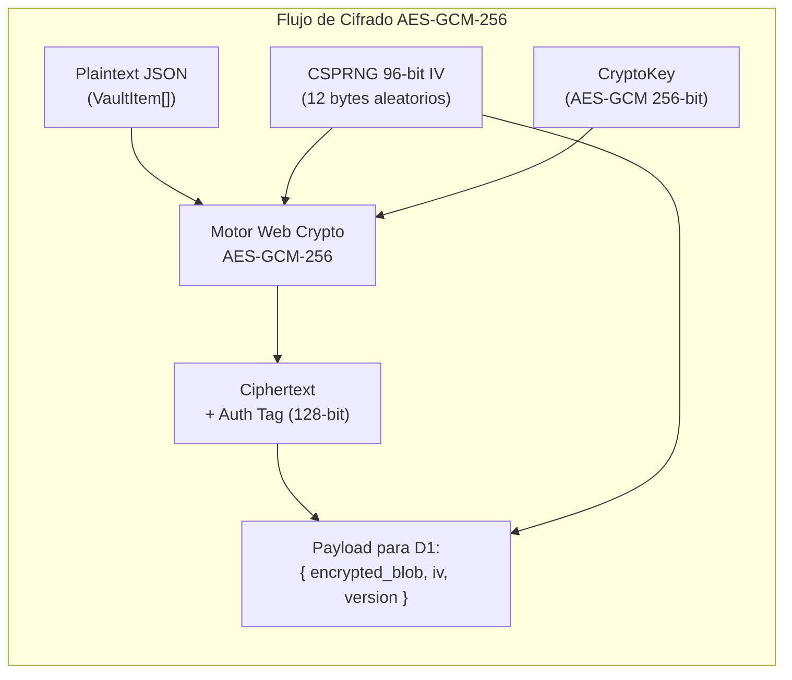
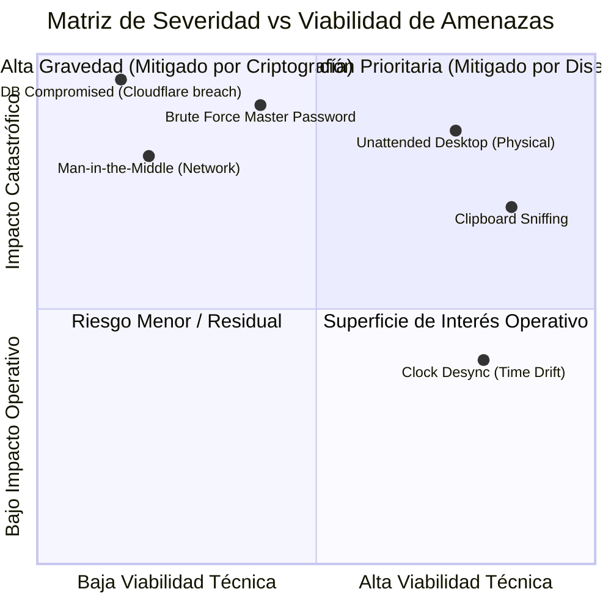

# Cryptographic Specification & Threat Model
## Proyecto: Revolt Pass — Zero-Knowledge 2FA & Security Vault

| Metadato | Detalle |
| :--- | :--- |
| **Identificador de Documento** | `RP-SEC-003` |
| **Versión** | `1.2.1-PROD` |
| **Estado** | Aprobado / Especificación de Seguridad de Grado Criptográfico |
| **Marco de Referencia** | OWASP ASVS v4.0, NIST SP 800-63B, RFC 6238, RFC 5869, W3C WebAuthn Level 3 |
| **Dominio Productivo** | `https://<tu-dominio-o-subdominio>.workers.dev` |
| **Licencia** | GNU AGPLv3 + Política de Marca Registrada (Revolt Group) |

---

## 1. Especificación Criptográfica Formal

Revolt Pass adopta el paradigma criptográfico **Zero-Knowledge (Conocimiento Cero)**. Toda operación de generación de entropía, derivación de llaves, cifrado simétrico y verificación de integridad se efectúa de manera exclusiva en el entorno de ejecución del cliente mediante la **Web Crypto API** (`window.crypto.subtle`), un componente nativo compilado en C++ / Rust dentro del motor del navegador y protegido contra manipulaciones en el espacio de usuario.

### 1.1 Derivación de Clave Maestra (Key Derivation Function - KDF)
La derivación de la llave maestra a partir de la contraseña del usuario se rige por los siguientes parámetros inmutables:

| Parámetro | Valor Canónico | Justificación de Ingeniería / Estándar |
| :--- | :--- | :--- |
| **Algoritmo Base** | `PBKDF2` (Password-Based Key Derivation Function 2) | RFC 8018, estándar de la industria soportado de forma nativa en Web Crypto sin dependencias externas. |
| **Función Pseudoaleatoria (PRF)** | `HMAC-SHA256` | Ofrece resistencia superior a colisiones frente a SHA-1 y mitiga ataques de longitud de extensión. |
| **Iteraciones** | **$600,000$ rondas** | Supera el umbral estipulado por OWASP Password Storage Cheat Sheet (mínimo recomendado: 600,000 para PBKDF2-HMAC-SHA256), forzando un costo computacional masivo contra clústeres GPU/ASIC. |
| **Salt (Salting)** | $128 \text{ bits}$ ($16 \text{ bytes}$) aleatorios | Generado criptográficamente vía `crypto.getRandomValues(new Uint8Array(16))`. Es único por usuario y previene ataques mediante tablas Rainbow (*Rainbow Tables*). |
| **Longitud de Clave Saliente** | $256 \text{ bits}$ ($32 \text{ bytes}$) | Coincide exactamente con el tamaño requerido para la llave simétrica `AES-GCM-256`. |
| **Exportabilidad de la Llave** | `extractable: false` | La `CryptoKey` generada en memoria RAM se marca como no extraíble por JavaScript, impidiendo su exportación arbitraria en caso de inspección de objetos. |

#### Proceso Matemático de Derivación:
$$\text{BaseKey} = \text{importKey}(\text{"raw"}, \text{encode}(\text{MasterPassword}), \text{"PBKDF2"})$$
$$\text{MasterKey} = \text{deriveKey}(\text{PBKDF2-HMAC-SHA256}, \text{BaseKey}, \text{Salt}, 600000, \text{"AES-GCM"}, 256)$$

Para evitar bloquear el hilo principal de la interfaz de usuario (*UI thread*) durante los ~300-800 ms de cálculo de las 600,000 iteraciones, este proceso se traslada a un **Web Worker** aislado (`src/lib/crypto/kdf.worker.ts`).

---

### 1.2 Cifrado Simétrico y Autenticación del Vault (AES-GCM)
El payload de la bóveda (lista de cuentas TOTP, secretos Base32, claves de recuperación y metadatos) se serializa en una cadena UTF-8 JSON y se procesa mediante **AES-GCM (Advanced Encryption Standard in Galois/Counter Mode)**.



* **Tamaño de Llave:** 256 bits (`AES-256`).
* **Vector de Inicialización (IV / Nonce):** 96 bits (12 bytes). **Regla estricta:** Un nuevo IV se genera con `crypto.getRandomValues(new Uint8Array(12))` **en cada operación de guardado**. La reutilización de un par (Llave, IV) bajo AES-GCM destruye la autenticidad y puede permitir la recuperación de texto plano.
* **Authentication Tag:** 128 bits (16 bytes). La etiqueta de autenticación garantiza integridad criptográfica estricta: cualquier alteración de un solo bit en la base de datos o en tránsito provoca el rechazo inmediato (`OperationError`) durante `subtle.decrypt()`, neutralizando ataques de alteración de mensaje (*tampering*).

---

### 1.3 Mecanismo de Desbloqueo Rápido vía WebAuthn / Passkeys
Para proporcionar una experiencia sin fricción sin comprometer el modelo Zero-Knowledge, se implementa una arquitectura de **Envoltura Local de Llave (Key Wrapping)** respaldada por hardware FIDO2 / WebAuthn.

1. **Enrolamiento:**
   * El usuario se autentica exitosamente con su Contraseña Maestra (obteniendo `MasterKey`).
   * El cliente invoca `navigator.credentials.create()` configurando:
     * `authenticatorAttachment: "platform"` (restringe al hardware del equipo: Windows Hello en PC, Touch ID / Face ID en Apple, Biometría en Android).
     * `userVerification: "required"` (fuerza ingreso de PIN de Windows Hello o escaneo biométrico).
   * El cliente genera una llave simétrica local aleatoria de envoltura (`DeviceWrappingKey`, 256 bits).
   * Se cifra la `MasterKey` con la `DeviceWrappingKey` mediante AES-GCM, produciendo `wrapped_master_key`.
   * La `DeviceWrappingKey` se almacena protegida en el almacén local del navegador, vinculada al ID de la credencial WebAuthn generada.
2. **Desbloqueo Posterior:**
   * La aplicación solicita la aserción con `navigator.credentials.get({ publicKey: { challenge, userVerification: "required" } })`.
   * El usuario introduce su **PIN de Windows Hello** o coloca su huella en el móvil.
   * Tras la aserción válida devuelta por el TPM/Enclave de hardware del sistema operativo, el cliente libera la `DeviceWrappingKey`, desencripta `wrapped_master_key` y reconstruye la `MasterKey` en la memoria RAM volátil.
   * Si el usuario revoca la credencial, desinstala la PWA o falla la verificación, la clave de envoltura se purga y el sistema exige la Contraseña Maestra completa.

---

### 1.4 Motor TOTP (RFC 6238 / RFC 4226)
La generación de contraseñas de un solo uso por tiempo (TOTP) sigue estrictamente las especificaciones de Internet Engineering Task Force (IETF):

1. **Decodificación Base32 (RFC 4648):**
   * Se sanitiza el secreto eliminando caracteres nulos, guiones y espacios.
   * Decodificador Base32 puro implementado en TypeScript:
     * Entrada: `string` de caracteres en alfabeto `[A-Z2-7]`.
     * Salida: `Uint8Array` de bytes binarios.
2. **Cálculo del Intervalo:**
   $$C_t = \left\lfloor \frac{T_{local} + \Delta T_{drift}}{X} \right\rfloor$$
   donde $X = 30$ segundos, $T_{local}$ es el tiempo Unix en segundos y $\Delta T_{drift}$ es la corrección temporal calculada contra el Worker.
   El contador $C_t$ se serializa como un entero de 64 bits en formato Big-Endian (8 bytes).
3. **Generación del HMAC:**
   * Se firma $C_t$ con la clave secreta decodificada utilizando `crypto.subtle.sign("HMAC", hmacKey, counterBuffer)`.
   * Soporte de algoritmos: `SHA-1` (default de 20 bytes) y `SHA-256` (32 bytes).
4. **Truncamiento Dinámico (Dynamic Truncation):**
   * El último byte del hash determina el desplazamiento (*offset*):
     $$\text{offset} = \text{hash}[20 - 1] \ \& \ \text{0x0F}$$
   * Se extraen 4 bytes a partir del offset, aplicando máscara para anular el bit de signo más significativo:
     $$\text{binary} = ((\text{hash}[\text{offset}] \ \& \ \text{0x7F}) \ll 24) \ | \ ((\text{hash}[\text{offset} + 1] \ \& \ \text{0xFF}) \ll 16) \ | \ ((\text{hash}[\text{offset} + 2] \ \& \ \text{0xFF}) \ll 8) \ | \ (\text{hash}[\text{offset} + 3] \ \& \ \text{0xFF})$$
   * Se calcula el código final mediante módulo:
     $$\text{token} = (\text{binary} \pmod{10^{\text{digits}}}).\text{toString}().\text{padStart}(\text{digits}, \text{'0'})$$

---

## 2. Modelo de Amenazas (STRIDE & Análisis de Vectores de Ataque)

Se evalúa la postura de seguridad de Revolt Pass conforme a la metodología **STRIDE** de Microsoft y se detalla la matriz de vectores de ataque.



### Matriz Detallada de Vectores de Ataque y Mitigaciones

| Vector / ID | Categoría STRIDE | Descripción de la Amenaza | Impacto | Controles de Mitigación Implementados |
| :--- | :--- | :--- | :--- | :--- |
| **VEC-01** | *Information Disclosure* | **Compromiso de Cloudflare D1:** Un actor malicioso o un empleado desleal con acceso administrativo a la cuenta de Cloudflare extrae el contenido de la tabla `vaults`. | Nulo (Zero-Knowledge) | **Inviolabilidad Criptográfica:** La base de datos solo almacena blobs cifrados con AES-256-GCM. Sin la Contraseña Maestra y el salt, romper el blob requeriría $2^{255}$ operaciones computacionales, lo cual es físicamente imposible. |
| **VEC-02** | *Tampering* | **Alteración de Datos en Tránsito o en Reposo:** Modificación malintencionada de bytes en el `encrypted_blob` dentro de D1 para provocar comportamientos anómalos en el cliente. | Nulo (Rechazo Inmediato) | **Etiqueta de Autenticación GCM:** AES-GCM verifica el Authentication Tag de 128 bits. Si un solo bit es modificado, `crypto.subtle.decrypt` arroja un error inmutable y la aplicación se bloquea de inmediato sin procesar datos corruptos. |
| **VEC-03** | *Information Disclosure* | **Acceso Físico a Estación de Trabajo Desbloqueada:** El operador abandona su escritorio con la PWA abierta en primer plano. | Crítico | **Auto-Lock por Inactividad & Ocultamiento:** Temporizador en RAM que purga las claves tras 5 minutos de inactividad de mouse/teclado. Adicionalmente, el evento `visibilitychange` bloquea la bóveda si la pestaña permanece oculta. |
| **VEC-04** | *Information Disclosure* | **Clipboard Sniffing (Espionaje de Portapapeles):** Aplicaciones en segundo plano o malware sin privilegios de administrador que monitorean el portapapeles del sistema operativo para capturar códigos TOTP o Recovery Codes. | Alto | **Auto-Clear Programado:** Rutina con temporizador estricto de 45 segundos que sobrescribe el portapapeles con texto vacío. Compara el contenido previo para evitar borrar información legítima si el usuario copió otra cosa en el intervalo. |
| **VEC-05** | *Information Disclosure* | **Ataque de Fuerza Bruta Offline sobre la Contraseña Maestra:** Si un atacante roba el salt y el blob cifrado, intenta deducir la contraseña mediante diccionarios y hashes masivos. | Alto | **Factor de Trabajo Elevado (PBKDF2 600,000 rondas):** 600,000 iteraciones con SHA-256 fuerzan al atacante a consumir enormes recursos energéticos y de cómputo por cada intento de clave, volviendo inviable la fuerza bruta frente a contraseñas robustas. |
| **VEC-06** | *Elevation of Privilege* | **Ataques de Inyección de Scripts (XSS):** Inyección de código JavaScript para leer la memoria del navegador o interceptar los eventos de teclado. | Crítico | **Aislamiento Estricto & CSP:** Política de Seguridad de Contenido (CSP) que bloquea `unsafe-inline`, `unsafe-eval` y restringe la carga de recursos externos únicamente a `self` y al CDN de `cdn.simpleicons.org`. Cero dependencias de librerías CDN en tiempo de ejecución. |
| **VEC-07** | *Denial of Service* | **Falla de Sincronización por Pérdida de Conectividad:** El usuario viaja en avión o experimenta cortes de red y necesita acceder a sus cuentas corporativas. | Alto | **Disponibilidad Offline Absoluta (100%):** Todo el estado se mantiene cifrado en IndexedDB y los assets en Service Worker. La aplicación opera indefinidamente en modo avión. |

---

## 3. Medidas de Mitigación y Buenas Prácticas de Ingeniería

### 3.1 Higiene de Memoria RAM
En entornos de navegador con recolección de basura (*Garbage Collection*), la sobreescritura garantizada de memoria presenta retos específicos. Para mitigar la persistencia de secretos:
1. Las llaves se manejan primordialmente como objetos no extraíbles `CryptoKey`.
2. Las claves temporales o contraseñas en texto plano manipuladas como `Uint8Array` se sobrescriben explícitamente con ceros inmediatamente después de su uso:
   ```typescript
   function secureZeroBuffer(buffer: Uint8Array): void {
     buffer.fill(0);
   }
   ```
3. Al dispararse el evento de bloqueo (*lock*), la variable de estado `activeSessionState.masterKey` se asigna a `null` y se invoca la dereferencia de los elementos de la bóveda para permitir su recolección inmediata por el motor V8.

### 3.2 Content Security Policy (CSP) en Cloudflare
El Worker y las cabeceras emitidas por Cloudflare para el subdominio `https://<tu-dominio-o-subdominio>.workers.dev` aplican la siguiente directiva canónica:

```http
Content-Security-Policy: default-src 'self'; script-src 'self'; style-src 'self' 'unsafe-inline'; img-src 'self' data: https://cdn.simpleicons.org; connect-src 'self'; font-src 'self'; object-src 'none'; frame-ancestors 'none'; base-uri 'self'; form-action 'self';
Strict-Transport-Security: max-age=31536000; includeSubDomains; preload
X-Content-Type-Options: nosniff
X-Frame-Options: DENY
X-XSS-Protection: 1; mode=block
Referrer-Policy: strict-origin-when-cross-origin
```

### 3.3 Protocolo de Limpieza Automática de Portapapeles (Algoritmo)
```typescript
class ClipboardGuard {
  private timeoutId: number | null = null;
  private lastCopiedSecret: string | null = null;

  public copySecret(secret: string, clearDelayMs = 45000): void {
    if (this.timeoutId !== null) {
      window.clearTimeout(this.timeoutId);
    }

    navigator.clipboard.writeText(secret).then(() => {
      this.lastCopiedSecret = secret;
      this.timeoutId = window.setTimeout(async () => {
        try {
          // Solo limpiar si el portapapeles aún contiene el secreto protegido
          const currentText = await navigator.clipboard.readText();
          if (currentText === this.lastCopiedSecret) {
            await navigator.clipboard.writeText('');
          }
        } catch {
          // Si los permisos de lectura fallan, forzar escritura vacía preventiva
          await navigator.clipboard.writeText('');
        } finally {
          this.lastCopiedSecret = null;
          this.timeoutId = null;
        }
      }, clearDelayMs);
    });
  }
}
```
Este algoritmo previene la fuga involuntaria de secretos en aplicaciones de mensajería, suites ofimáticas o herramientas de captura de texto.

### 3.4 Seguridad de Sesiones y Almacenamiento Hash de Tokens (D1)
* **Tokens de Sesión:** Cada cliente autenticado posee un token de sesión criptográfico generado en cliente con alta entropía (`crypto.getRandomValues`).
* **Protección contra Infiltración de Base de Datos:** Los tokens de sesión jamás se almacenan en texto plano en la base de datos Cloudflare D1. El Worker computa un hash **SHA-256** del token (`token_hash`) antes de persistirlo o indexarlo en la tabla `sessions`.
* **Revocación Granular Inmediata:** Si un token es revocado individualmente (`is_revoked = 1`), cualquier solicitud posterior que presente ese token es denegada con código HTTP `401 Unauthorized`.

### 3.5 Mitigación de Reingreso Biométrico y Ciclo de Vida de Passkeys (FIDO2)
* **Vector de Amenaza:** En un entorno corporativo o compartido, un usuario podría cerrar su sesión en una PC ajena; sin embargo, si el hardware local mantiene registrada una credencial de Windows Hello o biometría vinculada a la cuenta, un tercero con acceso a esa máquina podría intentar re-autenticarse.
* **Mitigación Arquitectónica:**
  1. **Revocación Remota:** El usuario puede listar todas sus Passkeys enroladas desde cualquier otro dispositivo y eliminarlas (`DELETE /api/passkeys/:id`).
  2. **Eliminación del Bypass de Windows Hello:** Se eliminó la omisión insegura de verificación biométrica, asegurando que ninguna clave de envoltura local pueda descifrarse sin pasar por el flujo formal de autenticación de plataforma.

### 3.6 Privacidad Estricta en Internacionalización (Zero-Leak i18n)
* **Sin Servicios de Terceros:** A diferencia de aplicaciones que envían el DOM a APIs externas (Google Translate, DeepL, etc.) —lo que expondría descripciones de cuentas, nombres de servicios y tokens 2FA—, Revolt Pass utiliza diccionarios 100% estáticos compilados en el bundle cliente.
* **Cero Telemetría Lingüística:** La selección de idioma se almacena localmente en `localStorage.revolt_lang` y no se envía ni se registra en ningún servidor central.
