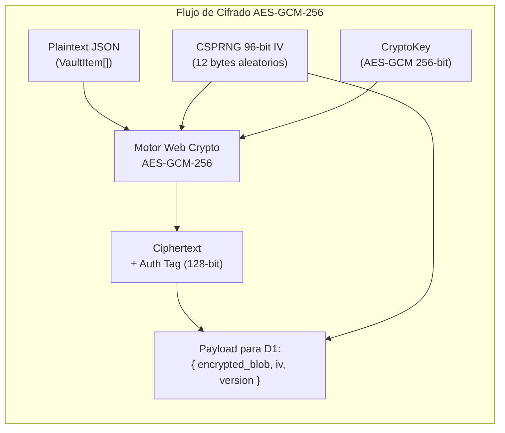
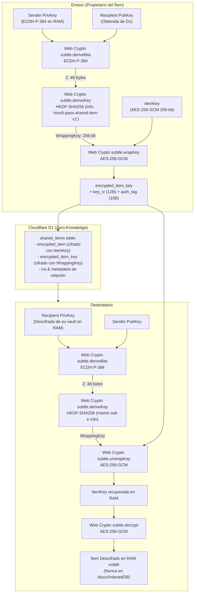
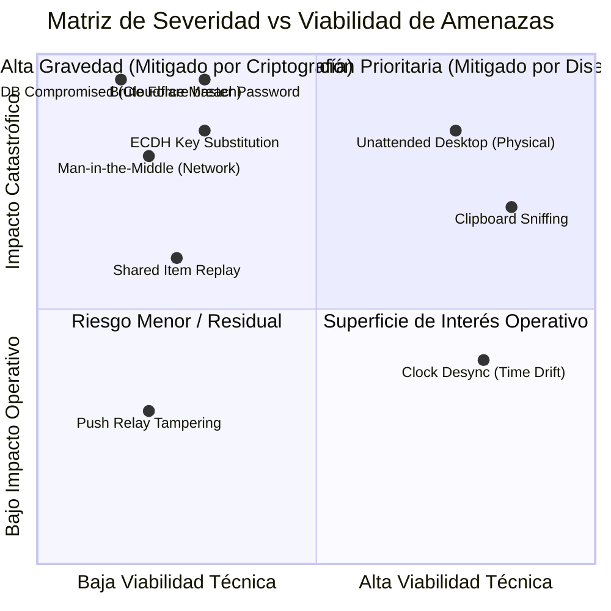

# Cryptographic Specification & Threat Model
## Proyecto: Revolt Pass — Zero-Knowledge 2FA & Security Vault

| Metadato | Detalle |
| :--- | :--- |
| **Identificador de Documento** | `RP-SEC-003` |
| **Versión** | `1.5.0-PROD` |
| **Estado** | Aprobado / Especificación de Seguridad de Grado Criptográfico |
| **Marco de Referencia** | OWASP ASVS v4.0, NIST SP 800-63B, RFC 6238, RFC 5869, RFC 9106 (Argon2), RFC 8291, RFC 8292, W3C WebAuthn Level 3 |
| **Dominio Productivo** | `https://<tu-dominio-o-subdominio>.workers.dev` |
| **Licencia** | GNU AGPLv3 + Política de Marca Registrada (Revolt Group) |

---

## 1. Especificación Criptográfica Formal

Revolt Pass adopta el paradigma criptográfico **Zero-Knowledge (Conocimiento Cero)**. Toda operación de generación de entropía, derivación de llaves, cifrado simétrico y verificación de integridad se efectúa de manera exclusiva en el entorno de ejecución del cliente mediante la **Web Crypto API** (`window.crypto.subtle`) y módulos WebAssembly compilados y aislados, protegiendo todo cómputo criptográfico contra manipulaciones en el espacio de usuario.

### 1.1 Derivación de Clave Maestra (Key Derivation Function - KDF)

A partir de la versión **v1.5.0**, Revolt Pass establece **Argon2id** (RFC 9106) como el algoritmo predeterminado y mandated para toda nueva derivación de clave maestra, reteniendo compatibilidad con **PBKDF2-HMAC-SHA256** mediante un canal de migración atómica transparente (*silent auto-upgrade*).

#### 1.1.1 Parámetros Canónicos de Argon2id (Por Defecto)
Ejecutado a través de WebAssembly de alto rendimiento (`hash-wasm`) encapsulado en un **Web Worker** dedicado (`src/lib/crypto/kdf.worker.ts`) para no degradar el hilo de renderizado del DOM:

| Parámetro | Valor Canónico | Justificación de Ingeniería / Estándar |
| :--- | :--- | :--- |
| **Algoritmo Base** | `Argon2id` (RFC 9106) | Ganador del Password Hashing Competition (PHC). Proporciona resistencia híbrida óptima contra ataques de canal lateral (Argon2i) y ataques masivos en GPU/ASICs (Argon2d). |
| **Memoria de Trabajo ($m$)** | **$64 \text{ MB}$ ($65,536 \text{ KiB}$)** | Cumple estrictamente con las recomendaciones de OWASP 2024 (Password Storage Cheat Sheet). Obliga al hardware de descifrado masivo a reservar bloques de RAM masivos por intento, neutralizando granjas GPU y ASICs. |
| **Iteraciones de Tiempo ($t$)** | **$3$ rondas** | Equilibrio óptimo entre resistencia criptográfica y latencia de desbloqueo en dispositivos móviles y estaciones de trabajo (~200-400 ms en WebAssembly). |
| **Paralelismo ($p$)** | **$1$ hilo (lane)** | Diseñado para máxima compatibilidad y predictibilidad de recursos dentro del contexto Web Worker en navegadores web. |
| **Salt (Salting)** | $128 \text{ bits}$ ($16 \text{ bytes}$) aleatorios | Generado criptográficamente vía `crypto.getRandomValues(new Uint8Array(16))`. Es único por usuario y previene ataques mediante tablas Rainbow. |
| **Longitud de Clave Saliente** | $256 \text{ bits}$ ($32 \text{ bytes}$) | Coincide exactamente con el tamaño requerido para la llave simétrica `AES-GCM-256`. |
| **Exportabilidad de la Llave** | `extractable: false` | La `CryptoKey` generada en memoria RAM se importa y marca como no extraíble por JavaScript. |

#### 1.1.2 Algoritmo Legado y Auto-Upgrade Silencioso (PBKDF2)
Para cuentas creadas con anterioridad a v1.5.0, el sistema preserva el soporte para **PBKDF2-HMAC-SHA256** a **600,000 rondas** (RFC 8018).

* **Mecanismo de Auto-Upgrade Transparente:** En el instante en que un usuario con cuenta PBKDF2 desbloquea su baúl o inicia sesión, el cliente detecta el metadato de KDF legado, re-deriva inmediatamente la nueva clave maestra empleando **Argon2id (64 MB, 3 rondas)** con un nuevo salt criptográfico, re-cifra el payload del baúl y las credenciales WebAuthn/passkey asociadas, y efectúa una llamada atómica a `POST /api/auth/upgrade-kdf`. El usuario experimenta una transición sin fricción ni necesidad de reingresar credenciales.

Para evitar bloquear el hilo principal de la interfaz de usuario (*UI thread*) durante el cálculo del KDF, tanto Argon2id como PBKDF2 se ejecutan exclusivamente en el **Web Worker** aislado.

---

### 1.2 Cifrado Simétrico y Autenticación del Vault (AES-GCM)
El payload de la bóveda (lista de cuentas TOTP, secretos Base32, claves de recuperación y metadatos) se serializa en una cadena UTF-8 JSON y se procesa mediante **AES-GCM (Advanced Encryption Standard in Galois/Counter Mode)**.



* **Tamaño de Llave:** 256 bits (`AES-256`).
* **Vector de Inicialización (IV / Nonce):** 96 bits (12 bytes). **Regla estricta:** Un nuevo IV se genera con `crypto.getRandomValues(new Uint8Array(12))` **en cada operación de guardado**. La reutilización de un par (Llave, IV) bajo AES-GCM destruye la autenticidad y puede permitir la recuperación de texto plano.
* **Authentication Tag:** 128 bits (16 bytes). La etiqueta de autenticación garantiza integridad criptográfica estricta: cualquier alteración de un solo bit en la base de datos o en tránsito provoca el rechazo inmediato (`OperationError`) durante `subtle.decrypt()`, neutralizando ataques de alteración de mensaje (*tampering*).

---

### 1.3 Mecanismo de Desbloqueo Rápido vía WebAuthn / Passkeys
Para proporcionar una experiencia sin fricción sin comprometer el modelo Zero-Knowledge, se implementa una arquitectura de **Envoltura Local de Llave (Key Wrapping)** respaldada por hardware FIDO2 / WebAuthn.

1. **Enrolamiento:**
   * El usuario se autentica exitosamente con su Contraseña Maestra (obteniendo `MasterKey`).
   * El cliente invoca `navigator.credentials.create()` configurando:
     * `authenticatorAttachment: "platform"` (restringe al hardware del equipo: Windows Hello en PC, Touch ID / Face ID en Apple, Biometría en Android).
     * `userVerification: "required"` (fuerza ingreso de PIN de Windows Hello o escaneo biométrico).
   * El cliente genera una llave simétrica local aleatoria de envoltura (`DeviceWrappingKey`, 256 bits).
   * Se cifra la `MasterKey` con la `DeviceWrappingKey` mediante AES-GCM, produciendo `wrapped_master_key`.
   * La `DeviceWrappingKey` se almacena protegida en el almacén local del navegador, vinculada al ID de la credencial WebAuthn generada.
2. **Desbloqueo Posterior:**
   * La aplicación solicita la aserción con `navigator.credentials.get({ publicKey: { challenge, userVerification: "required" } })`.
   * El usuario introduce su **PIN de Windows Hello** o coloca su huella en el móvil.
   * Tras la aserción válida devuelta por el TPM/Enclave de hardware del sistema operativo, el cliente libera la `DeviceWrappingKey`, desencripta `wrapped_master_key` y reconstruye la `MasterKey` en la memoria RAM volátil.
   * Si el usuario revoca la credencial, desinstala la PWA o falla la verificación, la clave de envoltura se purga y el sistema exige la Contraseña Maestra.

---

### 1.4 Motor TOTP (RFC 6238 / RFC 4226)
La generación de contraseñas de un solo uso por tiempo (TOTP) sigue estrictamente las especificaciones de Internet Engineering Task Force (IETF):

1. **Decodificación Base32 (RFC 4648):**
   * Se sanitiza el secreto eliminando caracteres nulos, guiones y espacios.
   * Decodificador Base32 puro implementado en TypeScript:
     * Entrada: `string` de caracteres en alfabeto `[A-Z2-7]`.
     * Salida: `Uint8Array` de bytes binarios.
2. **Cálculo del Intervalo:**
   $$C_t = \left\lfloor \frac{T_{local} + \Delta T_{drift}}{X} \right\rfloor$$
   donde $X = 30$ segundos, $T_{local}$ es el tiempo Unix en segundos y $\Delta T_{drift}$ es la corrección temporal calculada contra el Worker.
   El contador $C_t$ se serializa como un entero de 64 bits en formato Big-Endian (8 bytes).
3. **Generación del HMAC:**
   * Se firma $C_t$ con la clave secreta decodificada utilizando `crypto.subtle.sign("HMAC", hmacKey, counterBuffer)`.
   * Soporte de algoritmos: `SHA-1` (default de 20 bytes) y `SHA-256` (32 bytes).
4. **Truncamiento Dinámico (Dynamic Truncation):**
   * El último byte del hash determina el desplazamiento (*offset*):
     $$\text{offset} = \text{hash}[20 - 1] \ \& \ \text{0x0F}$$
   * Se extraen 4 bytes a partir del offset, aplicando máscara para anular el bit de signo más significativo:
     $$\text{binary} = ((\text{hash}[\text{offset}] \ \& \ \text{0x7F}) \ll 24) \ | \ ((\text{hash}[\text{offset} + 1] \ \& \ \text{0xFF}) \ll 16) \ | \ ((\text{hash}[\text{offset} + 2] \ \& \ \text{0xFF}) \ll 8) \ | \ (\text{hash}[\text{offset} + 3] \ \& \ \text{0xFF})$$
   * Se calcula el código final mediante módulo:
     $$\text{token} = (\text{binary} \pmod{10^{\text{digits}}}).\text{toString}().\text{padStart}(\text{digits}, \text{'0'})$$

---

### 1.5 Criptografía Asimétrica y Acuerdo de Claves (ECDH P-384 + HKDF-SHA256 - ADR-014)
Para permitir la compartición segura de secretos individuales entre usuarios sin revelar información en texto claro al servidor Cloudflare D1 ni requerir canales externos fuera de banda, Revolt Pass adopta un esquema de **Encapsulamiento Asimétrico de Claves (KEM)** basado en **ECDH P-384** y **HKDF-SHA256**.



#### Parámetros Criptográficos Canónicos:
1. **Curva Elíptica:** NIST P-384 (`secp384r1`). Proporciona un margen de seguridad criptográfico de 192 bits (superior a P-256 y alineado con suites CNSA/NSA Suite B), respaldado de forma nativa en la Web Crypto API sin paquetes externos.
2. **Generación de Par de Claves:**
   $$\text{KeyPair} = \text{crypto.subtle.generateKey}(\{ \text{name: "ECDH"}, \text{namedCurve: "P-384"} \}, \text{extractable: true}, [\text{"deriveKey"}, \text{"deriveBits"} ])$$
   * La clave pública se exporta en formato `spki` (codificada en Base64) y se publica en Cloudflare D1 en la columna `users.ecdh_public_key`.
   * La clave privada se exporta en formato `pkcs8`, se cifra simétricamente con la `MasterKey` del usuario y se almacena dentro de su propio `encrypted_blob` en IndexedDB. Jamás se envía en texto claro a la nube.
3. **Acuerdo de Clave Secreta Compartida (ECDH):**
   $$\mathcal{Z} = \text{ECDH}(\text{PrivKey}_A, \text{PubKey}_B) \in \mathbb{F}_p \quad (48 \text{ bytes})$$
4. **Función de Derivación de Clave de Envoltura (HKDF-SHA256 - RFC 5869):**
   A partir del secreto compartido $\mathcal{Z}$, se deriva una clave simétrica de envoltura `WrappingKey` (AES-GCM de 256 bits) garantizando independencia criptográfica y separación de contexto:
   $$\text{PRK} = \text{HMAC-SHA256}(\text{Salt}, \mathcal{Z})$$
   $$\text{WrappingKey} = \text{HKDF-Expand}(\text{PRK}, \text{"revolt-pass-shared-item-v1"}, 256 \text{ bits})$$
5. **Encapsulamiento del Secreto (Key Wrapping):**
   La clave simétrica propia del ítem (`ItemKey`, AES-256-GCM) se encapsula mediante la `WrappingKey` obtenida:
    $$\text{EncryptedKey}, \text{KeyTag} = \text{AES-GCM-256-Wrap}(\text{WrappingKey}, \text{ItemKey}, \text{KeyIV})$$
    El contenido del ítem se cifra con la `ItemKey`:
    $$\text{EncryptedItem}, \text{ItemTag} = \text{AES-GCM-256-Encrypt}(\text{ItemKey}, \text{ItemJSON}, \text{ItemIV})$$

---

### 1.6 Notificaciones Proactivas Zero-Knowledge: Web Push (RFC 8291/8292) y Email BYOK

A fin de alertar al usuario de inmediato ante accesos anómalos o cambios en su sesión sin comprometer la privacidad ni incurrir en costes de infraestructura:

#### 1.6.1 Web Push Nativo y Cifrado de Carga Útil (RFC 8291 / RFC 8292)
1. **Suscripción en Cliente:** El navegador genera una suscripción Push vinculada a la clave pública VAPID de la instancia. Dicha suscripción exporta dos parámetros criptográficos: `p256dh` (clave pública del navegador sobre la curva NIST P-256) y `auth` (secreto de autenticación compartido de 16 bytes).
2. **Autenticación del Servidor de Aplicación (VAPID - RFC 8292):** Cloudflare Workers genera un JWT de autorización firmado mediante ECDSA sobre la curva P-256 con SHA-256 (`ES256`), permitiendo enviar notificaciones directamente a los servidores de push del sistema operativo (Google FCM, Apple APNs, Mozilla Push) sin depender de brokers de terceros (Pusher, OneSignal).
3. **Cifrado de Mensaje en Tránsito (RFC 8291):** El payload de la notificación se cifra con `aes128gcm` derivando claves mediante ECDH efímero (P-256) y HKDF. Los servidores intermediarios de notificación del sistema operativo actúan como repetidores ciegos (*blind relays*), siendo matemáticamente incapaces de leer el texto de la alerta.
4. **Higiene de Contenido:** Las notificaciones jamás contienen secretos, códigos TOTP ni nombres de cuentas. Únicamente alertan sobre eventos de auditoría operativa (ej: *"Nueva sesión iniciada desde España"* o *"Sesión revocada remotamente"*).

#### 1.6.2 Correo Electrónico BYOK (Bring Your Own Key)
Para usuarios que prefieren alertas por email, Revolt Pass implementa una arquitectura **BYOK** de coste $0:
- El usuario proporciona opcionalmente su clave personal de Resend (nivel gratuito de 3,000 correos/mes de por vida) o la instancia utiliza Cloudflare Email Workers nativo (`send_email`).
- La plataforma no mantiene un servidor SMTP centralizado de pago ni comercializa ni indexa correos electrónicos de los usuarios.

---

## 2. Modelo de Amenazas (STRIDE & Análisis de Vectores de Ataque)

Se evalúa la postura de seguridad de Revolt Pass conforme a la metodología **STRIDE** de Microsoft y se detalla la matriz de vectores de ataque.



### Matriz Detallada de Vectores de Ataque y Mitigaciones

| Vector / ID | Categoría STRIDE | Descripción de la Amenaza | Impacto | Controles de Mitigación Implementados |
| :--- | :--- | :--- | :--- | :--- |
| **VEC-01** | *Information Disclosure* | **Compromiso de Cloudflare D1:** Un actor malicioso o un empleado desleal con acceso administrativo a la cuenta de Cloudflare extrae el contenido de la tabla `vaults`. | Nulo (Zero-Knowledge) | **Inviolabilidad Criptográfica:** La base de datos solo almacena blobs cifrados con AES-256-GCM. Sin la Contraseña Maestra y el salt, romper el blob requeriría $2^{255}$ operaciones computacionales, lo cual es físicamente imposible. |
| **VEC-02** | *Tampering* | **Alteración de Datos en Tránsito o en Reposo:** Modificación malintencionada de bytes en el `encrypted_blob` dentro de D1 para provocar comportamientos anómalos en el cliente. | Nulo (Rechazo Inmediato) | **Etiqueta de Autenticación GCM:** AES-GCM verifica el Authentication Tag de 128 bits. Si un solo bit es modificado, `crypto.subtle.decrypt` arroja un error inmutable y la aplicación se bloquea de inmediato sin procesar datos corruptos. |
| **VEC-03** | *Information Disclosure* | **Acceso Físico a Estación de Trabajo Desbloqueada:** El operador abandona su escritorio con la PWA abierta en primer plano. | Crítico | **Auto-Lock por Inactividad & Ocultamiento:** Temporizador en RAM que purga las claves tras 5 minutos de inactividad de mouse/teclado. Adicionalmente, el evento `visibilitychange` bloquea la bóveda si la pestaña permanece oculta. |
| **VEC-04** | *Information Disclosure* | **Clipboard Sniffing (Espionaje de Portapapeles):** Aplicaciones en segundo plano o malware sin privilegios de administrador que monitorean el portapapeles del sistema operativo para capturar códigos TOTP o Recovery Codes. | Alto | **Auto-Clear Programado:** Rutina con temporizador estricto de 45 segundos que sobrescribe el portapapeles con texto vacío. Compara el contenido previo para evitar borrar información legítima si el usuario copió otra cosa en el intervalo. |
| **VEC-05** | *Information Disclosure* | **Ataque de Fuerza Bruta Offline sobre la Contraseña Maestra:** Si un atacante roba el salt y el blob cifrado, intenta deducir la contraseña mediante diccionarios y hashes masivos. | Alto (Inviable) | **Dureza en Memoria Argon2id (64 MB, 3 rondas) & PBKDF2 600k:** Argon2id exige 64 MB de memoria física por cada intento computacional, saturando el ancho de banda de memoria de ASICs y tarjetas gráficas GPU e invalidando ataques paralelos a gran escala. Las cuentas históricas PBKDF2 se migran automáticamente a Argon2id al desbloquear. |
| **VEC-06** | *Elevation of Privilege* | **Ataques de Inyección de Scripts (XSS):** Inyección de código JavaScript para leer la memoria del navegador o interceptar los eventos de teclado. | Crítico | **Aislamiento Estricto & CSP:** Política de Seguridad de Contenido (CSP) que bloquea `unsafe-inline`, `unsafe-eval` y restringe la carga de recursos externos únicamente a `self` y al CDN de `cdn.simpleicons.org`. Cero dependencias de librerías CDN en tiempo de ejecución. |
| **VEC-07** | *Denial of Service* | **Falla de Sincronización por Pérdida de Conectividad:** El usuario viaja en avión o experimenta cortes de red y necesita acceder a sus cuentas corporativas. | Alto | **Disponibilidad Offline Absoluta (100%):** Todo el estado se mantiene cifrado en IndexedDB y los assets en Service Worker. La aplicación opera indefinidamente en modo avión. |
| **VEC-08** | *Information Disclosure / Spoofing* | **Intercepción o Alteración de Notificaciones Web Push:** Un atacante en la red intercepta o intenta falsificar alertas push dirigidas a los dispositivos del usuario. | Nulo | **Cifrado de Carga Útil RFC 8291 (ECDH P-256 + AES-128-GCM):** Todo payload push va cifrado de extremo a extremo con el par de claves del navegador. Las alertas no contienen secretos de la bóveda ni credenciales maestras. |
| **VEC-NEW-01** | *Spoofing / Tampering* | **Sustitución Maliciosa de Clave Pública ECDH (Key Substitution Attack):** Un atacante que comprometa el servidor Cloudflare D1 sustituye la clave pública de un usuario por una propia para descifrar ítems compartidos dirigidos a ese usuario. | Crítico | **Verificación de Fingerprint Fuera de Banda:** La UI computa y muestra la huella criptográfica SHA-256 de la clave pública del destinatario (`SHA-256(spki)` en formato hex agrupado o emoji-hash). Los usuarios verifican la huella mediante un canal secundario seguro (Signal, llamada) antes de compartir secretos de alto impacto. |
| **VEC-NEW-02** | *Tampering / Replay* | **Replay o Reinserción de Paquetes Cifrados Compartidos:** Un actor reenvía un ciphertext compartido antiguo para sobreescribir una versión actualizada o revertir una revocación. | Medio | **Restricciones de Unicidad y Versión en D1:** Índice único `UNIQUE(owner_user_id, recipient_user_id, source_item_id)`, monotonicidad de versiones y validación estricta de sesión autenticada que impide a terceros inyectar o reactivar filas en `shared_items`. |
| **VEC-NEW-03** | *Information Disclosure* | **Enumeración Masiva de Destinatarios:** Escaneo automatizado del endpoint público de claves para descubrir nombres de usuario registrados en la plataforma. | Bajo | **Defensa en Profundidad en el Edge:** Requiere sesión autenticada activa (`Authorization: Bearer <token>`) para consultar `/api/users/:username/public-key` y aplica Rate Limiter en Cloudflare Workers limitando solicitudes ráfaga por IP. |

---

## 3. Medidas de Mitigación y Buenas Prácticas de Ingeniería

### 3.1 Higiene de Memoria RAM
En entornos de navegador con recolección de basura (*Garbage Collection*), la sobreescritura garantizada de memoria presenta retos específicos. Para mitigar la persistencia de secretos:
1. Las llaves se manejan primordialmente como objetos no extraíbles `CryptoKey`.
2. Las claves temporales o contraseñas en texto plano manipuladas como `Uint8Array` se sobrescriben explícitamente con ceros inmediatamente después de su uso:
   ```typescript
   function secureZeroBuffer(buffer: Uint8Array): void {
     buffer.fill(0);
   }
   ```
3. Al dispararse el evento de bloqueo (*lock*), la variable de estado `activeSessionState.masterKey` se asigna a `null` y se invoca la dereferencia de los elementos de la bóveda para permitir su recolección inmediata por el motor V8.

### 3.2 Content Security Policy (CSP) en Cloudflare
El Worker y las cabeceras emitidas por Cloudflare para el subdominio `https://<tu-dominio-o-subdominio>.workers.dev` aplican la siguiente directiva canónica:

```http
Content-Security-Policy: default-src 'self'; script-src 'self'; style-src 'self' 'unsafe-inline'; img-src 'self' data: https://cdn.simpleicons.org; connect-src 'self'; font-src 'self'; object-src 'none'; frame-ancestors 'none'; base-uri 'self'; form-action 'self';
Strict-Transport-Security: max-age=31536000; includeSubDomains; preload
X-Content-Type-Options: nosniff
X-Frame-Options: DENY
X-XSS-Protection: 1; mode=block
Referrer-Policy: strict-origin-when-cross-origin
```

### 3.3 Protocolo de Limpieza Automática de Portapapeles (Algoritmo)
```typescript
class ClipboardGuard {
  private timeoutId: number | null = null;
  private lastCopiedSecret: string | null = null;

  public copySecret(secret: string, clearDelayMs = 45000): void {
    if (this.timeoutId !== null) {
      window.clearTimeout(this.timeoutId);
    }

    navigator.clipboard.writeText(secret).then(() => {
      this.lastCopiedSecret = secret;
      this.timeoutId = window.setTimeout(async () => {
        try {
          // Solo limpiar si el portapapeles aún contiene el secreto protegido
          const currentText = await navigator.clipboard.readText();
          if (currentText === this.lastCopiedSecret) {
            await navigator.clipboard.writeText('');
          }
        } catch {
          // Si los permisos de lectura fallan, forzar escritura vacía preventiva
          await navigator.clipboard.writeText('');
        } finally {
          this.lastCopiedSecret = null;
          this.timeoutId = null;
        }
      }, clearDelayMs);
    });
  }
}
```
Este algoritmo previene la fuga involuntaria de secretos en aplicaciones de mensajería, suites ofimáticas o herramientas de captura de texto.

### 3.4 Seguridad de Sesiones y Almacenamiento Hash de Tokens (D1)
* **Tokens de Sesión:** Cada cliente autenticado posee un token de sesión criptográfico generado en cliente con alta entropía (`crypto.getRandomValues`).
* **Protección contra Infiltración de Base de Datos:** Los tokens de sesión jamás se almacenan en texto plano en la base de datos Cloudflare D1. El Worker computa un hash **SHA-256** del token (`token_hash`) antes de persistirlo o indexarlo en la tabla `sessions`.
* **Revocación Granular Inmediata:** Si un token es revocado individualmente (`is_revoked = 1`), cualquier solicitud posterior que presente ese token es denegada con código HTTP `401 Unauthorized`.

### 3.5 Mitigación de Reingreso Biométrico y Ciclo de Vida de Passkeys (FIDO2)
* **Vector de Amenaza:** En un entorno corporativo o compartido, un usuario podría cerrar su sesión en una PC ajena; sin embargo, si el hardware local mantiene registrada una credencial de Windows Hello o biometría vinculada a la cuenta, un tercero con acceso a esa máquina podría intentar re-autenticarse.
* **Mitigación Arquitectónica:**
  1. **Revocación Remota:** El usuario puede listar todas sus Passkeys enroladas desde cualquier otro dispositivo y eliminarlas (`DELETE /api/passkeys/:id`).
  2. **Eliminación del Bypass de Windows Hello:** Se eliminó la omisión insegura de verificación biométrica, asegurando que ninguna clave de envoltura local pueda descifrarse sin pasar por el flujo formal de autenticación de plataforma.

### 3.6 Privacidad Estricta en Internacionalización (Zero-Leak i18n)
* **Sin Servicios de Terceros:** A diferencia de aplicaciones que envían el DOM a APIs externas (Google Translate, DeepL, etc.) —lo que expondría descripciones de cuentas, nombres de servicios y tokens 2FA—, Revolt Pass utiliza diccionarios 100% estáticos compilados en el bundle cliente.
* **Cero Telemetría Lingüística:** La selección de idioma se almacena localmente en `localStorage.revolt_lang` y no se envía ni se registra en ningún servidor central.

---

### 3.7 Extensión del Modelo de Confianza (Compartición Segura v2.5: Metadatos de Relación vs. Contenido ZK)
El Hito v2.5 introduce la capacidad de compartir secretos entre usuarios de forma asimétrica. Es un principio de transparencia de ingeniería delimitar con rigor matemático qué información aprende la infraestructura central frente a qué información permanece inexpugnable bajo Conocimiento Cero:

#### 1. Información Conocida por el Servidor / Cloudflare D1 (Metadatos de Relación):
* **Participantes de la Transacción:** Quién comparte (`owner_user_id`) y con quién (`recipient_user_id`).
* **Identificador Opaco del Ítem Origen:** El identificador UUID/CUID del ítem compartido (`source_item_id`).
* **Marcas Temporales:** Fechas y horas de compartición (`created_at`), última actualización (`updated_at`) y revocación (`revoked_at`).
* **Permisos Concedidos:** Si el receptor tiene privilegios de solo lectura (`read`) o edición (`write`).
* **Claves Públicas ECDH P-384:** Las representaciones SPKI públicas de las claves de los usuarios, necesarias para efectuar el acuerdo Diffie-Hellman.

#### 2. Información 100% Blindada bajo Zero-Knowledge (Contenido e Integridad):
* **Contenido del Secreto:** Nombres de usuario, contraseñas, semillas TOTP, códigos de respaldo y notas cifradas (`encrypted_item`).
* **Clave Simétrica del Ítem (`item_key`):** Permanece encapsulada (`encrypted_item_key`) mediante una clave AES-256-GCM derivada exclusivamente en la RAM de los dos navegadores involucrados mediante ECDH + HKDF.
* **Inviolabilidad frente a Brechas Centrales:** Incluso si un adversario obtiene un volcado completo de la base de datos D1 o compromete el Worker en el Edge, le es matemáticamente inviable descifrar los ítems o recuperar las claves simétricas, ya que ninguna clave privada ECDH reside jamás en el servidor ni abandona el dispositivo del usuario sin estar cifrada con su propia `MasterKey`.
* **Ciclo de Vida en Memoria Volátil:** Los secretos compartidos recibidos se descifran al vuelo y residen **exclusivamente en la memoria RAM del cliente**; nunca se persisten en texto plano en la base de datos local IndexedDB, mitigando ataques de extracción forense en disco.

