# Roadmap & Plan de Evolución Técnica
## Proyecto: Revolt Pass — Zero-Knowledge 2FA & Security Vault

| Metadato | Detalle |
| :--- | :--- |
| **Identificador de Documento** | `RP-RDM-005` |
| **Versión Actual** | `1.3.1-PROD` (En Producción / Live) |
| **Estado** | Aprobado / Plan de Evolución Basado en Hitos de Calidad |
| **Repositorio Remoto** | `https://github.com/Revolt-Group/revolt-pass.git` |
| **Rama Principal** | `main` |
| **Filosofía de Tiempos** | Calidad y Seguridad ante todo (Quality-Driven, sin plazos rígidos de calendario) |
| **Licencia** | GNU AGPLv3 + Política de Marca Registrada (Revolt Group) |

---

## 1. Filosofía de Ingeniería y Puertas de Calidad (Quality Gates)

En **Revolt Pass**, el desarrollo y la evolución arquitectónica se rigen por un principio inquebrantable de **seguridad, robustez criptográfica y excelencia en la experiencia de usuario**, priorizando la calidad y la verificación exhaustiva por sobre cronogramas arbitrarios o fechas de calendario rígidas.

Cada hito o versión del proyecto se estructura en torno a una **Definición de Terminado (Definition of Done - DoD)** formal. Ninguna funcionalidad se promueve a producción o se considera completada sin superar el 100% de sus pruebas unitarias, análisis estático de tipos (`tsc -b`), auditorías de higiene de memoria y revisión de seguridad Zero-Knowledge.

```mermaid
flowchart TD
    subgraph COMPLETADAS ["Cimientos Fundacionales en Producción (v1.0 a v1.3.1)"]
        v10["Fases 1 a 8: Núcleo Criptográfico & PWA<br/>AES-256-GCM, PBKDF2 600k en Web Worker, Cloudflare D1 Edge, WebAuthn, AutoLock"]
        v11["Fase 9: Multidispositivo & Auditoría (v1.1)<br/>Sesiones D1, Revocación remota granular, Passkeys FIDO2, Audit Logs"]
        v12["Fases 10 y 11: i18n, Backups & Apertura Open Source (v1.2.1)<br/>Internacionalización ES/EN, Backups cifrados, Modo Instancia Privada, AGPLv3"]
        v13["Fase 12: Higiene & HaveIBeenPwned (v1.3.0)<br/>k-Anonymity SHA-1, Alertas de entropía Base32, Scorecard visual"]
        v131["Fase 13: Endurecimiento & Rotación (v1.3.1)<br/>CSP estricta, Rate Limiter perimetral, CORS restringido, Sliding Token Rotation"]
        v10 --> v11 --> v12 --> v13 --> v131
    end

    subgraph PROXIMAS ["Horizontes de Evolución Técnica (Próximas Versiones)"]
        v14["Hito v1.4: Ingesta Masiva, Exportadores & YubiKey<br/>Google Auth, Aegis, 2FAS, Bitwarden + Export otpauth:// y FIDO2 roaming"]
        v15["Hito v1.5: Argon2id KDF & Notificaciones Proactivas<br/>Upgrade criptográfico Argon2id WASM, Cloudflare Email Workers"]
        v20["Hito v2.0: Suite Integral de Secretos & Bóveda Completa<br/>Contraseñas, Tarjetas de pago, Notas Markdown, Claves SSH, Snapshots 5d, Emergency Kit"]
        v21["Hito v2.1: Extensión para Navegadores (Manifest V3)<br/>Autofill contextual por dominio eTLD+1, Inyección inline de tokens 2FA, Auto-lock 2m"]
        v22["Hito v2.2: Aplicación de Escritorio Nativa (Tauri v2 + Rust)<br/>Binario liviano <10MB, Windows Hello / Touch ID OS, Auto-update firmado"]
        v131 -.-> v14 --> v15 --> v20 --> v21 --> v22
    end

    style COMPLETADAS fill:#0f172a,stroke:#22c55e,stroke-width:2px,color:#f8fafc
    style PROXIMAS fill:#090d16,stroke:#6366f1,stroke-width:2px,stroke-dasharray: 5 5,color:#f8fafc
    style v10 fill:#1e293b,stroke:#3b82f6,color:#fff
    style v11 fill:#1e293b,stroke:#3b82f6,color:#fff
    style v12 fill:#166534,stroke:#22c55e,color:#fff
    style v13 fill:#166534,stroke:#22c55e,color:#fff
    style v131 fill:#166534,stroke:#22c55e,color:#fff
    style v14 fill:#1e1b4b,stroke:#818cf8,color:#fff
    style v15 fill:#1e1b4b,stroke:#818cf8,color:#fff
    style v20 fill:#1e1b4b,stroke:#818cf8,color:#fff
    style v21 fill:#1e1b4b,stroke:#818cf8,color:#fff
    style v22 fill:#1e1b4b,stroke:#818cf8,color:#fff
```

---

## 2. Bloque I: Cimientos Fundacionales Desplegados (v1.0 — v1.3.1)

Las siguientes fases iniciales representan la base estructural que se encuentra **100% implementada, auditada y en producción**:

### FASE 1: Configuración del Entorno y Scaffolding Base
* **Objetivo:** Inicializar la estructura del proyecto con herramientas oficiales, TypeScript estricto, Tailwind CSS y soporte de Wrangler para Cloudflare D1.
* **Definition of Done (DoD) - Fase 1:**
  - [x] El comando `pnpm build` compila limpiamente con 0 errores y 0 advertencias de TypeScript.
  - [x] Servidor de desarrollo local (`pnpm dev`) responde en `<100ms`.
  - [x] `wrangler.toml` contiene la configuración estructural correcta para D1 y Workers.
  - [x] Repositorio Git limpio con rama activa `main` y `.gitignore` exhaustivo.

---

### FASE 2: Motor Criptográfico Core en Cliente
* **Objetivo:** Implementar la suite criptográfica nativa en TypeScript bajo los estándares RFC 6238, RFC 4648 y Web Crypto API, sin librerías externas obsoletas.
* **Definition of Done (DoD) - Fase 2:**
  - [x] Pruebas unitarias validadas contra los vectores oficiales del RFC 6238 Apéndice B.
  - [x] Cifrado y descifrado de carga útil JSON genera salida idéntica (*roundtrip test*).
  - [x] La manipulación intencional de 1 bit en el blob cifrado genera rechazo inmediato por `AES-GCM` (`OperationError`).
  - [x] PBKDF2 (600.000 rondas) se ejecuta en segundo plano vía Web Worker dedicado sin bloquear el renderizado visual de React.

---

### FASE 3: Backend Edge & Capa de Persistencia Remota
* **Objetivo:** Crear la API REST en Cloudflare Workers y aprovisionar el esquema relacional en Cloudflare D1.
* **Definition of Done (DoD) - Fase 3:**
  - [x] Base de datos D1 inicializada con tablas relacionales seguras.
  - [x] `GET /api/time` devuelve el timestamp del servidor con latencia inferior a 50ms para compensación de Time Drift.
  - [x] Intentos de actualizar una bóveda con una versión desactualizada devuelven de forma determinista `HTTP 409 Conflict`.
  - [x] Todas las respuestas se empaquetan en el formato canónico `{ success, data, error, timestamp }`.

---

### FASE 4: Capa de Persistencia Local & Sincronización Offline
* **Objetivo:** Garantizar la soberanía de datos y disponibilidad 100% offline mediante IndexedDB y motor de sincronización asíncrono.
* **Definition of Done (DoD) - Fase 4:**
  - [x] La aplicación puede cerrarse y reabrirse sin conexión a Internet, recuperando el último estado local cifrado.
  - [x] Las modificaciones realizadas offline se sincronizan automáticamente con D1 en cuanto se detecta conectividad (`window.addEventListener('online')`).
  - [x] El desfase temporal se compensa correctamente ante discrepancias del reloj del sistema operativo.

---

### FASE 5: Componentes UI & Experiencia de Usuario Dark-Mode First
* **Objetivo:** Construir la interfaz de usuario Dark-Mode First inspirada en los estándares estéticos de Raycast, Linear y Vercel.
* **Definition of Done (DoD) - Fase 5:**
  - [x] Interfaz completamente responsiva en pantallas móviles (375px) y monitores de escritorio 4K.
  - [x] Atajo `Ctrl + K` abre la paleta de comandos en menos de 50ms y permite copiar códigos con `Enter`.
  - [x] Escaneo de QR funciona indistintamente por cámara, arrastrando una imagen o pulsando `Ctrl + V`.
  - [x] Cuenta regresiva del temporizador circular anima fluidamente a 60 FPS sin parpadeos.

---

### FASE 6: Seguridad de Memoria, Clipboard & Respaldo
* **Objetivo:** Blindar la superficie local de la aplicación contra fugas de información y accesos no autorizados.
* **Definition of Done (DoD) - Fase 6:**
  - [x] Tras inactividad de mouse/teclado o cambio de visibilidad, la sesión se bloquea y la `MasterKey` en memoria se destruye.
  - [x] Al copiar un código TOTP o secreto, el portapapeles del sistema operativo se purga de manera inteligente a los 45 segundos.
  - [x] El desbloqueo rápido con PIN de Windows Hello o biometría móvil restaura la sesión de forma instantánea.
  - [x] Exportación e importación de bóveda en JSON cifrado reconstituye íntegramente todas las cuentas y recovery codes.

---

### FASE 7: PWA, Service Worker & Endurecimiento Offline
* **Objetivo:** Convertir el proyecto en una Progressive Web App plenamente instalable y resiliente a nivel de sistema operativo.
* **Definition of Done (DoD) - Fase 7:**
  - [x] PWA puntúa 100/100 en la auditoría PWA de Google Lighthouse.
  - [x] La app se instala como aplicación de escritorio independiente en Windows 10/11 y teléfonos móviles.
  - [x] Desconexión física de red permite continuar navegando y generando códigos TOTP sin interrupciones.

---

### FASE 8: Auditoría de Seguridad, QA & Despliegue en Producción
* **Objetivo:** Someter el sistema a verificación exhaustiva, comprobación de dependencias y despliegue sobre infraestructura global Cloudflare.
* **Definition of Done (DoD) - Fase 8:**
  - [x] Producción operativa y respondiendo globalmente con latencia ultra-baja.
  - [x] Calificación "A+" en pruebas de cabeceras de seguridad SSL Labs / SecurityHeaders.
  - [x] Suite completa de 73 pruebas unitarias y de integración pasando al 100% en Vitest.
  - [x] Consumo contenido de forma sostenible dentro del tier gratuito de Cloudflare.

---

### FASE 9: Panel de Seguridad, Sesiones Multidispositivo y Gestión de Passkeys (v1.1.0)
* **Objetivo:** Dotar a los usuarios de visibilidad y control granular sobre todas las sesiones abiertas y credenciales biométricas asociadas.
* **Definition of Done (DoD) - Fase 9:**
  - [x] Creación de tablas `sessions`, `passkeys` y `audit_logs` en Cloudflare D1.
  - [x] Cierre de sesión individual y remoto funcional en tiempo real con purga instantánea de memoria en equipos desconectados.
  - [x] Revocación remota de Passkeys operativa, previniendo reingreso biométrico en PCs ajenas.
  - [x] Nombres personalizados de dispositivos y Passkeys preservados permanentemente tras recargas con `Ctrl + F5`.

---

### FASE 10: Internacionalización Bilingüe Integral (i18n ES/EN) Zero-Knowledge (v1.2.0)
* **Objetivo:** Implementar soporte idiomático completo en Español e Inglés sin poner en riesgo la privacidad ni depender de APIs externas.
* **Definition of Done (DoD) - Fase 10:**
  - [x] Diccionarios síncronos compilados en `src/i18n/locales/es.ts` y `en.ts` con tipado estricto `TranslationSchema`.
  - [x] 100% de paridad y cero cadenas faltantes verificado en tiempo de compilación y en suite de tests.
  - [x] Conmutador de idioma dinámico con autodetección de idioma del navegador y persistencia local sin telemetría.

---

### FASE 11: Desacoplamiento de Instancia Privada, Licencia AGPLv3 y Políticas de Seguridad (v1.2.1)
* **Objetivo:** Abrir el repositorio a la comunidad garantizando la privacidad de la instancia del autor, protección legal de marca y canal de divulgación responsable.
* **Definition of Done (DoD) - Fase 11:**
  - [x] Variable `VITE_PRIVATE_INSTANCE` desacoplada: por defecto abierta (`false`) en repo público y activa (`true`) en producción del autor.
  - [x] Pantalla superpuesta de acceso restringido con atajos de desbloqueo discretos (`Ctrl + Alt + U`, `Ctrl + Shift + U` y triple clic en escudo).
  - [x] Trigger de base de datos SQLite en D1 remoto como defensa en profundidad ante registros no autorizados.
  - [x] Licencia **GNU AGPLv3** adoptada con **Política de Marca Registrada (Sección 7(e))**.
  - [x] Políticas de seguridad bilingües [`SECURITY.md`](../../SECURITY.md) y [`SECURITY.es.md`](../../SECURITY.es.md) integradas con los Reportes Privados de Vulnerabilidades de GitHub.

---

### FASE 12: Diagnóstico de Higiene, Scorecard & HaveIBeenPwned k-Anonymity (v1.3.0)
* **Objetivo:** Dotar a la aplicación de capacidades de auditoría preventiva y telemetría de salud de contraseñas bajo un estricto modelo Zero-Knowledge con k-Anonymity.
* **Definition of Done (DoD) - Fase 12:**
  - [x] Ningún secreto, contraseña completa ni hash SHA-1 de más de 5 caracteres sale jamás del navegador del usuario (blindaje k-Anonymity con padding anti-análisis y proxy Cloudflare).
  - [x] Motor de diagnóstico de higiene en cliente detecta duplicados, secretos con baja entropía (<80b), ausencia de códigos de respaldo y obsolescencia de backups (>30d).
  - [x] Scorecard visual e interactivo de salud con acciones directas de remediación y medidor porcentual en tiempo real.
  - [x] Comprobador interactivo de filtraciones de datos (HaveIBeenPwned) con explicación transparente de la garantía Zero-Knowledge.
  - [x] Suite de 88 pruebas unitarias pasando al 100% en Vitest con 0 errores de compilación estricta en TypeScript (`tsc -b`).

---

### FASE 13: Endurecimiento Perimetral y Sesiones Deslizantes con Rotación (v1.3.1)
* **Objetivo:** Sincronizar las defensas del código con el modelo de amenazas documentado, mitigar enumeración de usuarios vía limitación de tasa perimetral, restringir orígenes CORS y blindar las credenciales activas con rotación continua de tokens.
* **Definition of Done (DoD) - Fase 13:**
  - [x] Implementación estricta de Content-Security-Policy (CSP) en respuestas de activos estáticos del Worker (mitigación VEC-06).
  - [x] Limitador de tasa perimetral nativo de Cloudflare Workers en `/api/auth/salt` y `/api/auth/register` con cabecera `Retry-After: 60`.
  - [x] Restricción de orígenes CORS basada en `env.APP_DOMAIN` en producción, con fallback a comodín solo en desarrollo desconfigurado.
  - [x] Rotación automática de tokens de sesión deslizantes (*sliding sessions*) en sincronizaciones (`GET` y `PUT /api/vault`) con invalidación inmediata del token previo en Cloudflare D1.
  - [x] El cliente PWA (`syncEngine.ts`) intercepta `X-New-Session-Token` y actualiza la sesión en IndexedDB (`user_config`).
  - [x] Suite de pruebas expandida a 94 pruebas pasando al 100% en Vitest y 0 errores de compilación estricta en TypeScript (`tsc -b`).

---

## 3. Bloque II: Horizontes de Evolución Técnica y Producto

Los siguientes hitos marcan el camino de desarrollo futuro. Cada hito se abordará de forma secuencial y se promoverá a producción únicamente tras alcanzar el 100% de sus criterios de calidad y seguridad:

---

### 📍 Hito v1.4: Ingesta Masiva & Importadores Universales
* **Objetivo:** Eliminar cualquier barrera de entrada permitiendo una migración fluida desde las principales herramientas de autenticación del mercado.
* **Entregables Clave:**
  1. **Lector de Códigos de Migración de Google Authenticator:**
     - Parser binario nativo de Protocol Buffers (`MigrationPayload`) implementado en TypeScript puro sin dependencias pesadas.
     - Decodificación instantánea de URLs `otpauth-migration://offline?data=...`.
  2. **Importadores Multi-Formato:**
     - Soporte para archivos `.json` de Aegis Authenticator (cifrados con Scrypt/AES-GCM o texto plano).
     - Parser para respaldos `.2fas` de 2FAS Authenticator.
     - Importador de archivos CSV / JSON exportados desde Bitwarden y 1Password.
     - Importador de listas de enlaces planos `otpauth://`.
  3. **Modal Interactivo de Conciliación de Duplicados:**
     - Previsualización estructurada previa a la escritura en IndexedDB/D1.
     - Detección de cuentas coincidentes (`issuer` + `account`) con opciones: *Sobrescribir*, *Conservar ambos* u *Omitir*.
* **Definition of Done (DoD) - v1.4:**
  - [ ] Pruebas unitarias de importación validadas contra archivos de prueba reales de Google Auth, Aegis, 2FAS y Bitwarden.
  - [ ] La descompresión de Protobuf se ejecuta en memoria volátil sin persistir datos en texto plano.
  - [ ] El diálogo de conciliación previene de forma determinista la pérdida accidental de secretos existentes.

---

### 📍 Hito v2.0: Suite Integral de Secretos (Password Manager Evolution)
* **Objetivo:** Expandir Revolt Pass desde un autenticador 2FA especializado hacia un gestor integral de contraseñas y secretos Zero-Knowledge.
* **Entregables Clave:**
  1. **Polimorfismo de Ítems en Bóveda:**
     - **Inicios de Sesión (Logins):** Nombre de usuario, contraseña, URLs con motor de coincidencia eTLD+1, semillas TOTP y campos personalizados.
     - **Tarjetas de Pago:** Titular, número, fecha de vencimiento y código de seguridad (CVV).
     - **Notas Seguras:** Editor de texto enriquecido con formato Markdown cifrado.
     - **Claves de Servidor & SSH:** Pares de llaves pública/privada, frases de paso y tokens API.
     - **Identidades:** Pasaportes, documentos nacionales de identidad y licencias de conducir.
  2. **Evolución del Esquema Relacional en D1:**
     - Migración hacia tabla unificada `vault_items` con payload cifrado polimórfico en AES-256-GCM.
     - Tabla `folders` con nombres de carpetas cifrados del lado del cliente.
  3. **Historial de Contraseñas & Papelera de Reciclaje:**
     - Historial de las últimas 5 contraseñas anteriores preservadas dentro del blob cifrado.
     - Papelera de reciclaje (*Trash Bin*) con purga automática permanente a los 30 días y recuperación inmediata.
* **Definition of Done (DoD) - v2.0:**
  - [ ] Compatibilidad retroactiva garantizada: las bóvedas 2FA existentes de la v1.x se migran automáticamente sin pérdida de datos.
  - [ ] Rendimiento de descifrado en memoria inferior a 100ms para bóvedas con más de 1.000 elementos.
  - [ ] El esquema de base de datos preserva el modelo Zero-Knowledge sin revelar tipos de secretos ni metadatos al servidor.

---

### 📍 Hito v2.1: Extensión de Navegador (Manifest V3)
* **Objetivo:** Brindar integración nativa y contextual en la navegación diaria en Chrome, Edge, Brave y Firefox.
* **Entregables Clave:**
  1. **Arquitectura Manifest V3:**
     - Service Worker en segundo plano compartiendo el 100% de la lógica criptográfica y de sincronización de `src/lib/`.
     - Manejo de llaves en memoria volátil de sesión con temporizadores de auto-bloqueo mediante `chrome.alarms`.
  2. **Autocompletado Contextual Inteligente:**
     - Detección de campos de login en el DOM y presentación de credenciales filtradas por el dominio actual (`window.location.origin`).
     - Inyección o copiado automático del código 2FA de 6 dígitos inmediatamente después de enviar el formulario de autenticación.
* **Definition of Done (DoD) - v2.1:**
  - [ ] Compatibilidad aprobada bajo las pautas de publicación de Chrome Web Store y Firefox Add-ons.
  - [ ] Cero fugas de credenciales entre pestañas o dominios cruzados (*cross-origin isolation*).

---

### 📍 Hito v2.2: Aplicación de Escritorio Nativa (Tauri v2 + Rust)
* **Objetivo:** Proporcionar una experiencia de escritorio ultraliviana con integración directa a las APIs de seguridad del sistema operativo.
* **Entregables Clave:**
  1. **Núcleo Nativo con Tauri v2:**
     - Binario compilado en Rust con huella de memoria ínfima (~25 MB de RAM frente a los >150 MB típicos de Electron) y tamaño inferior a 10 MB.
  2. **Integración con Hardware de Seguridad:**
     - Comunicación directa con APIs nativas del SO: **Windows Hello** (`windows-rs`) y **macOS Touch ID** (`LocalAuthentication`).
  3. **Paleta de Búsqueda Global Flotante:**
     - Atajo de teclado global a nivel de sistema operativo (`Ctrl + Shift + Espacio` o `Cmd + Shift + Espacio`) que invoca un buscador flotante sobre cualquier programa en ejecución.
     - Emulación de tecleo directo (*auto-type*) para ingresar contraseñas en terminales SSH y aplicaciones legacy.
* **Definition of Done (DoD) - v2.2:**
  - [ ] Paquetes de instalación oficiales generados para Windows (MSIX/EXE), macOS (DMG universal) y Linux (AppImage/Deb).
  - [ ] Tiempo de inicio en frío inferior a 250ms.
  - [ ] Bóveda offline protegida mediante base de datos SQLite local cifrada con SQLCipher.
