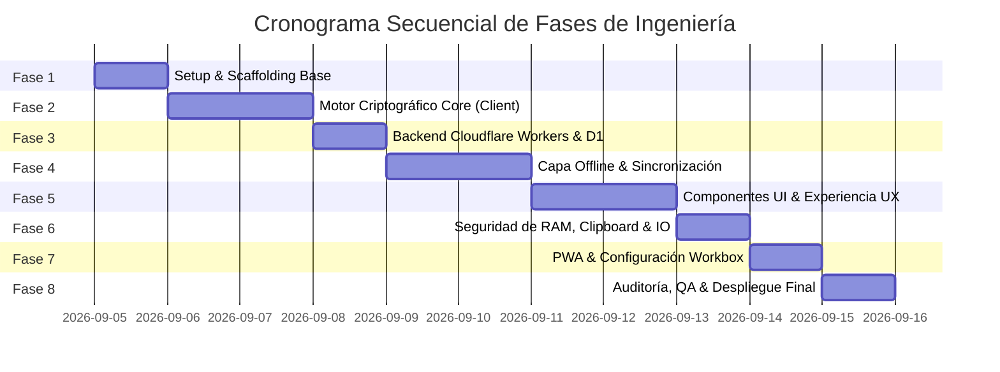

# Roadmap & Execution Plan
## Proyecto: Revolt Pass — Zero-Knowledge 2FA & Security Vault

| Metadato | Detalle |
| :--- | :--- |
| **Identificador de Documento** | `RP-RDM-005` |
| **Versión** | `1.2.1-PROD` |
| **Estado** | Aprobado / Plan de Ejecución Secuencial |
| **Repositorio Remoto** | `https://github.com/Revolt-Group/revolt-pass.git` |
| **Rama Principal** | `main` |
| **Target URL** | `https://<tu-dominio-o-subdominio>.workers.dev` |
| **Licencia** | GNU AGPLv3 + Política de Marca Registrada (Revolt Group) |

---

## 1. Metodología de Ejecución y Puertas de Control (Quality Gates)

La implementación de **Revolt Pass** se organiza en **8 fases secuenciales rigurosas**. Cada fase cuenta con un conjunto unívoco de **Criterios de Aceptación (Definition of Done - DoD)**. Ninguna fase subsiguiente puede iniciarse sin que la fase previa satisfaga el 100% de sus criterios de aceptación y cuente con validación técnica explícita.

---

## 2. Fases Detalladas de Desarrollo

### FASE 1: Configuración del Entorno y Scaffolding Base
* **Objetivo:** Inicializar la estructura del proyecto con la suite de herramientas oficial, configuración de TypeScript estricto, Tailwind CSS y el soporte de Wrangler para Cloudflare D1.
* **Actividades Principales:**
  1. Inicialización con `pnpm create vite . --template react-ts`.
  2. Instalación de dependencias core: `tailwindcss`, `@tailwindcss/vite` (o PostCSS), `lucide-react`, `idb`, `@zxing/browser`, `vite-plugin-pwa`.
  3. Configuración de `tsconfig.json` con `strict: true`, `noImplicitAny: true`, `exactOptionalPropertyTypes: true`.
  4. Configuración de `wrangler.toml` vinculando la base de datos D1 (`DB`) y declarando variables de entorno.
  5. Configuración de Git (`.gitignore`, verificación de rama `main` y enlace remoto `https://github.com/Revolt-Group/revolt-pass.git`).
* **Definition of Done (DoD) - Fase 1:**
  - [ ] El comando `pnpm build` compila limpiamente con 0 errores y 0 advertencias de TypeScript.
  - [ ] Servidor de desarrollo local (`pnpm dev`) responde en `<100ms`.
  - [ ] `wrangler.toml` contiene la configuración estructural correcta para D1 y Workers.
  - [ ] Repositorio Git limpio con rama activa `main` y `.gitignore` exhaustivo.

---

### FASE 2: Motor Criptográfico Core en Cliente
* **Objetivo:** Implementar la suite criptográfica nativa en TypeScript bajo los estándares RFC 6238, RFC 4648 y Web Crypto API, sin librerías externas de cifrado.
* **Actividades Principales:**
  1. `src/lib/crypto/base32.ts`: Decodificador y codificador Base32 puro con manejo de alfabetos canónicos y padding flexible.
  2. `src/lib/crypto/totp.ts`: Generación de tokens TOTP con HMAC-SHA1 y HMAC-SHA256, cálculo de pasos temporales y truncamiento dinámico.
  3. `src/lib/crypto/kdf.worker.ts`: Web Worker dedicado para derivación PBKDF2-SHA256 (600,000 iteraciones) sin congelar la UI.
  4. `src/lib/crypto/vault.ts`: Cifrado y descifrado autenticado de la bóveda con AES-GCM (llave de 256 bits, IV de 12 bytes aleatorio por operación, tag de 128 bits).
  5. `src/lib/crypto/webauthn.ts`: Módulo de registro y autenticación FIDO2 con autenticador de plataforma (Windows Hello PIN y biometría móvil) para envoltura local de llaves.
* **Definition of Done (DoD) - Fase 2:**
  - [ ] Pruebas unitarias validadas contra los vectores oficiales del RFC 6238 Apéndice B (tokens exactos para marcas de tiempo predefinidas).
  - [ ] Cifrado y descifrado de carga útil JSON genera salida idéntica (*roundtrip test*).
  - [ ] La manipulación intencional de 1 bit en el `encrypted_blob` genera rechazo inmediato por `AES-GCM` (`OperationError`).
  - [ ] PBKDF2 se ejecuta en segundo plano vía Web Worker sin bloquear el renderizado visual de React.

---

### FASE 3: Backend Edge & Capa de Persistencia Remota
* **Objetivo:** Crear la API REST en Cloudflare Workers y aprovisionar el esquema relacional en Cloudflare D1.
* **Actividades Principales:**
  1. Creación y ejecución de la migración inicial de base de datos (`schema.sql`) en Cloudflare D1.
  2. Creación del enrutador de API en Cloudflare Workers (`functions/api/[[route]].ts` o Worker standalone).
  3. Endpoint `GET /api/time`: Emisión del timestamp UTC del servidor con cabeceras `Cache-Control: no-store`.
  4. Endpoints de autenticación: `POST /api/auth/register`, `GET /api/auth/salt`.
  5. Endpoints de bóveda: `GET /api/vault` y `PUT /api/vault` con control de concurrencia optimista (`version`).
  6. Middleware de cabeceras de seguridad estrictas (CSP, HSTS, X-Frame-Options, CORS para `<tu-dominio.com>`).
* **Definition of Done (DoD) - Fase 3:**
  - [ ] Base de datos D1 inicializada con tablas `users`, `vaults` y `sync_logs`.
  - [ ] `GET /api/time` devuelve el timestamp del servidor con latencia inferior a 50ms.
  - [ ] Intentos de actualizar una bóveda con una versión desactualizada devuelven de forma determinista `HTTP 409 Conflict`.
  - [ ] Todas las respuestas se empaquetan en el formato canónico `{ success, data, error, timestamp }`.

---

### FASE 4: Capa de Persistencia Local & Sincronización Offline
* **Objetivo:** Garantizar la soberanía de datos y disponibilidad 100% offline mediante IndexedDB y motor de sincronización asíncrono.
* **Actividades Principales:**
  1. `src/lib/storage/idb.ts`: Inicialización de `idb` con los almacenes `vault_encrypted`, `user_config` y `sync_queue`.
  2. `src/lib/sync/syncEngine.ts`: Máquina de estados de sincronización (`synced`, `dirty`, `syncing`, `conflict`).
  3. Algoritmo de resolución de conflictos Last-Write-Wins a nivel de ítem (`VaultItem.updated_at`).
  4. Sincronizador de Time Drift: cálculo de desfase milimétrico entre el reloj de la estación de trabajo y el Worker.
* **Definition of Done (DoD) - Fase 4:**
  - [ ] La aplicación puede cerrarse y reabrirse sin conexión a Internet, recuperando el último estado local cifrado.
  - [ ] Las modificaciones realizadas offline se sincronizan automáticamente con D1 en cuanto se detecta conectividad (`window.addEventListener('online')`).
  - [ ] El desfase temporal se compensa correctamente si el reloj del sistema operativo se altera intencionalmente en 5 minutos.

---

### FASE 5: Componentes UI & Experiencia de Usuario de Grado Fortune 500
* **Objetivo:** Construir la interfaz de usuario Dark-Mode First inspirada en los estándares estéticos de Raycast, Linear y Vercel.
* **Actividades Principales:**
  1. `src/components/VaultList.tsx`: Listado fluido de cuentas con soporte de filtrado instantáneo, agrupación por tags y sección de favoritos fijados (`pinned`).
  2. `src/components/TotpCard.tsx`: Tarjeta con logo de la marca, nombre, indicador circular SVG con cuenta regresiva, botón de copiado con respuesta háptica (`navigator.vibrate`) y sección colapsable de Recovery Codes.
  3. `src/components/CommandPalette.tsx`: Buscador flotante universal accesible vía `Ctrl + K` / `Cmd + K`.
  4. `src/components/QrModal.tsx`:
     * Escaneo de cámara en vivo con selector de dispositivo vía `@zxing/browser`.
     * Dropzone para arrastrar imágenes/capturas de pantalla.
     * Interceptor global de pegado (`Ctrl + V`) para escanear capturas del portapapeles directamente.
  5. `src/components/PasswordGeneratorModal.tsx`: Utilidad de generación de contraseñas de alta entropía con cálculo de bits.
  6. `src/components/BrandIcon.tsx`: Integración con CDN de Simple Icons con fallback a monograma y gradiente determinista.
* **Definition of Done (DoD) - Fase 5:**
  - [ ] Interfaz completamente responsiva en pantallas móviles (375px) y monitores de escritorio 4K.
  - [ ] Atajo `Ctrl + K` abre la paleta de comandos en menos de 50ms y permite copiar códigos con `Enter`.
  - [ ] Escaneo de QR funciona indistintamente por cámara, arrastrando una imagen o pulsando `Ctrl + V`.
  - [ ] La cuenta regresiva del temporizador circular anima fluidamente sin parpadeos ni pérdidas de cuadros.

---

### FASE 6: Seguridad de Memoria, Clipboard & Respaldo
* **Objetivo:** Blindar la superficie local de la aplicación contra fugas de información.
* **Actividades Principales:**
  1. `src/lib/security/autoLock.ts`: Temporizador de inactividad de ratón/teclado que purga las variables en RAM tras 5 minutos (configurable).
  2. Bloqueo reactivo por visibilidad de pestaña (`visibilitychange`).
  3. `src/lib/security/clipboardGuard.ts`: Auto-limpieza de portapapeles tras 45 segundos con verificación previa del contenido.
  4. Modal de desbloqueo rápido con soporte prioritario para **PIN de Windows Hello** en PC y biometría en smartphones.
  5. Módulo de exportación/importación: Generación de archivo JSON cifrado con Master Key y opción de descarga en texto plano bajo confirmación destructiva.
* **Definition of Done (DoD) - Fase 6:**
  - [ ] Tras 5 minutos sin actividad de mouse/teclado, la aplicación vuelve a la pantalla de bloqueo y la `MasterKey` en memoria se destruye.
  - [ ] Al copiar un código TOTP, el portapapeles del sistema operativo se borra de manera verificable exactamente a los 45 segundos.
  - [ ] El desbloqueo rápido con PIN de Windows Hello restaura la sesión en <400ms.
  - [ ] La exportación e importación de bóveda reconstituye íntegramente todas las cuentas, tags y recovery codes.

---

### FASE 7: PWA, Service Worker & Endurecimiento Offline
* **Objetivo:** Convertir el proyecto en una Progressive Web App plenamente instalable y resiliente a nivel de sistema operativo.
* **Actividades Principales:**
  1. Configuración de `vite-plugin-pwa` en `vite.config.ts` con manifiesto canónico (`name: "Revolt Pass"`, `short_name: "RevoltPass"`, `theme_color: "#0a0a0c"`).
  2. Generación y provisión de íconos PWA (`192x192`, `512x512`, `maskable`, `apple-touch-icon`).
  3. Configuración de reglas de caché Workbox para pre-cachear el 100% de los bundles estáticos.
  4. Pruebas de instalación nativa en Windows (PWA en ventana independiente) y teléfonos móviles.
* **Definition of Done (DoD) - Fase 7:**
  - [ ] PWA puntúa 100/100 en la auditoría PWA de Google Lighthouse.
  - [ ] La app se instala como aplicación de escritorio nativa en Windows 10/11 con icono de alta resolución.
  - [ ] Desconexión física de red permite continuar navegando y generando códigos TOTP sin interrupciones.

---

### FASE 8: Auditoría de Seguridad, QA & Despliegue en Producción
* **Objetivo:** Someter el sistema a verificación exhaustiva, comprobación de dependencias y despliegue sobre `<tu-dominio.com>`.
* **Actividades Principales:**
  1. Auditoría de seguridad de dependencias (`pnpm audit`).
  2. Verificación de bundle size y eliminación de código muerto (*tree shaking*).
  3. Despliegue de la API y base de datos D1 mediante `wrangler deploy` y `wrangler d1 migrations apply`.
  4. Despliegue del frontend en Cloudflare Pages / Workers Sites enlazado al subdominio `<tu-dominio.com>`.
  5. Verificación de registros DNS, certificados SSL y directivas de cabeceras de seguridad en producción.
* **Definition of Done (DoD) - Fase 8:**
  - [x] Producción operativa y respondiendo sobre `https://<tu-dominio-o-subdominio>.workers.dev`.
  - [x] Calificación "A+" en pruebas de cabeceras de seguridad SSL Labs / SecurityHeaders.
  - [x] Registro completo del primer usuario y sincronización de bóveda comprobada en Cloudflare D1 real.
  - [x] Cero consumo de presupuesto financiero (100% contenido en el free tier de Cloudflare).

---

### FASE 9: Panel de Seguridad, Sesiones Multidispositivo y Gestión de Passkeys (v1.1.0)
* **Objetivo:** Dotar a los usuarios de visibilidad y control granular sobre todas las sesiones abiertas y credenciales biométricas asociadas.
* **Actividades Principales:**
  1. Creación de tablas `sessions`, `passkeys` y `audit_logs` en Cloudflare D1.
  2. Implementación de endpoints REST en el Worker: `POST/GET/DELETE /api/auth/sessions`, `GET/POST/PUT/DELETE /api/passkeys`, `GET /api/audit-logs`.
  3. Desarrollo del modal de seguridad y auditoría `SecurityModal.tsx`.
  4. Eliminación de bypass de Windows Hello y forzado de verificación de plataforma estricta.
  5. Nombrado personalizado de dispositivos y Passkeys con persistencia concurrente en D1 e IndexedDB.
* **Definition of Done (DoD) - Fase 9:**
  - [x] Cierre de sesión individual y remoto funcional en tiempo real.
  - [x] Revocación remota de Passkeys operativa, previniendo reingreso biométrico en PCs ajenas.
  - [x] Nombres personalizados de dispositivos y Passkeys preservados permanentemente tras recargas con `Ctrl + F5`.

---

### FASE 10: Internacionalización Bilingüe Integral (i18n ES/EN) Zero-Knowledge (v1.2.0)
* **Objetivo:** Implementar soporte idiomático completo en Español e Inglés sin poner en riesgo la privacidad ni depender de APIs externas.
* **Actividades Principales:**
  1. Arquitectura de diccionarios síncronos compilados en `src/i18n/locales/es.ts` y `en.ts`.
  2. Tipado estricto `TranslationSchema` y dot-notation `TranslationKey` con verificación de paridad total en compilación (`tsc -b`).
  3. Conmutador de idioma dinámico con autodetección de idioma preferido del navegador y persistencia local en `localStorage.revolt_lang`.
  4. Traducción del 100% de la interfaz, modales, generador de contraseñas, Command Palette y formatos de fecha.
* **Definition of Done (DoD) - Fase 10:**
  - [x] 100% de paridad y cero cadenas faltantes verificado por suite de tests Vitest (`src/i18n/i18n.test.ts`).
  - [x] Cero fugas de información a traductores en la nube.
  - [x] Alternancia instantánea de idioma sin recarga de página.

---

### FASE 11: Preparación Open Source, Licenciamiento GNU AGPLv3 y Política de Marca (v1.2.1+)
* **Objetivo:** Abrir el repositorio a la comunidad garantizando la máxima protección contra apropiaciones desleales, lucro de terceros y dilución de marca.
* **Actividades Principales:**
  1. Auditoría de seguridad del historial completo de Git (cero secretos, tokens ni variables `.env` expuestas).
  2. Redacción e incorporación de la licencia **GNU Affero General Public License v3.0 (AGPLv3)** con **Política de Marca Registrada de Revolt Group** (Sección 7(e)).
  3. Actualización de metadatos en `package.json` (`license: "AGPL-3.0-only"`).
  4. Actualización exhaustiva de la suite de documentación canónica bilingüe (`docs/es/` y `docs/en/`).
* **Definition of Done (DoD) - Fase 11:**
  - [x] Archivo `LICENSE` formalmente establecido en la raíz del repositorio.
  - [x] Insignias y referencias de licencia corregidas en `README.md` y `README.en.md`.
  - [x] Repositorio técnicamente preparado para apertura pública en GitHub.
